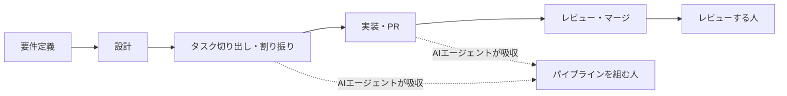

# タスク切り出し・割り振りの終焉

> **TL;DR**: 要件をタスクへ切り出し人に割り振るという開発の分業構造そのものがAIエージェントに吸収されつつあり、残る人間の役割は「パイプラインを組む人」と「レビューする人」の2つに収束するという論。

象徴的な事例としてSpotifyが挙げられる。同社は社内のバックグラウンドコーディングエージェントで既に1,500件超のAI生成PRをマージしており、その基盤である全社的な変更管理の仕組みは2024年だけで約65万件の自動PRを処理し、多くは人間レビューを介さず自動マージされている。awesome_kou氏（Zenn、2026-07）は、この事例の本質を「優秀なエンジニアを大量に雇って細かいタスクを割り振ることではなく、エージェントが安全に走り続けるパイプラインを整備すること」だったと分析し、Spotifyが決算で語った「最も優秀なエンジニアは去年の12月以降、一行もコードを書いていない」という発言を、コードを書くのをやめてパイプラインを設計しレビューする側に回った証拠として引用する。

著者はこの構造変化を、あらゆる工程に人間を挟み込むhuman-in-the-loopから、エージェントに実行を任せて要所だけを人間が監督するhuman-on-the-loopへの重心移動と位置づける。パイプラインを組む人が踏まえるべき制約として「35分問題」を紹介しており、人間がやれば35分を超える長さのタスクになるとエージェントの成功率が急落するという観測を挙げ、これを「ループエンジニアリング」——プロンプトを一発ずつ手で打つのでなく、エージェントが検証されながら走り続けるループそのものを設計すること——という言葉で言い換えている。

この構造変化は個人だけでなく、実装にかかる人月を稼ぎの源にする受託開発会社・SES企業にも同じ圧力をかけると著者は指摘する。SESは「エンジニアの時間」を、受託は「工数見積もりに基づく成果物」を売っているが、値付けの土台がどちらも「実装にかかる人月」である以上、実装が安く速く大量にこなせるようになるほど両者とも利幅を削られる。著者は、割り振り型の開発ではコストが仕事量にほぼ比例する変動費であるのに対し、エージェント前提のチームはパイプライン整備というほぼ固定費に置き換えており、規模が大きくなるほどこのコスト差が開くと論じる。割り振り型に依存してきた組織ほど検証ゲート・テスト基盤・標準化への投資を先送りしてきた分、移行の出発点で出遅れているとも指摘する。

## 観察ログ（未検証）

- 2026-07-27: 「AIを本格導入したチームでジュニア開発者の需要が40%減少した」という分析結果（出典・調査主体は本記事内で未特定）
- 2026-07-27: 「タスクの所要時間が倍になると失敗率はおよそ4倍になる」という35分問題の倍率則（出典未特定）

## 問い

- Spotifyの事例は「魔法ではなく15年分のインフラ投資の産物」とされる。自組織や自分のwiki運用がパイプラインに投資できていない場合、どこから着手すべきか
- 「パイプラインを組む人」と「レビューする人」は本当に排他的な2つの役割なのか、それとも同一人物が両方を兼ねる形が主流になっていくのか

## 関連

- [[business/ai-vertical-integration]] — 受託・SI業界への影響という同じ問題意識をfladdict氏が別の類比（コンビニPB戦略）で論じる
- [[concepts/recursive-self-improvement]] — 「エンジニアがコードを書かなくなった」という同型の観測をAnthropic内部でも報告
- [[concepts/loop-engineering]] — 本記事が言及する「ループエンジニアリング」という言葉の詳細な系譜・構成要素
- [[concepts/development-as-agriculture]] — 残る役割を「土壌をつくる人／選別基準をつくる人／最終判断をする人」の3つに整理する同型の議論（深津貴之）
- [[tools/xirp]] — 本ページが引くSpotifyのエージェント運用基盤が、外部向け製品として出てきたもの。「エージェントを安全に走らせるパイプライン」の文脈供給側にあたる
