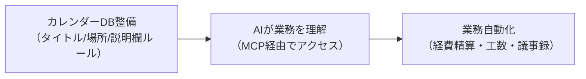

# GoogleカレンダーをAI業務データベースとして活用する

> **TL;DR**: AIに仕事を任せたいなら、AIツール導入より先にGoogleカレンダーを業務DBとして整備する方が効果が出る。「仕事が発生する瞬間の情報」が詰まったカレンダーは、MCPと組み合わせることで経費精算・工数管理・顧客対応を自動化する起点になる。

AIツール導入→業務自動化→生産性向上、という順番で考える組織が多いが、実際はデータ基盤の整備が先にあって初めてAIが業務を理解できる。AIに「何をすべきか」を理解させるには、業務情報が構造化されたデータとして存在している必要があるためだ。

Googleカレンダーには「誰と/いつ/どこで/何時間/何のために/誰が参加」という情報が詰まっており、API経由で構造的に取得できる。[[tools/claude-code]] のMCPコネクタでCalendar接続すれば、このデータを起点にした自動化パイプラインを組める。

## 5つの活用案

### ① 経費精算の自動化
予定の `location` に訪問先を登録し、MCP経由で取得。Google Maps・経費精算システム・会計システムと組み合わせて交通費精算を自動生成する。

### ② 工数管理
開始・終了時刻がタイムトラッキングの代替になる。CRMの顧客IDを `extendedProperties` に持たせると売上・案件情報と紐づけられる。

### ③ 議事録との連携
Google Meet付き予定なら会議URL→録画→文字起こし→議事録を起点で連鎖的に処理できる。

### ④ 顧客対応履歴
カレンダーを「顧客との接点DB」として使い、「この顧客との直近3ヶ月の接点まとめて」と問い合わせると面談履歴・議題・未対応事項を整理できる。

### ⑤ オートマネジメント
カレンダーを起点に管理業務をClaudeが補助する。外部勤怠管理システム（みえるクラウド等）との統合で活用範囲がさらに広がる。

## 入力ルールの標準化

データベースとして機能させるには入力ルールの統一が必須だ。

**タイトルルール**: `【顧客名】業務区分` の形式で統一
- NG: 「面談」「打合せ」「A社」（後から分析できない）
- OK: 「【A社】月次面談」「【B社】決算報告」「【社内】月次会議」

**場所ルール**: Google Mapsが解析できる住所形式で登録

**説明欄ルール**: テンプレート化（目的/議題/確認事項/宿題/次回予定）

**色ルール**: 業務区分を色で分類し視認性を高める

**運用上の課題**: マニュアルで徹底させようとしてもやる人とやらない人が出る。AppSheet等で「カレンダー入力専用フォーム」を作り、正しいフォーマットでしか入力できない仕組みにするのが現実的。

## 観察ログ（未検証）

- 2026-06-08: @miyagawadaisuke（企業DX・AI活用支援系アカウント）の note 記事より。定量データなし、著者の実践経験ベースの論考。Google Workspace を業務プラットフォームとして使う組織向けの提言。
- 2026-06-08: 「AI導入プロジェクトより先に、Googleカレンダーのタイトルルールを決めた方が効果が出たりして」という問いかけが記事の結論。スモールスタートの示唆として有効。

## 問い

- このアプローチは [[concepts/forward-deployed-engineer]] のFDEが顧客組織に入ってまず行う「業務データ構造化」と同じ本質ではないか？
- Googleカレンダー以外のデータ（Slack/メール/CRM）との組み合わせで何が変わるか？

## 関連

- [[concepts/forward-deployed-engineer]]（AIが業務を理解するためのデータ基盤整備・FDE的役割）
- [[tools/claude-code]]（MCPでGoogleCalendar接続・6種コネクタ）
- [[business/backoffice-ai-implementation]]（AI活用実践の類似事例・バックオフィス自動化）
