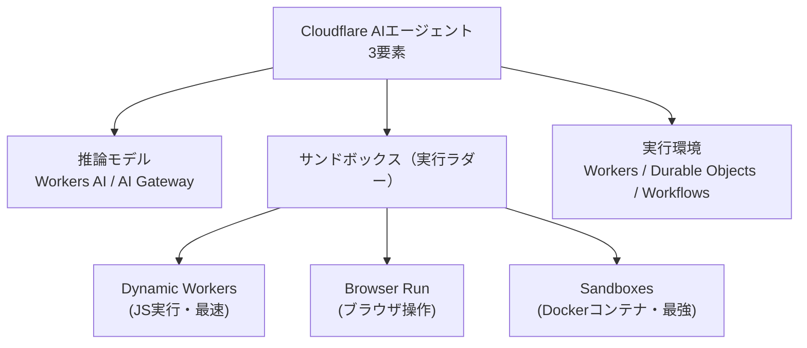

> **TL;DR**: CloudflareはV8 Isolate技術を基盤に、AIエージェントに必要な「推論モデル・サンドボックス・実行環境」を一気通貫で提供するプラットフォームとして2026年に整備された。

従来のクラウドは「1対多」（1アプリ→多クライアント）をコンテナで捌くモデルで設計されたが、AIエージェント時代は「1対1」（1エージェント→1ユーザー）のパーソナル実行環境が必要になる。Cloudflare WorkersはV8 Isolate技術（もとはChromeのJSエンジン）をサーバーサイドに転用したもので、高速起動・メモリ効率・無限スケール・環境隔離という特性がAIエージェントのユーザーごとインスタンス起動に合致する。

## 推論モデル層

**Workers AI** はCloudflareネットワーク上でオープンモデル80+を提供し、**Binding**経由でAPIキー不要のメソッド呼び出しが可能（SDKインポートや認証情報入力が不要）。**AI Gateway**をプロキシとして外部プロバイダー（OpenAI/Anthropic等）含む180+モデルに接続でき、ログ・キャッシュ・レート制限を一括管理できる。他に**Vectorize**（ベクトルDB）・**AI Search**（自動RAG生成）がある。

## サンドボックス層（実行ラダー）

3種のサンドボックスを用途別に使い分ける「実行ラダー」設計:

1. **Dynamic Workers** — WorkersがWorkersをコードの文字列として起動する。V8 Isolateなので高速起動。JavaScriptの実行・軽量計算に使う
2. **Browser Run** — ヘッドレスブラウザ（Puppeteer/Playwright互換）。APIのないサイト操作・スクリーンショット・PDF生成・スクレイピング。ステートフルなBrowser Sessions とステートレスなQuick Actionsの2モードがある
3. **Sandboxes** — ContainersベースのDockerコンテナ環境。Gitチェックアウト・テスト実行・プレビュー公開など、コンテナが必要なフル機能作業に使う

「JavaScriptで済む → Dynamic Workers / ブラウザ操作 → Browser Run / 特殊コマンド・コンパイル → Sandboxes」という段階的エスカレーション構造になっている。

## 実行環境層

- **Workers** — V8 Isolateベースのエッジ実行環境（基盤）
- **Durable Objects** — 状態永続化・長時間WebSocketセッション・ハイバネーション対応。エージェントのメモリ層として機能する
- **Workflows** — マルチステップ処理・自動リトライ・エラー処理・人間承認ステップ

## Code Mode（ツール呼び出し vs コード生成）

従来のAIエージェントは外部APIを「ツール呼び出し」で叩く。Code Modeでは代わりにAIがTypeScriptを書き、Dynamic Workers上で直接実行する。LLMは大量のツール定義を読む代わりに、既によく知っているTypeScriptの`.d.ts`型定義だけを読んでコードを書ける。Cloudflare MCP（2,500エンドポイント）を`search()`と`execute()`の2ツールに圧縮した実例がある。[[concepts/intermediate-notation-pattern]]（中間記法パターン）の一実装形態とも言える。

## Agents SDK

WorkersとDurable Objectsを隠蔽してAIエージェント開発をシンプルにするSDK:

- **Agentクラス** — `initialState`でSQLite永続ストア、`@callable()`デコレータで外部公開メソッド
- **useAgent()** — ReactフックでWebSocket経由のリアルタイム状態同期
- **ハイバネーション** — アイドル時に休止・再リクエストで起動（使った時のみ課金）
- **チャンネル** — チャット/Eメール/音声/Slack/Webhookで入力・出力を受け取る

## Cloudflare OS（2026-08-05 発表）

Cloudflare公式アカウントが2026年8月5日に発表したオープンソースのプラットフォーム。同社の説明では、社内の誰もがアプリを作り、業務を自動化し、社内システムへ安全にアクセスできるようにするもので、その形は「組織が何を知っていて、どう仕事をしているか」に沿って決まるとしている。ここまでの層（Workers/Durable Objects/Agents SDK）が開発者向けの部品だったのに対し、Cloudflare OSは非開発者を含む全社員を対象にしている点が位置づけの違いになる。詳細は同社ブログ（blog.cloudflare.com/cloudflare-os/）にあり、本ページ作成時点ではポストと発表動画の記述のみを反映している。

@commteは発表動画の内容を、社員一人ひとりに専用のエージェントとワークスペースを与え、その会社独自の業務のやり方・社内の知識・既存システムに合わせて動かすものだと要約する。権限モデルについては、エージェントは最初どこにもアクセスできず、許可したリソースにだけ手が届くという既定拒否（deny by default）の設計だと説明している。@commte はこれを「AIを社内に入れられない理由を潰せるかも」と評価しており、企業導入の障壁が機能でなくアクセス制御の設計にあるという見立てが背景にある。[[concepts/agent-adoption-walls]] が整理する組織側の壁（ガバナンス・権限）に対して、プラットフォーム側から答えを出そうとする位置づけになる。

公式ブログ（2026-08-05公開）で明かされた製品構成——エージェント作業空間・Gatekeeperと観測ログによるガバナンス基盤・アプリ＝Workerの3部——は [[tools/cloudflare-os]] に分けて記載した。本ページの Dynamic Workers / Durable Objects / AI Gateway がそのまま土台として使われており、Durable Object Facet と Dynamic Workers はこのプロジェクトのために作った機能だと同社は述べている。

## 観察ログ（未検証）

- 2026-06-15（yusukebe / Cloudflare社員 Zenn記事）: V8 IsolateがコンテナよりAIエージェントに向いているというCloudflareの立場
- 2026-06-15（yusukebe）: Dynamic Workersはコンテナより「100倍速い」とCloudflareのブログが主張
- 2026-06-15（yusukebe）: Cloudflare MCPサーバーで2,500エンドポイントをCode Modeにより`search()`と`execute()`の2ツールに圧縮
- 2026-06-15（yusukebe）: 社内ツール「Let It Slide」（AIスライド生成）がCloudflareフルスタック（Workers/Sandboxes/DO/R2/Browser Run/AI Gateway）で稼働し、社内WikiやGitリポジトリとMCP連携
- 2026-06-15（yusukebe）: [[concepts/generative-ui]]の「4番目のアプローチ（Dynamic）」として、AIがReact JSXを書きDynamic Workersで実行・SSRしiframeで表示するパターンを発表・デモ

## 問い

- Code ModeはMCPのツール呼び出しモデルと競合するか、それとも異なるユースケースを補完するか？
- Dynamic WorkersのV8 Isolate単体でフルサンドボックスとして機能するか（JavaScriptのみで完結しない場合のセキュリティ境界はどこか）？
- Workers AIのオープンモデルは[[companies/anthropic]]・[[companies/openai]]の最新モデルと品質でどこまで比較できるか？

## 関連

- [[concepts/generative-ui]] — Dynamic WorkersによるGenerativeUI「4番目のアプローチ（Dynamic）」がyusukebeにより提案
- [[concepts/intermediate-notation-pattern]] — Code Modeは型定義ファイル（.d.ts）を中間記法として使う設計の実例
- [[concepts/multi-agent-patterns]] — Agents SDKのチャンネル設計・状態管理はマルチエージェントパターンと交差する
- [[concepts/ai-native-cloud-selection]] — 「AIエージェントがCLI/APIで操作しやすいか」でクラウドを選ぶ基準。その筆頭としてCloudflareを挙げる論
- [[concepts/idp-shared-cli-mcp]] — Cloudflare Accessを使い人間とAIを同一身元で社内システムへ通す設計。Cloudflare OSの「社内システムへ安全にアクセス」に対応する既存の実装パターン
- [[concepts/agent-adoption-walls]] — 企業のエージェント導入で詰まる7つの壁。Cloudflare OSの既定拒否の権限モデルはこのうちガバナンス・可視化の壁への回答にあたる
- [[tools/cloudflare-os]] — 本ページの各層の上に載る社内AIプラットフォーム（OSS）。製品としての詳細はこちら
