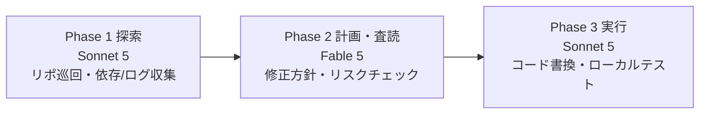

# Advisor-Executor パターン（Fable 5 × Sonnet 5 連携）

> **TL;DR**: 高知能・高価格の [[models/claude-fable-5|Fable 5]] と高速・安価な Sonnet 5 を、役割やフェーズで使い分ける3つの連携パターン（Advisor／Orchestrator／Fable Sandwich）。単一モデルを回すのでなくモデルを組み合わせて「知能」と「コスト・速度」のトレードオフを解消する。

> 📌 X bookmark: 26,784（2026-07-09 時点、@ClaudeDevs 公式ポスト）

自作コーディングエージェントに複雑な作業をさせるとコンテキストが膨らみ、賢いモデル（Opus/Fable級）を毎ターン呼ぶだけで API 料金が跳ね上がり応答も遅くなる——というのが出発点の悩みだと Na（yuche、AIツール活用ブロガー）は書く。この記事は ClaudeDevs 公式 X スレッドで紹介された「Fable 5＋Sonnet 5 のエージェント連携パターン」を、Claude Code での実用例つきで解説したもの。共通する発想は、**作業ループの9割以上を占める泥臭い手作業は安価モデルで回し、本当に知恵が要る瞬間だけ高価モデルを通す**という配分でトレードオフを解くことにある。3パターンは「どこに高価モデルを差すか」の位置が違う。

## パターン1: Advisor（相談役）

エージェントの役割を **Executor（実行役 / Sonnet 5）** と **Advisor（相談役 / Fable 5）** に完全分離して協調させる。

- **Executor（Sonnet 5）**: メインループを毎ターン回し、ファイル読み書き・ローカルコマンド・テスト実行・基本的なコード書きといった手を動かす作業を高速・低コストで愚直にこなす。
- **Advisor（Fable 5）**: 常時は回さず、必要なときだけオンデマンドで呼ぶ。複雑なエラーの根本原因特定や設計方針の決定など、頭を使う高度な判断に特化する。

大半のトークン消費は安価な Executor レートで課金されつつ、全体の知能レベルは最高峰の Advisor と同等に保てるのが強み。この核心は一次ソースでも確認できる。@ClaudeDevs 公式ポストは「Fable 5 でよく使うパターン」の筆頭に Advisor を挙げ、Executor（Sonnet 5）が指針を求めて Fable 5 を呼び、大半のトークンは低い Executor レートで課金される、と明言している（2026-07-07・図解画像つき）。記事は、Claude Code にはこの Advisor 機能がネイティブで備わり、`/advisor fable` でアドバイザーモデルを固定できると紹介する（Sonnet 5 が壁に当たると自動で Fable 5 に助言を仰ぐ、という描写。コマンドの存在は本記事のみの記述で要検証）。

## パターン2: Orchestrator（司令塔）

Fable 5 を司令塔（プランナー）としてトップに据え、Sonnet 5 を作業員（ワーカー）として従わせる。

- **Orchestrator（Fable 5）**: ユーザーの巨大タスクを解析し、アーキテクチャ設計と矛盾のない実行プランを作る。タスクを小さく分割してワーカーへ指示を出す。
- **Worker（Sonnet 5）**: 「この関数のユニットテストを書く」「CSSを修正する」など単一サブタスクに集中してコードを書き、Orchestrator に結果を報告する。

メインコンテキストを Orchestrator が握るため、作業中にエージェントが何をやっていたか忘れて迷子になる「コンテキストロス」を防げる。並列で複数の Worker を走らせればタスク処理時間も大幅短縮できる。これは [[concepts/multi-agent-patterns]] の Fan-Out／Orchestrator-subagent を、上位=Fable・下位=Sonnet というモデル階層に対応づけた形にあたる。

## パターン3: Fable Sandwich（サンドイッチ）

開発プロセスのフェーズごとにモデルを交互に入れ替える3ステップの信頼性重視パターン。最初と最後の関門だけ高知能モデルを置き、作業の大部分を標準モデルで挟むことから「サンドイッチ」と呼ばれる（上図）。

- **Phase 1: Explore（探索）** — 安価で高速な Sonnet 5 がリポジトリ全体を巡回し、関連コード・依存関係・エラーログを徹底的に集めて整理する。
- **Phase 2: Plan & Review（計画・査読）** — 整理された文脈を Fable 5 に渡し、最も頭を使う修正方針の決定とリスクチェック（セキュリティ・パフォーマンス影響）を行う。
- **Phase 3: Execute（実行）** — Fable 5 が立てたプランに沿って再び Sonnet 5 が具体的なコード書き換えとローカルテストを担当する。

最初から Fable 5 に探索させると読み込みトークンだけで膨大な費用がかかる。泥臭い探索は Sonnet に任せ、最も思考力が要る「設計・チェック」の一点だけ Fable 5 を通すことで、最高精度の成果物を最も安価に得る狙い。この3フェーズ配分は [[concepts/llm-model-selection-strategy]] の工程分解型サンドイッチ戦略（@ozaken_AI・上流大／中流中／下流小）と本質的に同じ発想で、別著者・別スレッドから同型の設計思想が収斂している。

## 実践例: 品質エスカレーション付き司令塔（fladdict）

[[people/fladdict|深津貴之（@fladdict）]]が2026-07-10に共有したプロンプトは、Orchestrator パターンをワンプロンプトで実装した実践例。「Fableは各Issueの設計を行い、実装タスク担当者を、fable, opus, sonet, 人間に割り当ててください。FableはOpus, SonetのPullRequestをレビューし、品質がたりない場合、タスク担当者を上位モデルに切り替えて最実行してください」というもの（引用は原文ママ）。狙いはトークン消費の削減で、本人は「これでトークンゴリッと減らないかな」と述べる。

上の3パターンに対する差分は2つあると考えられる。第一に、担当者の候補に**人間**を含めており、人間をループの外の監督でなく割り当て可能なワーカーの一人として配置している。第二に、最初から適材適所を決め打つ静的な配分でなく、**PRレビューで品質不足が出たときだけ担当を上位モデルに切り替えて再実行する**エスカレーション型の動的配分になっている。Advisor の「必要なときだけ高価モデルを通す」判断を、レビュー駆動で自動化した形といえる。

## まとめの含意

Na は記事末で、AIエージェントの実用化・プロダクション導入では**単一モデルの性能向上を待つのでなく、モデルの組み合わせで限界を突破するのがこれからのトレンド**になりそうだと結ぶ。3パターンは排他でなく、規模の判断は Advisor、大タスクの分解は Orchestrator、信頼性重視の1本道は Fable Sandwich、と局面で選べる。[[concepts/coding-agent-workflow-styles]] の「高速制御ループ vs 委譲低速ループ」という2類型とも重なり、モデル階層をどう配線するかがハーネス設計の主軸になりつつある。

## 観察ログ（未検証）

- 2026-07-09（Na/yuche）: Claude Code に Advisor 機能がネイティブで備わり `/advisor fable` でアドバイザーモデルを固定できる、という記述。本記事のみの単一ソースで、コマンドの実在は要検証
- 2026-07-21 @cathrynlavery: 「Fableで計画し、Codexで実装する」を1コマンド化した `/codex-build` スキルを紹介。Fableがオーケストレーション（計画・taste・文脈）、Codexが実装、両者の間に承認ゲートを置き何もレビュー・テストなしに出荷されないようにすると説明。本ページのOrchestratorパターンを自社モデル同士（Fable×Sonnet）でなくAnthropic外の製品（Codex）へ越境させた実例（詳細な内部実装は未公開）
- 2026-07-09: 記事は Fable 5／Sonnet 5 を「次世代モデル（仮定）」と前置きしつつ実運用例を書いている。Fable 5 は既にローンチ済み（[[models/claude-fable-5]]）だが Sonnet 5 側の実在・スペックは本記事では未確定 → 2026-07-10: @ClaudeDevs 公式ポスト（一次ソース）が Executor として Sonnet 5 を実名で挙げており、実在は公式発信で裏付けられた。スペックは引き続き未捕捉

## 問い

- Advisor パターンの「9割を安価モデル・判断だけ高価モデル」は、このvaultの [[concepts/llm-model-selection-strategy]] とどこまで同一で、何が新しいのか（Advisor＝オンデマンド呼び出しという発火設計が差分か）
- `/advisor fable` は本当に Claude Code に存在するか。存在するなら [[tools/claude-code-subagents]] やサブエージェントのモデル指定とどう関係するか
- 自作エージェントで Fable Sandwich を組むとき、Phase 1→2 の「文脈の受け渡し」で情報が劣化しない中間記法は何か（[[concepts/intermediate-notation-pattern]] と接続できるか）
- fladdict 式エスカレーション（下位モデルで失敗→上位モデルで再実行）は、失敗コスト（下位モデルの無駄試行＋レビュー分）を織り込んでも静的な工程分解型配分より安くなるか

## 関連

- [[models/claude-fable-5]] — 高知能側モデル。長い複雑タスクほど差が開く特性がこのパターンの前提
- [[concepts/llm-model-selection-strategy]] — 工程分解型サンドイッチ戦略。Fable Sandwich と同型の設計思想（別著者の収斂）
- [[concepts/multi-agent-patterns]] — Orchestrator＝Fan-Out/Orchestrator-subagentのモデル階層版
- [[concepts/fable-5-prompting]] — Fable 5公式プロンプト指針（並列サブエージェント・委任の非同期化）
- [[concepts/coding-agent-workflow-styles]] — 高速制御ループ／委譲低速ループの2類型
- [[concepts/claude-code-orchestration]] — Claude Code の subagent/agent teams/worktree 使い分け
- [[concepts/loop-engineering]] — エージェントループの設計論（安価ループ＋高価判断の配分）
- [[concepts/claude-code-model-effort]] — モデル=何を知っているか／effort=どれだけ徹底するかの公式フレーム。どこに高価モデルを差すかの判断基準側
- [[concepts/cost-effective-harness]] — 3パターンを「いつ使うと引き合うか」で実測した経済分析側（Lance Martin・Parameter Golf/BrowseComp）
- [[concepts/fable-sprint-strategy]] — 実践者版のP/G/E配分（Planner/Evaluator=Fable・Generator=Opus/Sonnet）。週50%制限下の運用記録（@AI_masaou）
- [[concepts/delegation-management-style]] — 本ページのOrchestratorパターンに近いDevin Fusion構成で、リードモデルをFable/Opusで入れ替えたコスト実験（Cognition社）
- [[tools/herdr]] — Orchestratorパターンをマルチペインのハーネス製品上で組んだ実例。Fable 5.1が方向づけ・分解・サインオフ、Claude/Codexの各ペインが実装（@Voxyz_ai）
