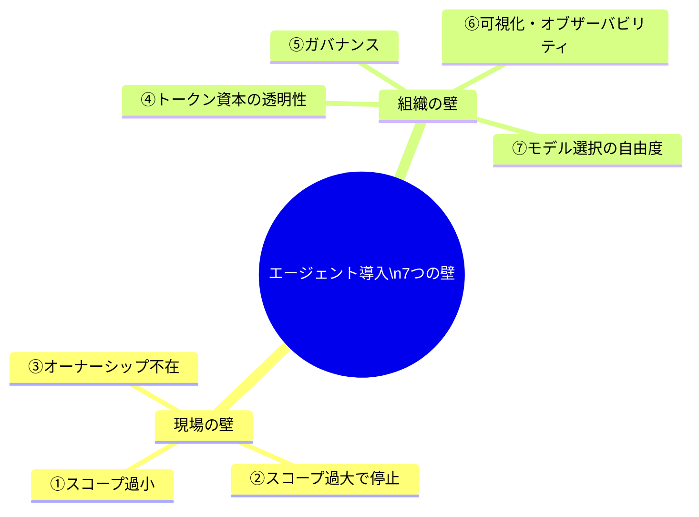

# AIエージェント導入 7つの壁（現場の壁と組織の壁）

> **TL;DR**: 企業にAIエージェントを定着させるとき、どの会社もほぼ同じ7箇所で詰まる——現場の壁3つ（スコープ過小・過大・オーナーシップ不在）と組織の壁4つ（トークン資本の透明性・ガバナンス・可視化・モデル選択の自由度）。技術の話に見えて、実は業務設計とオーナーシップの問題だと @kzkhykw は言う。

@kzkhykw は、Notion社内で他部門へのエージェント導入を推進しつつ、企業への導入支援を [[concepts/forward-deployed-engineer|FDE（顧客常駐型）]] アプローチで行うなかで見えてきた共通の詰まりどころを整理している。営業・インサイドセールス・マーケ・プロダクト開発・カスタマーサクセスと領域は違っても、壁の位置はどの会社でもだいたい同じだという。現場の壁を越えても「動くもの作れました」の先に組織の壁が待つ、という二層構造が骨子になっている。

## 現場の壁（3つは独立でなく連結している）

- **① スコープが小さくなりすぎる**: 「リードが入ったら自動調査する」エージェントを作り、あとは現場にオーナーシップを渡したところ、数週間経ってもメール下書きの自動化まで進まなかった。現場は「調査だけでも十分便利」で満足し、その先まで自動化しようという発想にすら至らない。@kzkhykw はこれを、業務スケールを小さくしすぎてリターンの少ない単発機能で止まるパターンと呼ぶ。
- **② 大きすぎて止まる**: 逆に複雑な業務を丸ごとエージェント化しようとすると、その業務を高い解像度で構造化できていないこと（人によってやり方が違う・暗黙知が多い）に気づく。ちゃんとやろうとしすぎてヒアリングだけで時間が溶け、関係者が増えて合意形成コストが膨らみ、最初の熱量が尻すぼみになる。これはプロジェクトマネジメントのスコープ決めの問題で、達成したいアウトカムが先に決まっていれば必要十分なスコープも決まる、という指摘。
- **③ オーナーシップの不在**: 推進者が勢いで作っても、改善やバグ対応の責任が曖昧だとじわじわ使われなくなり、推進者もガス欠する。本来は現場が自分ごととしてエージェントを育てられるかが鍵で、これが抜けると最初の3ヶ月は good でもスケールしない。

@kzkhykw はこの3つを独立した問題でなく全部つながっているものと見る。スコープ設計がおかしいとオーナーシップも定まらず、オーナーが不在だとスコープの拡張も起きない、という相互依存が核心。

## 組織の壁（「動いた」の先にある4つ）

- **④ トークン資本の透明性**: 部門ごとのトークン消費量が見えても「どんな仕事のために・どういうアウトカムを得たか」が見えないと予算の説得ができず、経営層はトークンを単なる消費コストとしか捉えられなくなる。→ 深掘りは [[concepts/token-management]]（消費を経営イシューとして可視化・最適化する考え方）。
- **⑤ ガバナンス**: 誰が作れて・誰が見えて・誰が管理するかが曖昧だと、野良エージェントや「動いてるけど誰も使わないゾンビエージェント」が溢れ、責任も予算も取れずセキュリティリスクだけ高まる。→ [[concepts/ai-agent-governance]]（MCP認可の限界と外部ポリシーによる実行制御）。
- **⑥ 可視化（オブザーバビリティ）**: エージェントが何回動き・どれくらい成功し・どこで失敗しているか。運用の最低条件だがここが手薄なツールが多く、見えないものは改善できない。可視化があって初めて改善のフィードバックループが組める。
- **⑦ モデル選択の自由度**: 特定のLLMプロバイダーへの依存はリスク。性能低下・障害・輸出規制ですぐ別プロバイダーに切り替えられないと、業務直結のエージェントは導入できない。AIがインフラ化しているのに極度の依存が盲目的に許容されている、という警鐘。→ プロバイダー非依存の運用は [[concepts/llm-model-selection-strategy]] の工程別モデル配分とも接続する。

## 問い

- 自分のwiki/自動化ワークフローに当てはめると、いま詰まっているのは①〜⑦のどれか。単発ingestで止まっている（①スコープ過小）状態ではないか。
- 「小さすぎず大きすぎず」の適正スコープを、アウトカム起点で決める具体的な手順は何か。[[concepts/forward-deployed-engineer]] の導入プロセスと突き合わせられるか。
- 個人運用でも④〜⑥（トークン可視化・ガバナンス・オブザーバビリティ）の軽量版は必要か。log.jsonl / tier_log.jsonl は⑥の萌芽と言えるか。

## 関連

- [[concepts/forward-deployed-engineer]] — 著者が企業導入で用いるFDEアプローチ
- [[concepts/token-management]] — ④トークン資本の透明性の深掘り
- [[concepts/ai-agent-governance]] — ⑤ガバナンス（外部ポリシーによる実行制御）
- [[concepts/llm-model-selection-strategy]] — ⑦モデル選択の自由度（プロバイダー非依存の運用）
- [[concepts/agent-skill-management-system]] — ⑤⑥の運用基盤（ライフサイクル／ガバナンス／評価の5機能）
- [[business/backoffice-ai-implementation]] — 管理部門でのエージェント実装の実践記録（現場の壁の実例）
- [[business/talent-to-value-ai]] — 価値の単位を「人＋エージェントのシステム」へ移す組織論
- [[companies/linear]] — 壁を越えた側の対照例。LLMが開発ほぼ全工程に組み込まれエンジニアが依存するレベルまで定着
- [[tools/cloudflare-os]] — ④トークン資本の透明性（AI Gatewayでの帰属・予算）と⑤ガバナンス（Gatekeeper・観測ログ）にプラットフォーム側から答える製品
- [[business/gitlab-ai-fluent-teams]] — ③オーナーシップ不在と⑤ガバナンスへの大企業側の制度的回答。Enterprise AI（中央のガードレール）・AI Transformation Owner（機能別オーナー）・AIチャンピオン（現場CoE）の3層連合型モデル（GitLab公式）
