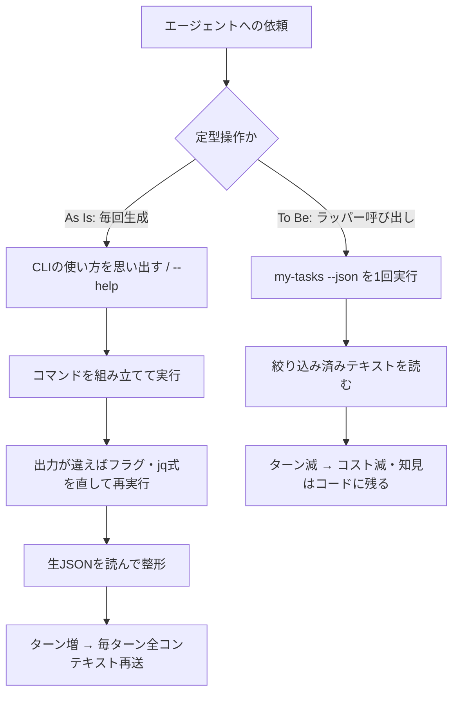

# エージェント向けコマンドラッパー（定型操作の固定化）

> **TL;DR**: エージェントに毎回コマンドを組み立てさせず、定型操作を数十行のスクリプトに固めて1行で呼ばせる。効き目の正体は試行錯誤の削減ではなく**ターン数の削減**で、ステートレスなLLM APIではターンが増えるたびに全コンテキストが再送されるため。



同じ調査をエージェントに何度もやらせると、タスクの本質と無関係な往復が毎セッション繰り返される。CLIで何ができるか思い出す、フラグやjq式を直して再実行する、といった手順がそれにあたる（jq式＝JSONを絞り込むフィルタの記法）。会話が終わればその試行錯誤はコンテキストごと消えるため、知見は次のセッションに残らない。この記事の筆者は、往復を消す手段としてシェルスクリプトやgh拡張へのラッパー化を挙げ、効き目の中心は試行錯誤そのものではなく**ターン数**にあると論じる（Sun* のZennパブリケーション掲載、記事ソースのリポジトリは `UtakataKyosui/MyZenns`）。

## なぜターン数がコストになるのか

LLMのAPIはステートレスで、ターンが増えるたびにシステムプロンプトと過去の全コンテキストが入力として再送される。再送分の単価はプロンプトキャッシュで下がるが、ゼロにはならない。筆者はAnthropicのドキュメント記載として次の倍率を引く。

| トークンの種類 | TTL | 基本入力単価に対する倍率 |
| --- | --- | --- |
| キャッシュ読み出し | — | 0.1 倍 |
| キャッシュ書き込み | 5 分 | 1.25 倍 |
| キャッシュ書き込み | 1 時間 | 2 倍 |

合計入力トークンは `cache_read_input_tokens + cache_creation_input_tokens + input_tokens` の和として毎リクエスト計上される。キャッシュに載っていてもコンテキストはリクエストに含めて送るため、**コンテキストが大きいほどターン1つ追加のコストが高くつく**。仕組みの詳細は [[concepts/prompt-caching]] にある。

## 実測: ghラッパーで24%減

筆者は `claude -p --output-format json`（Claude Codeを非対話で実行し、レスポンスに `total_cost_usd` とモデル別コスト内訳を含める形式）を使い、「自分がauthorのopen PRとassigneeのopen Issueを一覧して報告する」という同一タスクをラッパーなし・ありで比較している。

| 指標 | ラッパーなし | ラッパーあり |
| --- | --- | --- |
| ターン数 | 3 | 2 |
| 出力トークン | 1,203 | 919 |
| 入力処理量の合計 | 約151,800 | 約151,100 |
| コスト | $1.67 | $1.26 |

筆者はこの結果を「ghのようにモデルが熟知したツールではコマンド組み立てが1回でほぼ正解し、試行錯誤の往復は起きない。それでもコストは24%下がった。差を生んだのはターン数だ」と読む。裏を返せば、効果が大きくなる条件も構造から導ける。

- **モデルが知らない対象**を扱う場合。社内APIや自作サービスでは、ghでは起きなかった試行錯誤の往復が実際に発生し、そのたびにターンが増える
- **出力が大きい操作**の場合。生JSONがコンテキストに載ると、以降の全ターンで再処理コストとして残り続ける
- **1タスクの中で何度も呼ばれる操作**の場合。ターン削減の効果が呼び出し回数分だけ倍加する

## 作り方: 薄いシェルスクリプトから

特別な仕組みは要らず、`gh` と `jq` を組み合わせた数十行で足りると筆者は述べる。

```bash
#!/usr/bin/env bash
# my-tasks: 自分が担当している open な Issue と PR を一覧する
set -euo pipefail

echo "## PRs (author: @me)"
gh pr list --author "@me" --state open \
  --json number,title,reviewDecision,url \
  --jq '.[] | "#\(.number) \(.title) [\(.reviewDecision // "PENDING")]"'

echo "## Issues (assignee: @me)"
gh issue list --assignee "@me" --state open \
  --json number,title,labels,url \
  --jq '.[] | "#\(.number) \(.title) [\(.labels | map(.name) | join(","))]"'
```

設計のポイントは3つ。**出力を人間とエージェントの両方が読める最小限のテキストに絞る**（生JSONを垂れ流さない）、**`--jq` のフィルタをスクリプト側に埋め込む**（エージェントにjq式を毎回考えさせない）、**`PATH` の通った場所に置き CLAUDE.md にコマンド名と用途を1行書く**（エージェントが迷わず呼べる）。筆者はこの1行の常駐コストを30トークン程度と見積もり、毎回の試行錯誤数千トークンと比べれば無視できるとする。どの指示をどこへ置くかの判断軸は [[concepts/claude-code-instruction-methods]] のフレームと接続する。

スクリプトが増えたらgh拡張として束ねると、`gh extension install owner/repo` で別マシンへ配布でき、ghの認証をそのまま使えるためトークン管理を書かずに済む。このとき筆者は、絞り込み条件を `--jq` のような汎用フィルタに逃がさず**よく使うものから専用フラグに昇格させる**ことを勧める。jq式を書かせるとエージェントはフィールド名やデータ構造を毎回推測することになり、試行錯誤を減らすというラッパーの目的に反するため。専用フラグなら `--help` の1行を読むだけで正しく呼べる。人間がTUIで使う入口とエージェントがJSONで使う入口を同じコマンドに持たせるのがコツだという。

## どこまでラッパーにするか

判断基準は再利用の見込み、と筆者は切る。

| ラッパーにする価値がある | そのまま生成させてよい |
| --- | --- |
| 週1回以上繰り返す定型操作 | 一度きりのアドホックな調査 |
| 出力が大きくフィルタしないとコンテキストを圧迫する操作 | 対象や条件が毎回大きく変わる操作 |
| フラグやAPI仕様を調べ直す必要があり毎回試行錯誤が発生する操作 | `git status` のように1コマンドで済み間違えようのない操作 |

運用ルールとしては「**同じコマンド列をエージェントが2回組み立てたのを見た時点で切り出す**」がわかりやすい。2回目が発生した操作は3回目も発生する、というのがその根拠。ラッパーを書くコスト自体もエージェントに払わせれば初回投資は数回の利用で回収できる、とも述べている。

## 観察ログ（未検証）

- 2026-08-14: 筆者の試算では、毎朝1回の実行・ラッパー作成の初回投資$2という仮定で1年（240回）に約+$96.4の節約。1件の実測差 $0.41 の線形外挿であり、モデル更新や単価改定で崩れうる

## 問い

- このリポの定型操作（inbox取り込み・lint・weekly生成）で、エージェントが2回以上同じコマンド列を組み立てている箇所はどこか。切り出し候補を洗い出せるか
- ラッパー化の判断基準「再利用の見込み」は、このリポの決定論的自動化とAI自動化の線引きと同じ線か。違うなら何が違うか
- ターン削減という効き目は、同じ操作を独立コンテキストのサブエージェントへ切り出した場合（[[tools/claude-code-subagents]]）と比べてどちらが大きいか

## 関連

- [[concepts/prompt-caching]] — 再送分の単価を下げる仕組み。本ページの「ターン1つ追加のコスト」を決める土台
- [[concepts/token-management]] — トークン消費を可視化して配分する経営側の視点。本ページはその削減レバーの1つ（操作のプログラム化）
- [[concepts/cost-effective-harness]] — 同じくコストの損益分岐を扱うが、あちらはモデル間の委譲、こちらは操作をコードに固定する軸
- [[concepts/claude-code-instruction-methods]] — CLAUDE.mdにコマンド名1行を置く判断の格納先フレーム（常駐トークンコストの評価軸を共有）
- [[tools/claude-code]] — ラッパーを呼ぶ側。`claude -p --output-format json` はコスト実測の計測手段でもある
- [[concepts/claude-code-task-delegation]] — 「毎回うまく指示する」から「指示なしでも結果が出る環境を設計する」への発想転換。ラッパー整備はその環境設計の具体策
- [[concepts/software-factory-cost-equation]] — 同じターン削減をUberが全社規模で実装した側（1,000超のMCPツールをCLIに投影・code-modeで50%超、バルクで90%超の削減）
