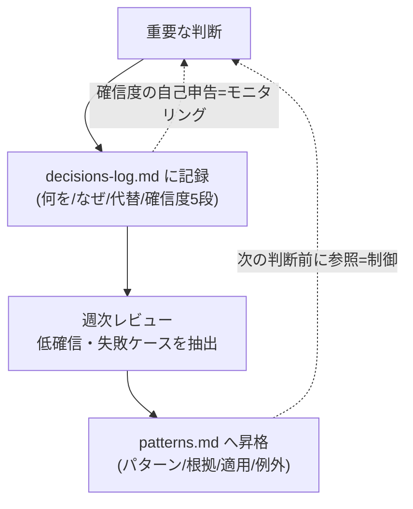

# 省察の層（メタ認知でエージェントに「振り返り」を実装する）

> **TL;DR**: タスクを実行する自分と、それを観察する自分を**構造として分ける**設計。重要な判断を確信度つきでログ化し（モニタリング）、週次でその共通点をパターンに昇格させ次の判断前に参照させる（制御）。記憶＝水平の層、スキーマ＝世界の層に対し、メタ認知は「垂直の層」。

人間が学習できるのは、タスクをこなす自分とは別に「それを観察するもう一人の自分」がいるからで、認知科学はこれをメタ認知（思考についての思考）と呼ぶ。メタ認知は**モニタリング**（今の自分の状態を観察する）と**制御**（観察結果を踏まえてやり方を調整する）の2層からなる。省察はそれを行為のレベルに落としたもので、「状況との対話」——行動が状況の反応を引き出し、その反応が予想を裏切る驚きが振り返りのきっかけになる。この観察→調整のループをエージェントに実装すると、タスクの実行後に結果を振り返り自分のやり方を問い直す層が立ち上がる。

中心になるのは2つの仕組み。

1. **判断の言語化**: 重要な判断のたびに4点を `decisions-log.md` に残させる——何を選んだか／なぜそれを選んだか／他にどんな選択肢があったか／どれくらい確信があるか（5段階）。確信度を数値で残すのが要で、低い数値が「あとで見返すべき判断」の目印になる。
2. **パターンの抽出**: 週次でAI自身に `decisions-log.md` を読み返させ、確信度の低かった判断・うまくいかなかったケースを拾い、共通点を `patterns.md` に昇格させる。書式は「パターン・根拠・適用・例外」の4点。適用と例外をセットで持たせることで、AIが表層的に真似るのを防ぐ。

この2つは Schön の "2つの省察" にそのまま対応する——判断の言語化＝**行為の中の省察**、週次の振り返り＝**行為についての省察**。また Flavell の2層にも対応し、モニタリング＝確信度の自己申告、制御＝新しい判断の前に `patterns.md` を読み過去の同じ失敗を避けること。両方を CLAUDE.md の指示に落とし込む。

**入り口は薄いインデックス**: 省察の層も入り口は `REFLECTION.md` で、各ファイルの役割だけを薄く書き詳細は個別ファイルに逃がす。毎回読まれるファイルが厚くなると省察のために常時コストがかかるため「目次は薄く、中身は厚く」。これは CLAUDE.md・SKILL.md を最小に保つ指示ミニマリズム（[[concepts/claude-code-instruction-methods]] の200行基準）と同じ発想。

**昇格という一貫構造**: 記憶では繰り返し参照されるログが意味記憶へ昇格し、省察では繰り返し現れる判断パターンが"思考の型"へ昇格する。個別の判断がやがて自分の方法論になる。領域が変わっても「繰り返されたものを一段上の層へ上げる」構造は一貫している。

**渡そうとして初めて持っていないと気づく**: 記憶・スキーマは「自分が持っているものをAIに渡す」作業だが、メタ認知は逆転がある。AIに理由を残させる習慣が、自分にも「なぜ自分はこれを選んだのか」を問わせる。言語化して初めて自分の思考の輪郭が見える——考え方を渡すことは、考え方を知ることでもある。

## 観察ログ（未検証）

- 2026-06-21 @kenichiota0711: 記憶／スキーマに続く連載第3回として「メタ認知でClaude Codeに省察を実装する」を公開（X bookmark 251・impression 18,620、2026-06-22時点）。記憶＝過去を共有する存在、スキーマ＝世界を共有する存在、メタ認知＝考え方を共有する存在、という3部構成の整理
- 2026-06-21 @kenichiota0711: `patterns.md` の「パターン・根拠・適用・例外」4点は、連載スキーマ回のバリュー記述「定義・適用・例・誤解」と同一構造だと明言。表層模倣を防ぐため適用と例外をセットで持たせる設計意図

## 問い

- このwikiの `LESSONS.md`（ingest判断の蓄積）は本ページの `decisions-log.md` に相当するが、確信度の5段階自己申告は付いていない。Tierログの `confidence` フィールドを判断ログ全般に広げ、低確信を週次で拾う運用にできるか
- 「週次で低確信・失敗を `patterns.md` に昇格」は [[concepts/skill-self-improving-loop]] の会話履歴→Issue→PR外部ループと同じ目的か。内蔵型（[[concepts/self-refining-skills]]）とどちらがこのwikiに合うか
- `REFLECTION.md` を薄い索引に保つ規律は、肥大したCLAUDE.md（[[concepts/claude-md-rules]] の200行上限）の棚卸しにそのまま使えるか

## 関連

- [[concepts/skill-self-improving-loop]] — 会話履歴→Issue→Routines→PRの外部自己改善ループ。本ページの「週次で振り返ってパターン昇格」を別セッション・別スキルに外部化した形
- [[concepts/self-refining-skills]] — LESSONS.md にその場で学びを追記する内蔵型自己改善。本ページの decisions-log とパターン昇格の最小実装
- [[concepts/claude-md-rules]] — 確信度の可視化（モニタリング）・失敗の可視化（Rule 12）と通じる行動契約。省察層は CLAUDE.md 指示に落ちる
- [[concepts/claude-code-instruction-methods]] — 「目次は薄く中身は厚く」＝REFLECTION.md を薄い索引に保つ指示ミニマリズムの公式版
- [[concepts/implementation-notes-prompt]] — 実装の傍らで判断を書き残させる手法。判断の言語化の近縁
- [[concepts/agent-memory-layer]] — 連載が前提に置く「記憶の層」。本ページのメタ認知（垂直の層）と対になる水平の層
- [[concepts/structuring-ability]] — 同著者(@kenichiota0711)の構造化力論（全体と部分の入れ子を整理する）
- [[concepts/loop-engineering]] — 観察→調整の学習ループをエージェント運用工学として一般化した上位概念
- [[concepts/semantic-generation-skill]] — 「書く前に構造化させる」という同じ設計思想を、判断ログでなく独自語の定義に適用したもの（@u1）
