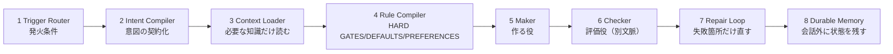

# Agent Skillの八層設計

> **TL;DR**: Agent Skillを「発火→意図変換→文脈選択→ルール検査→生成→評価→修復→記憶」の8層パイプラインとして設計するフレームワーク。生成役と評価役を分離し、指示をHARD GATES/DEFAULTS/PREFERENCESの3段階に変換して検査可能にする。

@ai_ai_ailover は、Skillの強弱を分けるのは文章量ではなく「正解に近づく工程をモデルが省略できないようにする」設計だと位置づける。「高品質なWebサイトを作ってください」「必ずテストしてください」という指示は、何をもって高品質・テスト済みとするかが曖昧なまま終わる。強いSkillは代わりに、対象読者の定義→デザイン方向の比較→ブラウザでの実操作→カテゴリ別採点→失敗項目のみ修正、という工程そのものを固定する。

## 8層の役割

1. **Trigger Router**（いつ使うか）— Agent Skillsは起動時に全Skill本文を読まず、まずnameとdescriptionだけを見て必要なものだけ読み込む（Progressive Disclosure）。descriptionには「何をするか」「いつ使うか」に加え、キーワードは似るが発火してはいけない「近接例」を書く。「Webサイト作成を支援します」のような要約文はトリガーとして機能しない
2. **Intent Compiler**（曖昧な依頼を契約へ変える）— ユーザーの一文をそのまま実装へ渡さず、対象ユーザー・成功条件・やらないこと・絶対条件へ変換し `brief.md` / `acceptance-criteria.md` / `assumptions.md` に記録してから着手する
3. **Context Loader**（必要な知識だけ読む）— SKILL.mdは500行未満・約5,000トークン未満に抑え、詳細知識は `references/` へ分離する。「必要に応じて読んでください」ではなく「日本語コピーを作成・修正する場合のみ `references/japanese-voice.md` を読む」のように条件を明記して初めてモデルは無駄なファイルを読まなくなる
4. **Rule Compiler**（お願いを検査へ変える）— すべての指示をHARD GATES（違反したら成果物全体を不合格にする絶対条件）・DEFAULTS（理由があれば変更可）・PREFERENCES（余力があれば最適化）の3段階に分ける。「ダミー実装は禁止」ではなく「クリックしても状態が変化しない主要ボタンがあれば不合格」のように検査可能な条件へ変換する
5. **Maker**（作る役）— 大きな成果物を一括生成させず、機能単位に分解し各単位ごとに完成条件を契約する
6. **Checker**（評価役）— 生成した本人に自己採点させると「大きな問題ではない」「ユーザーは気にしないだろう」と甘くなりやすいため、可能ならクリーンな文脈で別途起動する。評価結果は感想でなく `criterion_id` / `expected` / `observed` / `evidence` / `severity` / `likely_cause` / `minimal_fix` を含む証拠付きJSONで返す
7. **Repair Loop**（失敗箇所だけ直す）— 評価が低くても全体を作り直さず、原因を特定した箇所だけ修正する。同じ失敗を2回繰り返したら微修正をやめて方向転換する。最後の版ではなく、最も評価が高かったチェックポイントを採用する
8. **Durable Memory**（会話の外へ状態を残す）— `state.json` / `feature-ledger.json` / `decisions.md` などにcurrent_phase・best_checkpoint・failed_criteriaを永続化し、モデルの記憶だけに長い作業を頼らない

## ループの強さは3段階で選ぶ

| レベル | 向いている仕事 | 構成 |
|---|---|---|
| Level 1 | 軽微な修正・短い文章・単純変換 | 実行＋セルフチェック |
| Level 2 | 実務記事・Webページ・一機能の実装 | Maker＋Checker＋1〜3回修正 |
| Level 3 | 高価値アプリ・ゲーム・映像・複雑なMCP連携 | Planner＋Maker＋Evaluator＋実環境検証 |

複雑にするほど必ず良くなるわけではなく、Evaluatorはモデルが単独で安定処理できる範囲を超えたときにだけ価値が出ると著者は位置づける。初心者の初期値はLevel 2で十分としている。SKILL.md内のワークフロー自体もPLAN→BUILD→RUN→OBSERVE→GRADE→REPAIR→RETEST→STOPの8ステップに分け、初期値は最大3回反復、「HARD GATESを全通過」「直近2回で意味のある改善がない」「同じ失敗を2回繰り返した」などいずれかで終了する。[[concepts/loop-engineering]] のMVL（最小構成ループ）がリポジトリ運用ループの最小構成を定義するのに対し、こちらはSkill1回の実行内部のワークフロー粒度に当たる。

## 成功した会話からSkillを抽出する

著者が「ゼロから設計するより強い」とする手法。すでにClaudeやCodexと実際の仕事を1回成功させた会話には、最初の依頼になかった追加情報・途中で修正した内容・分野固有のGotcha・自動化できる検証・良い出力例と悪い出力例が埋まっている。これを要約でなく「再利用可能な工程」として抽出し、単発の成功に過剰適合しないよう一般化すべき原則と推測を分けて `assumptions.md` に記録する。[[concepts/skill-building-best-practices]] の「Gotchasセクションが最高シグナル」という原則と同じ着眼点を、抽出プロンプトとして具体化したものといえる。

## 観察ログ(未検証)

- 2026-07-23: 記事は「Anthropicの長時間アプリ開発実験でPlanner・Generator・Evaluatorを分け、EvaluatorがPlaywrightで実UIを操作し単独実行よりコストが大幅に増えた」と述べるが、一次ソースへのリンクはなく数値の裏取りができていない
- 2026-07-23: bookmark 2,862件（2026-07-24時点）。個人アカウント（@ai_ai_ailover）による記事の転載で、著者本人が「海外のトップ実務家」から抽出したと主張する枠組みであり一次情報源は不明

## 問い

- この8層設計と[[concepts/skill-building-best-practices]]の9カテゴリ分類はどちらも自分のwiki-ingestスキルの棚卸しに使えるが、実際どちらがより具体的な改善指示を出せるか
- Repair Loopの「同じ失敗を2回繰り返したら戦略転換」を、wiki-ingestのLESSONS.md運用（同種の判定パターンが繰り返し蓄積されている状態)に適用する価値はあるか
- 「成功した会話からSkillを抽出する」プロンプトを実際にこのvaultのSkill改善に一度使ってみる価値があるか

## 関連

- [[concepts/skill-building-best-practices]] — Anthropic社内知見による9カテゴリ分類。本ページは海外実務家による別の切り口（8層アーキテクチャ＋ループ強度3段階）
- [[concepts/self-refining-skills]] — LESSONS.md自己改善ループ。本ページのRepair Loop・Gotcha抽出プロンプトと同じ問題意識
- [[concepts/eval-loop]] — 生成→採点→閾値未満を止める品質ゲート。本ページのChecker層（生成役と評価役の分離）と同型の構造
- [[concepts/loop-engineering]] — ループ設計論全般。8ステップワークフローはSkill1回の実行内部という粒度違いの実装
- [[concepts/claude-skills]] — Claudeスキルの基本概念（永続的職務定義・自動ロード）
- [[concepts/agent-skill-management-system]] — Skillが増えた後の管理問題（発見/ライフサイクル/ガバナンス）。本ページは増える前の「作り方」側
