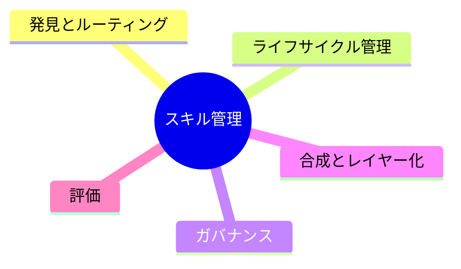

# AIエージェントのスキル管理システム

> **TL;DR**: スキルが1〜2個のうちは問題ないが増えると発見・重複・矛盾・陳腐化という「知識的負債」が生まれる。これを健全に保つには発見/ライフサイクル/ガバナンス/合成/評価の5機能を持つ管理システムが要る。

「AIに何をやらせるか」を考えるときの起点が、モデル選定からスキル選定へ移っている。同じモデルでも渡すスキル次第でアウトプットの質がまるで違うため、能力はモデル単体に宿るのではなく、モデルの上に積み重ねる後付けのレイヤーになってきた。スキルとは、ある作業をうまくやるための指示・参照知識・判断基準・ツールやテンプレートをひとまとめにパッケージ化したもので、人間組織の「引き継ぎ書」「SOP（標準作業手順書）」に相当する。賢いモデルでも引き継ぎ書なしでは我流になり、平凡なモデルでも良い引き継ぎ書があれば一定の質を出せる。

スキルが1〜2個のうちは手で渡せば済むが、十数個に増えると困りごとが顔を出す。**発見の問題**（必要なスキルが呼ばれない、別の似たスキルが誤発動する）、**重複の問題**（似て非なるスキルが増え、どれが正か分からない）、**矛盾の問題**（スキルAとBで言っていることが食い違う）、**陳腐化の問題**（半年前のスキルが今のやり方と合っていないが誰も消していない）。これはソフトウェア開発の「技術的負債」と同じ構造で、知識的負債と呼べる。

## スキル管理システムの5機能

1. **発見とルーティング**: エージェントが多数のスキルから「今これを使うべきだ」を自分で選べる必要がある。選択精度を決めるのはスキル本体の中身ではなく、付けられた説明文（メタデータ）の質。図書館の分類や検索エンジンに近く、ラベルが雑だと良いスキルでも永遠に発見されない
2. **ライフサイクル管理**: スキルは作って終わりでなく、試す・直す・バージョンを上げる・捨てるの循環を持つ。最も大事で最も難しいのが「捨てる」工程。これを怠ると知識的負債が溜まる
3. **ガバナンス**: スキルはエージェントの行動を直接書き換えるため、悪いスキルはそのままリスクになる。誰が追加・編集できるか、どんなチェックを通すか。「自由に作れること」と「勝手に作られないこと」の両立が論点
4. **合成とレイヤー化**: スキルが成熟すると「共通の幹」（文書作成の基本作法等）の上に「個別の枝」（議事録用・提案書用）が乗る構造になる。スキル同士が呼び合い積み重なる設計はまだ発展途上の領域
5. **評価**: 「このスキルは本当に成果につながっているか」を測る仕組み。効果が分からないスキルは足し算も引き算もできず、管理が感覚論に陥る

これら5機能は企業が何十年も格闘してきた「ナレッジマネジメント」の構造そのものであり、スキル管理システムは技術の皮をかぶった知識経営の問題と捉えられる。スキルを作る行為自体が、頭の中の暗黙知を形式知に変換する作業であるため、スキル管理がうまい組織とは「自分たちのやり方を言葉にするのが得意な組織」になる。属人化していて誰も言語化していない組織は、高性能なAIを導入しても渡せるスキルがない。

## 検証済み事実

- Microsoft Copilot Coworkは、Microsoft 365内でメール送信・資料作成・会議調整等の複数ステップ作業を実行する実行レイヤー。OneDrive上に `SKILL.md` 形式の独自スキルを置くと、それを覚えて使えるようになる
- Google Gemini Sparkは、Google I/O 2026で発表された24時間稼働のパーソナルエージェント。新しいスキルを教えることを前提に設計され、GmailやDocsを横断して多段の作業をこなす
- 両プロダクトとも2026年6月時点ではまだ限定提供段階（Copilot Coworkはプレビュープログラム経由、Gemini Sparkも一部テスター・上位プランからの段階展開）

## 観察ログ（未検証）

- 2026-06-12 (@ozaken_AI): 顧問先では正式機能を待たず、①Gem/Copilot Studioのカスタムチャットボットでスキルを先行運用、②「スキルマネジメント・スプレッドシート」（どんなスキルがあるか・誰が作ったか・何の業務か・最終更新日を部署横断で共有）の2つで先取りしていると報告。ツールは変わるが「どんな業務知識をどうスキル化したか」という中身は引き継げる資産として残る、という主張
- 2026-06-12 (@ozaken_AI): プログラミングのパッケージマネージャ／レジストリと同じ道をスキルも辿るという予感。個人作成→チーム共有→業界共通スキルが「公開・流通・評価」される段階へ進み、良いスキルを書ける人・組織が価値の源泉になるという予測
- 2026-06-12 (@ozaken_AI): 「希少なのはAIを使える人ではなく、自分や現場のノウハウを言語化してスキルに落とせる人」という結論。スキルは最初から完璧に書こうとせず、80点で書いて運用しながら磨くのが良いという著者の流儀

## 問い

- このwikiの `wiki-ingest`／`wiki-research-radar` 等のスキル群は5機能のうちどこが手薄か。特に「ライフサイクル管理（捨てる）」と「評価」は[[concepts/skill-building-best-practices]]のgotchas蓄積だけでは足りないのではないか
- スキルマネジメント・スプレッドシート（業務名・作成者・最終更新）は、このリポジトリの `.claude/skills/` 一覧を同じ形式で棚卸しすると何が見えるか
- 「スキルのパッケージマネージャ」予測は、すでにある[[tools/claude-code-plugins]]のマーケットプレイスや[[tools/obsidian-skills]]のような共有リポジトリと、どこまで一致しているか

## 関連

- [[concepts/claude-skills]] — スキルの基本概念（永続的職務定義・自動ロード）。本ページが論じる「増えた後」の管理問題の前提
- [[concepts/skill-building-best-practices]] — スキルの「作り方」側の知見（9カテゴリ・gotchas・description＝トリガー定義）。本ページの「発見とルーティング」「評価」と直接対応
- [[business/skill-library-strategy]] — スキルを企業の私有資産として戦略的に捉える論考。本ページの「知識経営の問題」という結論と同じ方向
- [[papers/2026-zhou-colleague-skill]] — 人物の作業痕跡からスキルを自動蒸留する研究。本ページの5機能（特にライフサイクル管理・合成）を自動化側から実装する試み
