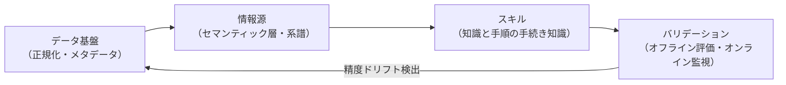

# LLMを使った業務分析エージェントの設計

> **TL;DR**: LLMを使った業務分析エージェントの正確性は「コード生成」でなく「コンテキストとデータ品質の問題」。エンティティ曖昧性・データ陳腐化・検索失敗の3失敗モードを直接攻撃する4層スタックを構築することで、精度を21%から95%超に引き上げることができる（Anthropic社内実績）。

コーディングエージェントはオープンエンドの解空間で創造性を発揮できるが、業務分析には唯一の正解と唯一の正しいデータソースが存在し、決定論的な正誤検証ができない。LLMをデータウェアハウスに接続して実行を任せるだけでは「精度の錯覚」が生まれる。真の問題は**ユーザーの質問をデータモデル内の正確なエンティティにマッピングできるか**である。

## 3つの失敗モード

| 失敗モード | 内容 | 例 |
|---|---|---|
| エンティティ曖昧性 | 何百ものフィールドから正しいものを選べない | 「アクティブユーザー」= 何をもって「アクティブ」？不正ユーザーを含む？ |
| データ陳腐化 | データソース・スキーマ・ビジネス定義が変わりエージェント知識が古くなる | スキル未更新のまま1ヶ月でオフライン精度が95%→65%に低下 |
| 検索失敗 | 正しい情報がデータモデルに存在するのにエージェントが見つけられない | 数百万フィールドの検索空間から正解を引き当てられない |

## 4層のアジェンティック分析スタック

### データ基盤（Layer 1）

スタックの最上流。曖昧性とデータ陳腐化への最初の防衛線。

- **正規データセットの作成**: 「revenue」を1つのガバナンス済みデータセットに解決する。候補が複数存在する問題の大半はここで消える
- **ルールの三点固定**: ツール（エージェントを正規パスに構造的にルーティング）＋CI（変更時の自動チェック）＋マンデート（ガバナンス層上に構築）の3つで強制する
- **アーティファクトのコロケーション**: データモデル・セマンティック層・参照ドキュメントを単一リポジトリに置き、CIがクロスレイヤー整合性を守る
- **メタデータをファーストクラス製品として扱う**: カラム説明・メトリクス定義・粒度ドキュメント・所有者情報をコードと同等の厳密さで維持する

### 情報源（Layer 2）

エージェントがデータモデルを航行するための参照サーフェス。降順信頼度で示す。

- **セマンティック層（最優先）**: 定義済みメトリクスにマッピングできる質問は関数を呼び出して一意の数値を返す。LLMに自動生成させると曖昧性を内包する定義が生まれるため、**ドキュメントはClaudeが生成し、定義は人間が所有する**
- **系譜と変換グラフ**: セマンティック層でカバーされない場合、参照数ランキングとテーブル系譜でどのモデルを集計すべきかを推論する
- **クエリコーパス**: 過去のSQL履歴を直接RAG検索に使っても精度向上は微小。構造化した参照ドキュメントとパターンに蒸留する「原材料」として扱う
- **ビジネスコンテキスト**: 「Q2ローンチ」が何を指すか、チーム間で同じ用語が異なる定義を持つ場合等を解決するため、ロードマップ・意思決定ログ・組織図などの組織知識グラフを接続する

### スキル（Layer 3）

スキルは手続き的知識。「何を意味するか」ではなく「どの順序でどのソースを参照し、最終的な分析がどう見えるか」を定義する。

**スキルなしの精度: 21% → スキルあり: 95%超**（特定ドメインでは99%）

- **ペアスキルの作成**: 「知識スキル」（セマンティック層優先→フォールバックで30件程度の参照ファイルへのルーター）と「アンブックスキル」（質問明確化→ソース特定→クエリ実行→アドバーサリアルレビューの手順）を対にする
- **LLM向け参照ドキュメントの作成**: テーブルの粒度・スコープ・除外条件・ゴッチャを記述。再現可能なレシピでなく「なぜ間違えるか」の説明を優先する
- **スキル保守を一等市民として扱う**: スキルを更新しない場合1ヶ月で精度が大幅にドリフトする。データモデルと同一リポジトリにスキルを置き、モデル変更PRには必ずスキル更新を含めるCIフックを設ける
- **全サーフェスで一貫した体験**: Slack・IDE・ダッシュボードツール・スタンドアロンセッションで同一スキルが同一回答を返す。正規ソースは単一のデータリポジトリ、変更はMCP経由で同期

### バリデーション（Layer 4）

3つの失敗モードのどれが漏れているかを検出する機構。

**オフライン評価**:
- ダッシュボードベース評価（主要な質問をClaudeが自動生成→人間がバリデーション）
- ロングテール評価（ビジネスコンテキスト→Claudeが想定外の質問を生成）
- 精度目標は~100%。ドメインオーナーが90%以上を達成するまではそのドメインでのローンチを承認しない

**アブレーション技術**:
- 一度に1コンポーネントのみ変更して精度変化を比較。最重要知見: 数千ファイルの過去SQLへのgrep直接アクセスを追加しても精度変化は1pt未満。ボトルネックはアクセスではなく**構造**（質問から正しいエンティティへのマッピング）だった

**オンラインバリデーション**:
- **アドバーサリアルレビュー**: サブエージェントが全前提仮定を積極的に検証し、最終回答前にブロッキング問題を修正する。精度+6%（ただしトークン+32%、レイテンシ+72%）
- **プロバナンスフッター**: 全レスポンスにデータソース階層・鮮度・所有チームを添付。「Raw table、freshness unknown」は上流に転送する前に要検証のサインとして機能する
- **アクティブ修正ハーベスティング**: スケジュールエージェントがSlackを定期スキャンして修正コメントを検出→参照ドキュメントの修正PRを自動起票→マージ後に全サーフェスへ自動同期

## 検証済み事実

- 2026-06-16: Anthropicのデータサイエンス・データエンジニアリングチーム（Chen Chang, Clement Peng, Justin Leder, Johanne Jiao, Josh Cherry）が社内実績とベストプラクティスを公開。業務分析クエリの95%をClaudeで自動化し、総合精度~95%を達成している

## 観察ログ（未検証）

- 2026-06-16: スキルなしでの精度21%というベースラインは、ウェアハウスに直接Claudeを向けた場合の数値（著者らのevalセットによる）
- 2026-06-16: セマンティック層をLLMで自動生成した場合は精度がネガティブ（人間キュレーションより悪化）。曖昧性を「排除」でなく「封じ込め」てしまうため（著者による）
- 2026-06-16: データモデルPRの90%が同一コミットにスキル変更を含む状態を達成（CIフック導入後）。著者はこれを保守コスト解決の主要な施策と位置付けている
- 2026-06-17: @yam_dr による日本語二次解説が、検索失敗モードについて「不正解だった回答の約80%は、正しい情報がコーパス内に実在していた」という数字を紹介。ボトルネックはモデルの推論力でなく「正しい情報への到達可能性（メタデータ・カタログ・絞り込み）」にある、という読みの裏付けとして引用（Anthropic公式記事からの引用とされるが本Wikiでは一次未確認）
- 2026-06-17: 同解説は[[concepts/openai-data-agent-context-layers]]との対比を「コンテキストの広さ＋ループで収束（OpenAI）」対「決定論的経路でそもそも当てにいく（Anthropic）」と整理。入口は逆だが、両社とも『正しい手続き』をどこかで人手で用意し、ゴールデンSQLとのevalで検証する点は共通、という@yam_drの解釈

## 問い

- Anthropicが「うまくいかなかった」と明言した「LLMによるセマンティック層自動生成」は、なぜ精度にネガティブだったか？曖昧性の「封じ込め」と「排除」の違いは何か？
- スキル保守コストをゼロに近づけるには何が必要か？スキルとモデル定義を同一PRに含めるCIルールはその答えのひとつだが、ドメインオーナーが薄い組織ではどう代替するか？
- [[concepts/openai-data-agent-context-layers]]の「コードエンリッチメント（Layer 3）」とAnthropicの「コロケーション」アプローチは何が違い、どちらが保守しやすいか？

## 関連

- [[concepts/openai-data-agent-context-layers]] — OpenAIが同時期に公開した自社データエージェントの6層コンテキスト設計。エンティティ選択問題への構造的アプローチが共通
- [[concepts/eval-loop]] — 精度ゲートとして機能するevalループ。本ページのバリデーション層と直接対応
- [[concepts/multi-agent-patterns]] — アドバーサリアルレビューサブエージェントがここで言及されるfan-outパターンに相当
- [[concepts/claude-skills]] — 本ページのスキル層（Claude Codeスキルフォルダ）の概念的基盤
- [[companies/anthropic]] — 本記事の発信元
- [[tools/google-knowledge-catalog]] — Google Cloudが同型のパイプライン（メタデータ収集→エンリッチ→検証済みクエリ）をマネージド製品として提供
