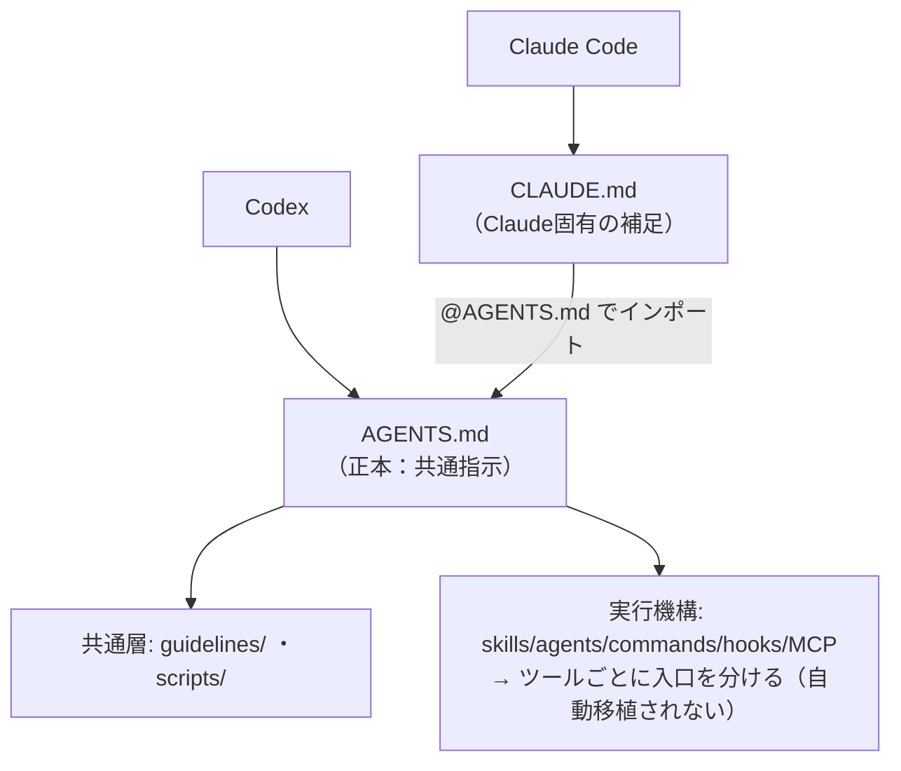

# AGENTS.md を正本にしたクロスエージェント設定

> **TL;DR**: Claude Code（CLAUDE.md を読む）とCodex（AGENTS.md を読む）で同じフォルダ環境を使うには、共通指示を AGENTS.md に一本化し、CLAUDE.md は @AGENTS.md で取り込む薄い補足にする。ただし共通化できるのは「指示文」だけで、skills/agents/hooks/MCP のような実行機構はツールごとに入口を分ける必要がある。

ツールが違えば最初に読む設定ファイルの名前も違う。Claude Code は `CLAUDE.md`、Codex は `AGENTS.md` を入口として読む。両方を使いたいからと同じ内容を両ファイルにベタ書きすると、片方だけ更新されて定義がズレる「二重管理」に陥る。これを避ける構造が、共通指示の正本を1ファイルに寄せ、もう片方からインポートする設計である。

正本に **AGENTS.md** を選ぶ理由は3つ。第一に、Claude Code には `@ファイル名` で別ファイルを取り込むインポート機構があり、CLAUDE.md の中に `@AGENTS.md` と書けば AGENTS.md の内容を読み込める。Codex 側には設定ファイル内で別ファイルを自動インポートする同等の仕組みがないため、Codex が直接読む AGENTS.md を正本にし、Claude Code がそれを取り込む向きが自然になる。第二に、Anthropic 公式ドキュメント（How Claude remembers your project）でも、既に AGENTS.md を使うリポジトリでは CLAUDE.md から `@AGENTS.md` で読み込めば両ツールが同じ指示を見られる、と共存パターンとして案内されている。第三に、CLAUDE.md は Claude Code 専用のファイル名だが、AGENTS.md は Codex をはじめ複数のコーディングエージェントが参照する事実上の共通指示ファイルとして広がっており、将来別ツールを足すときも汎用的に効く。

## 共通化できる層と、できない層

最大の落とし穴は「AGENTS.md に書けば Codex でも同じ環境が再現される」という誤解である。AGENTS.md に書いた内容は、Codex にとっては基本的に**指示文（参照ドキュメント）**にすぎない。一方で skills・agents・commands・hooks・MCP は、ただ読まれるドキュメントではなく**実行機構**である。Claude Code の `.claude/skills/` を読ませても Codex 側の登録済みスキルとして自動発火するわけではないし、`.claude/agents/` を読ませても Codex のカスタムエージェントとして起動するわけではない。「設定を読める」ことと「同じように動く」ことは別問題。

| 層 | 例 | 共通化の扱い |
|---|---|---|
| 共通指示 | 文体・参照フォルダ・承認ルール・ルーティング方針 | AGENTS.md に正本を置き CLAUDE.md は @import で取り込む |
| 共通参照 | `guidelines/` ・ `scripts/` | 両ツールから参照しやすいファイル群としてそのまま共有 |
| 実行機構 | skills / agents / commands / hooks / MCP | ツールごとに入口を分けて別々に登録・有効化する（自動移植されない） |

したがって、Claude Code で育てた環境を Codex でも近い感覚で使うには、(1) 設定ファイルを AGENTS.md に一本化したうえで、(2) Codex 側の実行環境を別途足す、の二段構えになる。subagent の起動方法・hooks の有効化・外部連携の承認は、見た目が揃っても挙動確認が要る部分として残る。

## 観察ログ（未検証）

- 2026-06-15: @showheyohtaki が、Claude の自動化系料金変更（2026-06-15 開始）をきっかけに、Claude Code 環境を Codex でも使えるよう棚卸しした実践として発信。自身は「10部門・約20人の仮想社員」をフォルダ構成（guidelines/=思想と文体、.claude/skills/=ワークフロー、.claude/agents/=専門エージェント、.claude/rules/=作業ルール、hooks/=自動実行、scripts/=よく使う処理）で運用していると述べる
- 2026-06-15: 棚卸し→移行を人力で設計するのは重いとして、既存の Claude Code 環境を壊さず棚卸しして Codex 環境を構築する「一括移行プロンプト」を LINE で無料配布する旨を告知（プロンプト本体は本ソースには含まれない）

## 問い

- このvault（CLAUDE.md と AGENTS.md がシンボリックリンクで同一内容）は既に一本化されているが、Codex 等から開いたとき skills/hooks の実行機構までは移植されない。Codex 側で発火させたいスキル・フックはどれで、どう別登録するか
- @import で取り込む方式と、シンボリックリンクで同一ファイルを指す方式は、保守性・他ツール互換でどちらが優れるか
- 「共通指示 vs 実行機構」の線引きは、[[concepts/cursor-instruction-methods]] の5分類（AGENTS.md/Rules/Commands/Skills/Subagents）とどう対応するか

## 関連

- [[concepts/cursor-instruction-methods]] — AGENTS.md を含む5つの指示手段を適用タイミング×再利用範囲×コンテキスト分離で使い分けるフレーム。本ページの「指示文 vs 実行機構」と同じ境界を別軸で整理
- [[concepts/ai-session-handover]] — AGENTS.md/Skill を後続エージェントへの引き継ぎ入口として使うパターン（こちらはセッション間、本ページはツール間の移植）
- [[concepts/claude-code-context-hierarchy]] — Memory/Slash commands/Permissions/MCP が同一4層構造に従う設定設計。設定をどこに置くかの軸
- [[concepts/claude-md-rules]] — CLAUDE.md/AGENTS.md に仕込む行動ルールの中身
- [[tools/claude-code]] — `@ファイル名` インポート機構を持つ側
- [[tools/openai-codex]] — AGENTS.md を入口として読む側
- [[concepts/open-knowledge-format]] — AGENTS.md/CLAUDE.md のアドホックな慣習を、フォーマットとして標準化しようとするGoogle Cloud発の仕様
