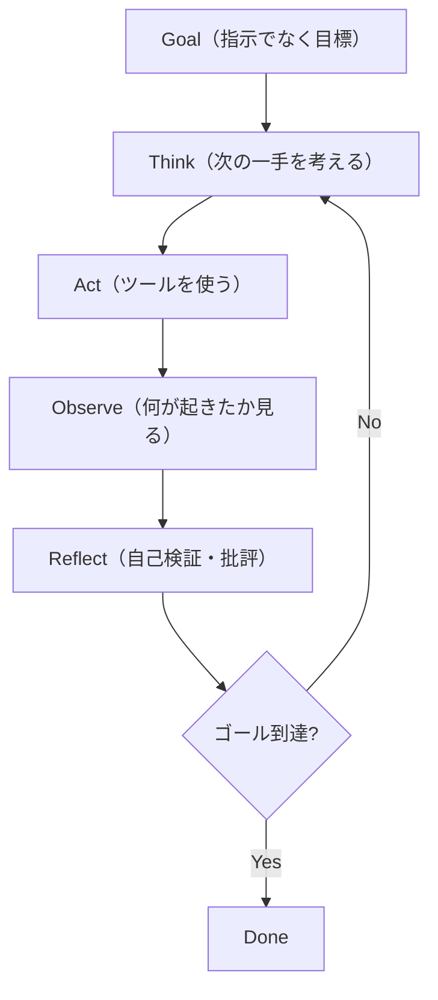

# AIエージェントの構成要素（ReActループと5ブロック）

> **TL;DR**: チャットボットは一度答えて止まる。エージェントはゴールに到達するまで「考える→ツールを使う→結果を確認する→直す→再試行する」を回し続ける。あらゆる本物のエージェントはこの1つのループ（ReAct）に、5つの構成要素（脳・手・記憶・ループ・検証）を巻き付けたものに還元できる。

エージェントを理解する鍵は「プロンプトの良し悪し」から「システム設計」への視点移動にある。`Prompt → Answer` はチャットボット。本物のエージェントは `Goal → Think → Act → Observe → Reflect → Retry → Done` という **ReActループ**（Reasoning + Acting、2022年の論文で命名）で動く。Cursor・Claude Code・Devin など実用エージェントはすべて「このループにツールとメモリを足したもの」にすぎない。だから差がつくのは巨大な単発プロンプトの巧拙ではなく、ループの設計である（[[concepts/loop-engineering]] と同じ主張）。

**3段階で能力が変わる**。(1) **Plain AI**＝瓶の中の脳。知っているし語るが何にも触れない（ChatGPT/Claude/Geminiとの会話）。(2) **AI Agent**＝脳に手が付く。手＝ツール（検索・コード実行・ファイル・API・メール・カレンダー）。ツールがなければLLMはチャットボックスに閉じ込められたまま。(3) **Agentic AI**＝指示でなくゴールを与えると、必要なサブタスクを自分で分解し、障害（材料切れ等）に出くわせば人間に聞かずに代替へ切り替え、自分の作業を検証し、規模が大きければ追加のエージェントを呼ぶ。「指示を出す」から「ゴールを渡す」への一文の転換が本質。

**動くエージェントは例外なく5つの構成要素を持つ**——多くもなく少なくもなく5つ:

1. **脳（LLM）** — 推論エンジン。次に何をするか・どのツールを使うか・いつ完了かを決める。他の4つがなければ「語るだけ」。
2. **手（ツール）** — 検索・コード実行・DB照会・API呼び出し・ファイル読み書き・メール送信など。語るのをやめて「やる」に変わる地点。あらゆる能力＝ツール。
3. **記憶（メモ帳）** — 短期記憶（いま取り組んでいること・直近の結果・エラー）がないとエージェントは同じ失敗を繰り返し無限ループに陥る。長期記憶（セッションを跨いで学んだこと。例: DBのカラムは `customer_id` でなく `cst_id_v2` だった）がないと毎回ゼロから始め過去の過ちを繰り返す。対策は「大きなステップごとに進捗ノート（完了したこと/決定と理由/現在地/次の一手）を書く」習慣。
4. **ループ（自己修正）** — 一発で完璧を狙わず、下書き→自己批評→修正→再試行を回す。同じモデルでも反省ループで出力品質が大きく変わる（例: ぶっきらぼうなメール下書きを「品質確保のため2日延ばすことを推奨します」と解決志向に書き直す）。
5. **検証（品質ゲート）** — 多くのエージェントが失敗するのは脳が弱いからではなく**自分の仕事を確認しないから**。「本当に正しいか/コードはエラーなく動いたか/元の問いに答えているか/見落としは何か」を問う自己検証を1ステップ足すだけで信頼性が60%→90%に上がる、という主張。

**失敗するエージェントの型は6つ**: ①記憶がない（同じ壊れた手を繰り返す）②ツールがない（訓練データから自信満々に幻覚）③ループがない（一度生成して止まる）④検証がない（バグに気づかない）⑤停止条件がない（無限に走りクレジットを焼く——対策: 最大ステップ数・最大リトライ・タイムアウト・詰まったら人間に聞く）⑥自律性を早く与えすぎる（初日にインターンへ会社経営を任せるようなもの——対策: 狭いゴール＋ガードレール＋高リスク行動はhuman-in-the-loop）。

設計の優先順位として「**アーキテクチャはフレームワークに勝る**」と説く。LangGraphの悪いエージェントは悪いエージェントのまま。50行のPythonでも目的が明確なら肥大した多フレームワーク構成より有用。まずReActループを理解し、フレームワークなしの最小エージェントを書いて壊し、ツール→反省→クリティックエージェントの順に足していくのが推奨ロードマップ。

## 観察ログ（未検証）

- 2026-06-11 (@sairahul1): 「2026年の勝者はより良いプロンプトを書く人ではなく、より良いシステムを設計する人」と予測。"Prompt engineering was the beginning. Agent engineering is what matters now." と主張。
- 2026-06-11 (@sairahul1): 2026年に実際に使うツールとして building: Claude Code（最良のコーディングエージェント）/ OpenAI Agents SDK / LangGraph（リトライ・チェックポイント・承認ゲートが要るとき）/ CrewAI（マルチエージェント）。connecting: MCP（"AIツールのUSB規格"——build once, connect to any agent）。memory: Pinecone/Qdrant/pgvector。local: Ollama。を列挙。
- 2026-06-11 (@sairahul1): 検証ステップ追加で「信頼性60%→90%」、クリティックエージェント導入で「20個の凡庸なアイデアが3個の良いアイデアに変わる」と単一ソースの効果を提示。具体的な測定根拠は記事内に未記載。
- 2026-06-11 (@sairahul1): スタートアップ・リサーチエージェントを題材に Researcher→Critic→Market Analyst→Final Scorer の4エージェント分業を「リサーチチームのように感じる」構成として提示。週末で最初のエージェントを作るDay1〜2の時間配分ロードマップ付き。

## 問い

- この「5ブロック＋ReActループ」の枠組みと、同著者の [[concepts/harness-engineering]]（エージェント=モデル+ハーネス）はどう接続するか？ 5ブロックの大半は「ハーネス」側の構成要素では？
- 「検証1ステップで60%→90%」は自分のwiki-ingest/weekly生成にも効くか？ 既に [[concepts/eval-loop]] の品質ゲートを持っているが、自己検証プロンプトを各スキルに足す余地は？
- 停止条件（最大ステップ・タイムアウト・詰まったら人間）を自分のheadless実行（launchd ingest）にどう組み込むか？

## 関連

- [[concepts/harness-engineering]] — 同じ@sairahul1による上位概念「エージェント=モデル+ハーネス」。本ページの5ブロックはハーネス側の具体例にあたる
- [[concepts/loop-engineering]] — ReActループ＝ループ設計。人間がループ外に出る工学的転換
- [[concepts/12-factor-agents]] — 信頼性の高いLLMアプリ構築の12原則（コンテキストエンジニアリング・ステートレス設計）
- [[concepts/multi-agent-patterns]] — Researcher/Critic等の専門エージェント分業の設計パターン
- [[concepts/eval-loop]] — 生成→採点→閾値未満を止める品質ゲート（本ページの「検証」ブロックの実装）
- [[concepts/agent-memory-layer]] — 短期/長期記憶を支える共有メモリ層の設計
- [[tools/claude-mcp]] — 「AIツールのUSB規格」として挙げられたツール連携標準
- [[concepts/agent-autonomy-levels]] — 別著者(@Mahaximus_)による4段の梯子。本ページの3段階に「どう起動されるか」という運用レベルを足した版で、記憶ブロックの破綻を3型に分けている
