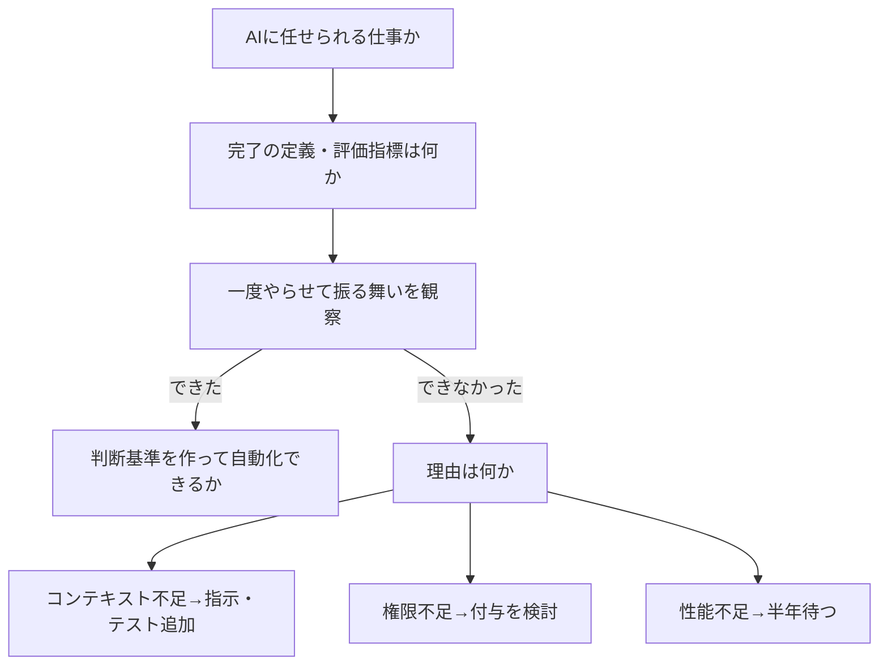

# AIコーディングのループ設計と形式手法（mizchi の棚卸し）

> **TL;DR**: 人間の仕事を「モデル評価・ループ構築・評価指標づくり・CIの優先度づけ」に移し、数値化できる指標と /goal でループを回し、仕様の正しさは TLA+/Z3 などの形式手法で検査する、という mizchi の 2026年10月時点の実務まとめ。

mizchi が仕事先への共有用に書いた Zenn 記事で、本人は冒頭で「棚卸し的な記事」、末尾で「またすぐ変わると思います」と位置づけている。コードを書く作業が AI に移った後、人間に残る仕事は何かを先に定義し、そこから逆算してループ・評価指標・理解の方法・形式手法を並べる構成になっている。X 投稿は 2,356 ブックマーク（2026-10-05 時点）。

## 人間の役割と考える順番

mizchi は人間の役割を次の5つに置く。

- **モデルの性能を評価する**: 無茶振りしてどこまでできるか観察する。何ができて何ができなかったかがドメイン知識になる
- **ループを構築する**: 自動化で浮いた時間を評価指標の改善に回す
- **評価指標を作る**: どの数値を改善すべきか、トレードオフで何を優先するか決める
- **ループのイテレーションを評価する**: AI の行動ログを見て、評価指標を正しく追えているか確かめる
- **テストと CI をチューニングする**: 指標が増えると CI が長くなるので、何を優先し何をやらないかを決める

仕事ごとの考える順番は上の図のとおりで、「数値化できるものなら AI で自動化できる」「人間がつきっきりでなく判断基準自体を作れるか」が分岐点だと mizchi は書く。できなかった理由の切り分け（コンテキスト・権限・性能）は、[[concepts/eval-loop]] の「閾値未満を止める」より手前の、タスクを AI に渡せるかの診断にあたると考えられる。

## 常にアンラーニングする

mizchi は「プロンプトは高速に陳腐化する」とし、「あなたは優秀なプログラマです」や「ゆっくり深呼吸して」（数学性能が7ポイント改善した、と記事は紹介）をもう古い例に挙げる。そのうえで次の方針を示す。

- AGENTS.md のグローバルプロンプトは基本的に**書かない**
- 書くなら「選択肢が複数あるときの判断基準」だけ（node は 24+、新規は npm でなく pnpm、nix の使用有無、Rust stable 1.99、gh stack など）
- 一般的でないこだわりや制約は AGENTS.md に書く
- モデルの組み込み知識は半年ほど古い。skill は（おそらく）重点的に学習されるので不要になるのが速い

既存リポジトリへの適用は「現状の構成を読み取って解説して」から始め、速習しながら自分の理解とのズレを確かめる、と mizchi は書く。

**世界知識と /compact**: コンテキストに与えた情報はモデル内の世界知識より優先される。モデルにとって既知の情報が多くなるように（よく知られた OSS で構築するように）すると高効率で動く。`/compact` は判断基準が正しく与えられていないと間違っている側に倒れる、と注意している。

## ループの道具立て

- **原始的な Ralph Loop**: `while :; do claude -p "Git 履歴を見て次にやることを探して"; done` の無限ループ
- **/goal**: セッション終了のたびにフックで目標文が再送され、goal を満たすまで自律ループする（[[tools/claude-code-goal]]）
- **dspy/RLM（実験的）**: ワークフローがある程度決まったものについて、巨大コンテキストをインタプリタで実行されるコード断片に分解する（[[tools/dspy]]）
- **マルチエージェント（実験的）**: mizchi は「現在決定的な解がない。難しいなら無理して使わなくていい」と書き、使うなら「干渉が少ないものをレーンに分割して、レーンごとにサブエージェントを分割して」と指示する

**探索的改善**: エージェントを信用してある程度丸投げする。例として「現在の実装と最新の研究を比較して」「SRE視点でテレメトリを計装して」「データベースに対するN+1を見つけて潰して」「攻撃側としてチェックリストを作り localhost に閉じてペネトレーションして」を挙げ、**視点**（誰にとって何の数値が大事か）が改善理由になると述べる。見つかったものは「Umbrella Issue でまとめて」で GitHub の1 Issue に集め、それを /goal に渡す流れになっている。

## /goal と組む評価指標

mizchi は「具体的な数値に落とせるものが望ましい。主観的な判断が必要だと、ユーザーが都度呼び出される」として次を挙げる。

- パフォーマンスベンチマーク（CI では安定しないので RSS や Fuel など決定的な指標を優先）
- メモリ使用率の RSS（hyperfine・perf・valgrind）
- 厳しいルールの lint warning 数（循環複雑度の moznion/cccc、コード重複率の mizchi/similarity）
- Mutation Test の Kill 率
- VRT（ビジュアルリグレッションテスト）の一致率

## 理解する・マージする

具体のコードを全部読むのは間に合わないので、せめて振る舞い（E2E のケース名・テストコード・関数シグネチャ）を把握し、スキルで AI に概念的に解説させる、と mizchi は書く。自作の mizchi/explainer で説明画像を作らせ PR に添付する使い方も紹介している。これは [[concepts/cognitive-debt]] が扱う「AI が書いたコードを人間が理解しなくなる」問題への、読む対象を絞る側の対処と読める。

マージ自動化は実験段階として、OpenAI が AI トリアージで安全なコードはそのままマージし、DB スキーマ変更や terraform 変更は人間にエスカレートしている「らしい」と伝聞で紹介し、mizchi 自身も同種のレビューツールを作成中だと書く。

## 形式手法

mizchi は形式手法を「実装しようとしている仕様がそもそも合っているか」の検査に使う。自然言語がそのまま形式仕様になるのでなく、性質を記述するイメージだという。

| 対象 | 道具（記事の指定） |
|---|---|
| マイクロサービス、マルチスレッドのキャッシュ制御 | TLA+ か Quint |
| 述語論理で書ける制約 | Z3 |
| アルゴリズム自体の開発 | Lean |
| ユーザー権限まわり | Alloy |

「マイクロサービス、マルチスレッドのキャッシュ制御はほぼ確実に漏れがある」は mizchi の経験則で、「困ったら Z3 か TLA+ を使っておくとよい」としている。実際の指示例は次の3つ。

- 「今あるコードを形式化できる部分を形式化して、それをテストオラクルに、実装がそれに従ってるか確認して」
- 「モデル検査で反例が出たら、それを実際のテストケースに落として」
- 「何を検査したか、ドメインの言葉を使わずに例え話で説明して」

形式仕様をテストオラクル（正解判定器）にする発想は、[[concepts/eval-loop]] の評価器を「人が決めた数値」から「仕様からの導出」に置き換えるものと考えられる。

## 問い

- 「AGENTS.md は基本書かない・判断基準だけ書く」は、このリポの CLAUDE.md の厚さと比べてどこまで削れるか？
- 形式仕様→反例→テストケースの流れは、仕様のない既存コードでどこまで実用になるか（何を「形式化できる部分」と判定させるのか）？

## 関連

- [[concepts/goal-loop-routine]] — /goal・loop・routine の使い分け。本ページは /goal に渡す評価指標と Umbrella Issue の作り方の側
- [[tools/claude-code-goal]] — 本ページの /goal の具体実装
- [[concepts/loop-engineering]] — ループ設計の全体論。本ページはその実務版の棚卸し
- [[concepts/eval-loop]] — 数値化した評価指標でループを止める品質ゲートの一般形
- [[concepts/agents-md-canonical]] — AGENTS.md の置き場所の設計。本ページは中身を「判断基準だけ」に絞る方針
- [[concepts/multi-agent-patterns]] — 本ページが「決定的な解がない」とするマルチエージェントの型
- [[concepts/cognitive-debt]] — AI が書いたコードを理解しなくなる問題。振る舞いと説明画像で理解する対処
- [[tools/dspy]] — 実験的手法として挙げられた dspy
- [[tools/laya-mlx]] — 同著者（mizchi）の小型判断モデル実測
