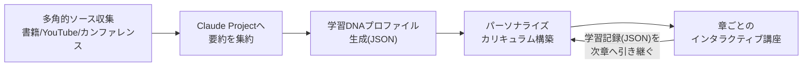

# AI駆動カリキュラム構築（学習DNAプロファイル×パーソナライズ講座）

> 📌 X bookmark: 17,461（2026-07-15 時点）

> **TL;DR**: 複雑な専門分野を丸ごとマスターするための5段階システム——多角的ソースの要約をClaude Projectへ集約し、学習者の認知特性を「学習DNAプロファイル」としてJSON化し、それに合わせてパーソナライズしたカリキュラムと章ごとのインタラクティブ講座を生成し、各章の学習記録を次章のAIへ引き継ぐフィードバックループを回す。

多くの人は専門書をAIに要約させて終わりにしてしまうが、@EXM7777 は「1冊読んで満足する」学び方と「複数の情報源を1つのシステムに統合し自分の認知特性に合わせて再構成する」学び方は別物だと述べる。実例としてゲーム理論を題材にしているが、著者はこれを特定分野の攻略法でなく「複雑な知識領域を深く習得するためのメタフレームワーク」として提示しており、量子物理学や行動心理学など任意の分野に転用できると主張する。

## Step1〜2: 知識収集とAIへの投入

まず書籍（Von Neumann & Morgenstern の原典から応用書まで8冊）・YouTube講義（Yale/Stanfordの公開コース等）・学会録画といった複数種のソースをかき集める。ここで著者が強調するのは「1つのソースを丸ごとLLMに投げない」こと。書籍は分割してアップロードし、専用プロンプトで「著者独自の視点・声を保った詳細サマリー」を1冊ずつ作らせ、その出力ファイルをClaude Projectに蓄積していく。YouTube動画はNotebookLMの動画解析機能でPDF化してから同じProjectに追加する。全ソースを個別に処理してから1箇所に集約する、という順序がこの手法の肝だと著者は述べる。

## Step3: 学習DNAプロファイル

次に専用プロンプトでユーザー自身の学習スタイルを診断させ、その結果をJSONファイルとしてProjectに保存する。大枠から入るか積み上げ型か、反復定着型か即応用型か、といった認知特性を明文化し、以降のすべての講座生成プロンプトがこのプロファイルを参照する設計にする。画一的な教材でなく、この学習者固有のプロファイルに合わせてカリキュラムを組み直す点が本手法の核だと著者は位置づける。

## Step4〜5: カリキュラムとインタラクティブ講座

蓄積した要約と学習DNAプロファイルを渡し、層を積み上げる形でカリキュラムを生成させ、`course_summary.pdf` としてProjectに保存する。最後に各章ごとに「[SELECTED CHAPTER]」部分を差し替えながら同じプロンプトを繰り返し実行し、その章に特化したインタラクティブ講座を生成する。各章の完了時には「何を学び・どこでつまずいたか」を記録したJSONを `completed-[chapter-name].json` として保存し、次の章の講座生成がこの記録を参照する。著者はこれを「章を追うごとに賢くなるフィードバックループ」と呼ぶ。

## なぜ機能するか（著者の主張）

著者は、この仕組みが効くのは「複数の専門的視点の統合」「学習者固有の認知特性への最適化」「何が定着し何が定着しなかったかの追跡」を1つのシステムに同居させているためだと説明する。一度構築すれば、完了後も「この概念を自分の業界の例で説明し直して」といった問いかけができる永続的な個人チューターとして機能し続ける、というのが著者の位置づけ。

## 問い

- このメタフレームワークをwikiのingest対象トピック学習（新規分野のキャッチアップ）に転用できるか
- Claude Projectへの知識蓄積という設計は [[concepts/claude-projects-blueprint]] の6パート（Identity/Rules/Process/Output/Knowledge Files/Onboarding）とどう対応するか。Knowledge Filesを「学習DNAプロファイル」に特化させた形と言えるか
- 学習DNAプロファイル（JSON化した認知特性）は、コーディングスタイル学習など他分野にも転用できるか

## 関連

- [[concepts/notebooklm-claude-workflow]] — NotebookLMで「知り」Claudeで「考える」分業パターン。本ページのStep1〜2（YouTube→NotebookLM→Claude Project）と同型の橋渡し
- [[concepts/claude-projects-blueprint]] — Claude Projectsを「AI社員化」する6パート設計図。本ページは学習ドメインに特化した実装例と言える
- [[concepts/output-first-learning]] — 学習定着を「出力（エッセイ化）」で強制する別の学習法。本ページは「AIとの対話・カリキュラム化」で強制する点が異なる
- [[tools/notebooklm-beginner-guide]] — NotebookLM単体の学習運用（振り返りノート・攻略本ノート）
- [[tools/notebooklm-book-mentors]] — 積読本をNotebookLMでメンター化する読書術。本ページのStep1（書籍収集・活用）と接続
