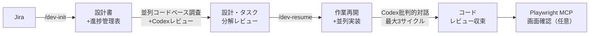

> **TL;DR**: ZOZOが全エンジニアに展開した「/dev-init + /dev-resume」2コマンド標準で、Claude Code × Codexを使って設計からテスト・画面確認まで再現可能なAI駆動開発フローを組織に定着させた実践報告。

AIの本質を「確率的予測変換機」と捉え、「同一レベル変換（Jira→設計書、設計書→タスク）」と「具体→抽象変換（矛盾検出・レビュー観点抽出）」はAIに任せ、「抽象→具体変換（企画・優先順位・最終責任）」は人間が主導する線引きが設計の中核にある。[[concepts/agentic-coding]]が「AIに自律実装させる」ことに焦点を当てるのに対し、こちらは「AIと人間の判断境界を組織として定義し再現可能にする」ことが核心。

## 2コマンドの役割分担

| コマンド | 用途 | 主な処理 |
|---------|------|---------|
| `/dev-init` | 開発開始時（1回） | Jira解析→並列コードベース調査→設計書＋進捗管理表＋テストパターン生成 |
| `/dev-resume` | 開発中・再開時（繰り返し） | 進捗管理表＋git status/diff読み込み→次アクション提示→並列実装→Codexレビュー |

設計書と進捗管理表をGit管理可能なMarkdownで持つことで、AIと人間が同じ状態を参照できる。会話履歴ではなくファイルに文脈を持たせるのが「/dev-resume の本質」。中断・翌日再開・別メンバーへの引き継ぎでも文脈が失われない。

## Claude Code × Codex 批判的対話レビュー

単一モデルのセルフレビューでは観点の独立性が弱い。役割を分担することで盲点を炙り出す：

- **[[tools/claude-code]]（オーケストレーター）**: 設計書生成・コード実装・採否判断・修正実行
- **[[tools/openai-codex]]（批判者）**: リポジトリ独自調査→批判的レビュー→再批判

3ラウンドを最小単位とし、同一指摘が2サイクル連続で解消しない場合は対話型に切り替え。これは[[concepts/llm-council]]の「複数AIが独立視点で疑う」パターンの実装例とも見なせる。

## なぜ2コマンドなのか

- **工程別細分化（不採用）**: 入口が増えて初心者の学習コストが上がる
- **完全1コマンド化（不採用）**: 初回は設計書・進捗管理表がなくAIが現在位置を特定できない
- **初回/再開の2分割（採用）**: 技術的な初回の差異のみを分離し、以後は同じ入口に寄せる

UIを2コマンドに固定し、内部のプロンプト・Skills・MCP連携を継続更新することで、ツールやモデルが変わっても組織全体をまとめてアップデートできる。

## 観察ログ（未検証）

- 2026-06-10: ZOZO基幹システム本部の田中秀明氏発表。全エンジニアに月額200ドル基準でClaude Code等を導入（2025年7月発表）済みの組織での実践
- 2026-06-10: AZARSという「AI Readiness Score」指標を定義。個人活用度と組織プロセス化の両面を測定
- 2026-06-10: Codexレビューはコスト・時間増加の副作用あり。重要機能/高リスク変更向けとして使い分ける設計
- 2026-06-10: Playwright MCPによる画面確認は環境整備に依存。未設定時は自動スキップする設計
- 2026-06-10: 効果測定（設計書作成時間・リードタイム・手戻り件数等）は今後の課題として挙げられている

## 問い

- `/dev-init`・`/dev-resume` の実装はGitHubで公開されているか？Claude Code marketplace経由で入手可能か？
- Codex批判的対話の「最大3サイクル」はどの根拠から来ているか？収束しない指摘の人間への判断移譲基準は？
- AZARSスコアの測定方法は公開されているか？組織のAI成熟度をスコア化するアプローチは汎用化できるか？

## 関連

- [[concepts/agentic-coding]]
- [[concepts/spec-driven-development]]
- [[concepts/harness-engineering]]
- [[concepts/llm-council]]
- [[tools/openai-codex]]
- [[tools/claude-code]]
- [[tools/adversarial-panel]] — Claude Code×Codex批判的対話と同型の異種モデル・クロスレビューを汎用スキル化したもの（2〜4パネリスト×3ラウンド＋統合）
