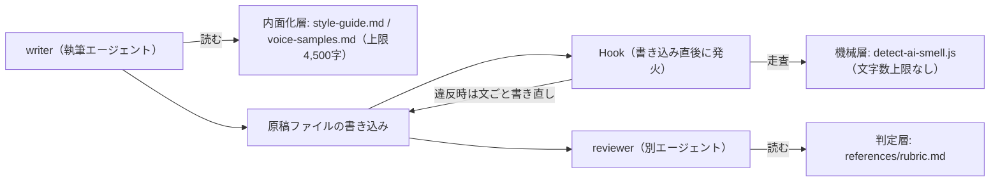

# AIに自然な日本語を書かせる執筆スタック

> **TL;DR**: AIの日本語は、プロンプトやHookといったハーネスの工夫よりもまずモデル選定で決まる。そのうえで規約は増やすほど文が縮んでAI臭が戻るため、@kgsi は規約を減らすのでなく writer・Hook・reviewer の誰が読むかで置き場所を分けた。

文法は正しいのに読むと疲れる、1行目で「AIが書いたな」と気づかれる——この違和感の解消策として、@kgsi は自身の執筆で検証した実践知とコミュニティの成果を、モデル選定・執筆手順・スキル・執筆環境の4つの視点にまとめている。順序に意味があり、著者はプロンプトやHookなどのハーネス以上に効くのがモデル選定だと最初に断っている。

## モデル選定を先に置く

2026年時点で日本語執筆に頭ひとつ抜けているのは Gemini 3.8 Flash、次点が Kimi K3 だ、というのが著者の評価である。かつて自然な文章で評価されていた Claude はコーディング特化の調整が進んだ結果、文章にもコードのような角張った硬さが目立つようになり、ChatGPT は段落の文数が均等すぎて教科書的な構成になりAI臭が最も露骨に残る、と著者は書く。この評価は、日本語検査Hookの警告件数を測定器にして同じ結論に達した[[concepts/reasoning-vs-japanese-fluency]]と同じ方向を向いている。

ただしモデル任せで素のまま書かせれば文長のリズムは均質化し、読者への認知負荷の丸投げが起きる、と著者は続ける。モデルの地力を活かすための手順と仕組みが、以降の層にあたる。

## 5ステップの執筆手順

著者が現状の知見を統合した手順は5つある。

**書く前の情報仕分けと削り**。AIの文章が読むに堪えない最大の原因は「認知負荷の丸投げ」だ、とつぼた（@tsubotax）の指摘を引く。前提・補足・先回りの安心材料をすべて1文に詰め込む癖を、書かせる前に削る。具体的には、冒頭2行で誰宛てで何を判断してほしいかを確定させ、各段落に選択肢の差分・判断材料・確認方法などの役割を1つだけ与え、どれにも当てはまらない段落は捨てる。削除しても判断に影響しない括弧の補足は取り除く。

**読者の脳内地図を壊さない大域設計**。文章の破綻は「少し先を読まないと意図が分からない不意打ち」や前段落との接続の欠如から生じる、という鹿野桂一郎（@golden_lucky）の指摘に沿って、概念を初めて示すときは読者が順に読むだけで種類や役割を同定できる順序にし、新しい情報の前にそれを受け止める道筋を用意し、見出しの直後には前段落との接続を1文置く。

**あえて偏り（ムラ）を仕込む**。AIは全トピックを同じ温度で語りがちだが、人間味の正体は偏りだ、というなつ（@art_reflection）の見立てを採り、引っかかった話題は執拗に語り前提は一文で流す、という熱量の濃淡を構成段階で割り振る。

**執筆と機械検査の分離**。プロンプトに禁止事項を並べるほどモデルは萎縮して文を縮める。書くときは伸び伸び書かせ、ファイル出力の直後にHookで機械検査する。違反時は語の置換でなく該当箇所を含む文を丸ごと書き直させる。著者はこの分離をリズムを守る急所と呼ぶ。

**最後の1割を人間が整える**。9割の骨組みをAIに任せ、残り1割の呼吸や手触りは人間が整える。直した差分は記録し、次のプロンプトや検査ルールへ還元する。

著者が挙げるコミュニティ発のツールは3つある。natural-japanese（@techtalkjp）は「AI臭は語彙よりリズムに出る」という着眼から生まれたAgent Skillで、人間とAIの実測コーパスを基に、体言止めの欠如や文頭反復の少なさといった従来の思い込みを排し、文長の長短のばらつき（burstiness）を機械検知する。[[tools/japanese-tech-writing]]（@golden_lucky）は商業書籍の編集視点をスキル化したもので、論点を増やさず姿勢だけを誇張するLLM口調を排除する。[[concepts/llm-japanese-style-hooks]]（@yugen_matuni）はファイル書き込み直後に検査し、NG表現に対して具体的な修正パターンをセットで返す仕組みである。

## ルールは減らさず、読む主体ごとに置き場所を分ける

著者は自身の執筆リポジトリで「ルールを足すほど文が縮んでAI臭が戻る」失敗を経験したと書く。規約を増やすほどAIは当たり障りのない短文に逃げる。そこから導かれた設計原則が「ルールは減らすのではなく、置き場所を分ける」である。

置き場所は3つ。書き手の判断基準だけを薄く記述した内面化層（`style-guide.md`・`voice-samples.md`、上限4,500字）は writer が読む。正規表現で判定できる禁則と修正方針を集約した機械層（`scripts/detect-ai-smell.js`）は文字数上限を設けず、Hookが自動走査する。完成原稿と目標の距離を独立評価する判定層（`references/rubric.md`）は別エージェントの reviewer が読む。肥大化の防止策として、ガイドが上限の8割を超えたら新ルール追加と同量の旧ルールを削る運用を置き、置き場所の原則と上限管理は `GOVERNANCE.md` に書いていると著者は述べる。

この「読む主体ごとに分ける」形は、Claude Code の指示7手段を決定論的強制はHookやパーミッションへ振り分ける[[concepts/claude-code-instruction-methods]]と同じ骨格をしている。あちらが強制力とロード時点で振り分けるのに対し、本ページは文章のリズムを守るために執筆時に読ませる量を絞るところが動機になっていると考えられる。著者は自作のローカルエディタ `note-editor` も使っており、左の編集が中央の本番相当プレビューへ即座に反映され、右ペインから選択範囲の部分的な推敲を行えると説明している。

## 素材がなければハーネスも効かない

記事の締めで著者は、どれほど精巧なハーネスを組み優れたモデルを選んでも、書く人間の中に「生の具体」がなければ文章は成立しないと書く。AIが手垢のついた定型文を吐くのは、人間側が何を体験し何に違和感を覚えたかという素材を渡していないからであり、抽象的な指示からは抽象的な正論しか生まれない。「実際に触ったら思ったより素朴で拍子抜けした」「夜中にプルリクエストが通って少し安心した」といった生身の観察・数字・固有名詞があって初めて、モデルの表現力も自動検査も効く、という位置づけである。なお著者は、この記事自体を解説した執筆環境で書いたと明記している。

## 観察ログ（未検証）

- 2026-09-13: 「ルールを足すほど文が縮んでAI臭が戻る」は著者の自リポジトリでの経験。ルール本数と文長の関係を測ったデータは示されていない
- 2026-09-13: 内面化層の上限4,500字・8割超で同量削るという閾値の根拠は記事にない。自分の環境で再現するなら実測が要る

## 問い

- このvaultのCLAUDE.md・スキル・メモリも「置き場所を分ける」形をとっているが、上限と同量削除の運用は入っていない。4,500字のような上限を置くとしたらどのファイルか
- 書き込み直後のHook検査は、wikiページ生成（wiki-ingest）にも入れられるか。[[concepts/llm-japanese-style-hooks]]の500本超ルールをこのvaultのページ生成に当てると、何件出るか
- 5ステップのうちStep1（書く前の削り）とStep4（執筆と検査の分離）は独立に導入できる。効果が大きいのはどちらから入れた場合か

## 関連

- [[concepts/reasoning-vs-japanese-fluency]] — 推論力と日本語の自然さは別能力という@yugen_matuniの実測。本ページの「まずモデル選定」という順序の根拠側にあたる
- [[concepts/llm-japanese-style-hooks]] — 本ページがStep4の実装例として挙げるHook検査の本体ページ（@yugen_matuni）
- [[tools/japanese-tech-writing]] — 本ページが推奨スキルに挙げる日本語文章規範（@golden_lucky）。Step2の大域設計もこの著者の指摘に基づく
- [[concepts/writing-norms-adoption]] — 同種の規範を「どの文章に入れるか」で判定する運用記録。本ページが規約の置き場所で解くのに対し、あちらは適用範囲で解く
- [[concepts/claude-code-instruction-methods]] — 指示を格納先ごとに振り分ける公式フレーム。本ページの3層分離と同じ骨格
- [[tools/suiko]] — 日本語の自然さを形態素解析で診断するCLI。本ページの機械層に置ける外部実装
- [[design/ai-skills-design]] — 同著者(@kgsi)がデザイン職とAgent Skillsの交差を論じた別テーマの記事
- [[concepts/gemini-rewrite-stop-hook]] — 執筆モデルと別に日本語整形専用のGeminiをStop Hookで呼ぶ@yugen_matuniの実装。本ページの分離構成に整形層を足す例
