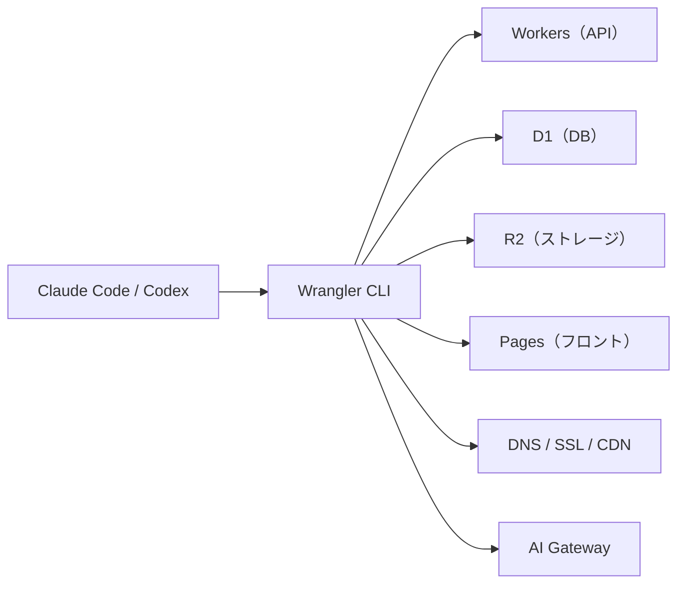

# AIネイティブなクラウド選定基準

> **TL;DR**: クラウドを選ぶ軸が「人間がGUIで操作しやすいか」から「AIエージェントがCLI/APIでどこまで操作しきれるか」へ移り、その基準で見ると個人開発・スタートアップ初期の最有力候補がCloudflareになる。

クラウドのコントロールパネルがGUI前提だと、人間には優しくてもAIエージェントには扱いづらい。逆に作成・デプロイ・設定変更がCLI/APIで完結するクラウドなら、「Workerを作ってDBを作って環境変数を設定して本番にデプロイして」という一連の作業をまるごとエージェントに委譲できる。AIにコードを書かせる開発（[[concepts/agentic-coding]]）が主流になるほど、この「エージェント操作性」がクラウドの価値を決める軸として効いてくる。AIにGUIでなく操作可能なインターフェースを渡すと精度が上がるという[[concepts/intermediate-notation-pattern]]の、インフラ選定版でもある。

Cloudflareがこの軸で強いのは、Wrangler CLIひとつでWorkers・D1・R2・KV・Queues・Durable Objects・Pages・DNSまで一通り操作でき、個人開発に必要なフロント／API／DB／ストレージ／CDN／LLMプロキシをほぼ単一プラットフォームに寄せられるからだ。無料枠が大きく「小さく作って安く試し、そのまま本番へ」という流れを止めずに進められる点も初期フェーズと相性がいい。LLM APIのコスト・ログ管理は[[companies/cloudflare]]のAI Gatewayを前段に挟むことで、ログ・キャッシュ・レート制限をまとめて扱える。

弱点もある。WorkersはNode.jsそのものではないためライブラリ次第でハマること、重いバックエンドやGPU処理・複雑なインフラ構成はAWS/GCPに分があること、寄せるほどロックインが強まることだ。ただし初期フェーズではロックインを恐れるより速く安く出すほうが優先される、という判断とセットで語られる。

## 観察ログ（未検証）

- 2026-06-26 @protoduct_ai: 「AI時代の個人開発はCloudflareを軸にしろ」と主張。ドメイン/DNSはCloudflare、APIはWorkers、DBはD1、ストレージはR2、AIはAI Gateway、必要ならContainers、そしてClaude Code/CodexにCLIで操作させる構成を「合理的」と推奨（個人の論考、X bookmark 290・2026-06-28時点）
- 2026-06-26 @protoduct_ai: Vercelも良い（Next.jsのデプロイ体験が強い）としつつ、複数プロダクトやAIアプリでAPI/ストレージを使い始めるとコストが怖くなる場面でCloudflareの守備範囲の広さが効く、と比較（単一ソースの主張）

## 問い

- 「エージェント操作性」を定量化してクラウドを比較できるか（CLIでカバーされる操作の割合・1コマンドの完結度など）
- 自分の個人開発スタックをCloudflareに寄せた場合、ロックインのコストはどの時点で速度メリットを上回るか
- AI Gatewayの前段集約は[[concepts/token-management]]のトークン可視化とどう接続できるか

## 関連

- [[companies/cloudflare]] — V8 Isolate基盤のAIエージェントプラットフォーム。本ページが「なぜAI時代にCloudflareを選ぶか」、あちらが「Cloudflareが何を提供するか」
- [[concepts/intermediate-notation-pattern]] — AIにGUIでなく操作可能な記法/インターフェースを渡す設計思想。クラウド選定への応用元
- [[concepts/agentic-coding]] — AIエージェントが自律的にコードを書く開発スタイル。CLI操作性が効く前提
- [[concepts/idp-shared-cli-mcp]] — Cloudflare Accessで人間とAIを同一身元にする設計（Cloudflare文脈の隣接事例）
- [[tools/cloudflare-os]] — Cloudflare公式の社内AIプラットフォーム。個人が知識ベースを載せた場合のコスト実測も含む
