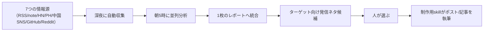

# 発信ネタを自動収集する7つの情報源（AIにリサーチを任せる型）

> **TL;DR**: 海外メディアRSS・noteの売れ筋・Hacker News・Product Hunt・中国SNS・GitHub Trending・Redditの7つをAIに深夜巡回させ、朝5時に1枚のレポートと発信ネタ候補にまとめさせる運用を @beku_AI が公開したX記事。人に残る仕事は取捨選択と判断だけだと主張する。

@beku_AI は、ネタ切れの原因をネタの不足でなく「探す時間を使い切っている」ことに置き、探す作業そのものを人の手から外すべきだと断言する。著者は GPT-6 Astra（[[models/gpt-6-astra]]）に7つの見張り先を渡し、寝ている20〜30分の間に収集させている。記事は各情報源の「何が取れるか・どう頼むか・何を弾くか」を具体的に書いている点が実用上の中身になる。

## 7つの情報源と取り方

| 情報源 | 取れるもの（著者の説明） | 取り方・コツ |
|---|---|---|
| 海外メディアのRSS（Bloomberg Markets / Reuters Business / TechCrunch / The Verge / Forbes Innovation / WSJ Tech / The Information） | 資金調達・売上・買収など数字の強い経済ニュースを、日本語圏に流れる前に | フィードURLを列挙して「今日の分をまとめて」。本家RSSが取れないときはGoogleニュースのRSS経由で拾わせ、「取れなかったら別ルートを探して」と添える |
| noteの売れ筋 | 日本の読者が「お金を払ってでも解決したい悩み」 | 売れている有料記事を数日おきに定点観測。スキ購入で水増ししたアカウントは条件をつけて弾く |
| Hacker News | これから話題になる技術ネタ | 自分のジャンルのキーワードで検索させ、新しい話題・一定の支持がある話題だけに絞る。「非エンジニアに関係ある部分だけ噛み砕いて」とレベルを合わせて翻訳させる |
| Product Hunt | 毎日デビューする新サービスと票数 | 直近の人気プロダクトを票数順に取らせる。拾う基準は「手でやっている作業を代わりにやるか」「発信ジャンルに関係するか」 |
| 中国SNS（微博熱捜・知乎熱榜・百度熱捜・36氪・掘金） | 中国AI企業・巨大テックの動き | トレンドをまとめて取れる無料ツールをAIに使わせ、AIとビジネスの話題だけ日本語で要約させる |
| GitHub Trending | 世界の開発者がいま作っているもの | 急上昇の名前と説明文だけ見させ、「自分のケースでどう使えるか」までAIに考えさせる |
| Reddit（r/LocalLLaMA / r/artificial / r/SaaS / r/Entrepreneur / r/ProductManagement / r/SideProject） | 個人の一次体験談、金額つきの収益報告 | 板のリストを渡して直近の話題をレポートにさせる |

著者は情報源ごとに「発信への効き方」も書き分けている。海外RSSは日本語で解説する人が少ないうちに書けること、GitHub Trendingは話題になる前に「もう触ってみた」と言える速さ、Redditは海外の個人の体験談が読者の「自分にもできそう」に変わりやすいことが価値だという。

## レポートから発信までの流れ

7つをばらばらに眺めるとかえって時間がかかるため、著者は深夜に全部を自動収集し、毎朝5時に分析を並列で走らせて最後に1本へ統合している。レポート生成時にターゲット情報を渡し、「ターゲットが興味を示しそうな切り口でネタを提案して」と同時に指示しておくと、毎日ネタ候補リストが出てくる。著者が朝やるのはリストから選び、「このネタでポストを作って」と頼むことだけで、制作用skillがポストや記事を書く。

いきなり7つを揃えず、1つを見張らせるところから始めればよいとも著者は書く。そのうえで「最新情報を知っても1円にもならない」とし、収益化するには集めた情報をコンテンツ・見込み客・収益の仕組みに落とし込む設計が要ると結ぶ。記事自体はこの設計を扱う無料特典（LINE登録）への導線を兼ねている。

この構成は、探索・統合・報告を役割分担させる [[tools/hermes-agent-research-department]] と同じパイプライン型であり、違いは出口が「自分の理解」でなく「発信ネタ」に置かれている点だと考えられる。

## 問い

- noteの「売れているが水増しでない」記事を見分ける条件は具体的に何か。記事は条件の中身を書いていない
- このvaultの取り込み（Xブックマーク起点）に、HN・GitHub Trendingのような「話題になる前」の情報源を足すと、wikiの鮮度は上がるか、ノイズが増えるだけか
- 収集を全部AIに任せたとき、何を見なかったか（取りこぼし）を人はどう検知するか

## 関連

- [[tools/hermes-agent-research-department]] — Scout / Analyst / Briefer の3エージェントで毎朝ブリーフを出すリサーチ部門。本ページの「並列分析→1本に統合」と同じ構造で、Scoutも Product Hunt を見張る
- [[concepts/modular-research-pipeline]] — 実行・分析・記憶の層を分けてソースを差し替える調査パイプライン。情報源を入れ替えて使い回す発想が共通
- [[tools/x-research-skills]] — Grok を使ったXリサーチをスキル化した構成。本ページの7源にX自体は含まれないため、補完関係にある
- [[models/gpt-6-astra]] — 著者がリサーチ担当に使っているモデル
