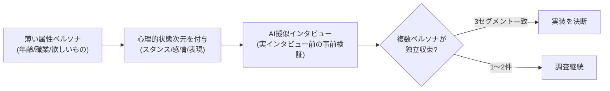

# AIペルソナ擬似インタビュー（心理的状態次元）

> **TL;DR**: ペルソナに「スタンス・感情的傾向・コミュニケーションスタイル」の心理的状態次元を与えると、AI擬似インタビューが汎用回答から設計判断に使える具体回答に変わり、複数ペルソナが独立して同じニーズに収束したら実装の強いシグナルになる。

「25〜35歳・テック系・〇〇を求めている」式の薄い属性定義でペルソナを作ると、そこから引き出すインタビュー回答も「あると便利ですね」程度の薄い汎用回答にしかならず、設計の判断材料にならない。この限界を超える鍵が、属性の下にある**心理的状態次元**をモデル化することにある。スタンフォード大学のHumanLM研究（2026、arXiv:2502.10558）は、表面的な属性だけでなく心理的状態次元をモデル化するとAIシミュレーションの応答リアリズムが大幅に向上すると示しており、この手法の根拠になっている。

付与する心理的状態次元は3つ。

- **スタンス（Stance）** — 特定トピックへの立場（例: 「尊敬する人が勧めれば試すが、自分で価値を確認するまで金は払わない」）
- **感情的傾向（Emotional Tendencies）** — 何が動機になり何が意欲を削ぐかの反応パターン（例: 「進歩が見えないと落ち込む。具体的マイルストーンで動機が上がる」）
- **コミュニケーションスタイル（Communication Style）** — ニーズの表現方法。直接的に言うか／不満として漏らすか／回避策の描写として語るか（例: 「機能が欲しいと言わず、昨日3本の動画をたぐる羽目になった、と言う」）

この3次元を与えると、AIペルソナは「学習パスが欲しい」のような機能名でなく「子どもの迎えまで45分。今日どの技を2つやるべきか即答してほしい」という文脈付きの根本ニーズを語るようになる。両者は全く異なる設計要件を意味する。運用は**実ユーザーインタビューの前にAI擬似インタビューで事前検証**する形を取り、回答が汎用的すぎると感じたらペルソナの深度不足のサインと読む。

実装判断のための原則が**複数ペルソナの収束**である。経験レベル・制約・ユースケース・メンタルモデルがバラバラのペルソナが、それぞれ独立に同じ根本ニーズを提示したら強いシグナルになる。目安は「1ペルソナの言及＝興味深い／2件＝調査する価値あり／異なるセグメントの3件＝作る」。逆に、表面リクエストが同じでも各ペルソナの**表現の違い**が複数の異なるプロダクト要件を浮かび上がらせる点に注目する——同じ機能名を求めていても、各人の具体的な解決像（ゲーム的UI／ガイド付きロードマップ／自分用の編集ツール）は分岐しうる。

## 観察ログ（未検証）

- 2026-06-19: toshipon氏がBJJ（ブラジリアン柔術）技術学習アプリ「BJJ Technique Library」の開発でこの手法を実践したと報告。3ペルソナ（白帯のITエンジニア／時短勤務の女性白帯／青帯の営業マネージャー）全員が独立して「技ツリー／学習パス」を要望し、設計書になかった機能の実装を決断した、と述べている。
- 2026-06-19: 同じ「技ツリー」要望でも各ペルソナの根本メンタルモデルは異なったという観察。白帯=RPGスキルツリー型（進捗とアンロック感）、女性白帯=学習ロードマップ型（今使える技だけのフィルタービュー）、青帯=ゲームプランビルダー型（自分の技を選んで指導用マップを作る）。表面リクエスト一致＝根本ニーズ一致でも具体解は分岐する、という主張。
- 2026-06-19: 実践には KaizenLab（toshipon氏が個人開発中のWebアプリ。市谷聡啓『正しいものを正しくつくる』の仮説検証思想をツール化し、仮説キャンバス・ペルソナ設計・AI擬似インタビュー・検証サイクル管理を備える。MCP連携でAIエージェントから直接操作可能、と紹介）の3心理次元設定機能を使用したとのこと。
- 2026-06-19: 根拠として引用されたStanford HumanLM研究（arXiv:2502.10558, 2026）の知見は一次未確認。記事内の単一引用にとどまる。

## 問い

- 自分のwikiやプロダクトのユーザー像にこの3心理次元を当て、AI擬似インタビューがどこまで設計判断に使える具体回答を返すか試せるか。
- 「3セグメント収束＝作る」のしきい値は、ペルソナ自体をAIが生成している場合に人工的に揃ってしまわないか。収束の独立性をどう担保するか。
- 発見フェーズ（このページ）→ 検証フェーズ（[[tools/buy-or-bounce]] によるコンバージョン障壁検出）と連結して、要望の発見から購買判断の検証まで一気通貫できるか。

## 関連

- [[tools/buy-or-bounce]] — 複数バイヤーペルソナを並行シミュレーションしコンバージョン障壁を特定するスキル。本ページの「発見」に対する「検証」側
- [[concepts/ai-requirements-definition]] — 「何を作るか・何を捨てるか」を決断する工程への転換。ペルソナ収束は決断の入力になる
- [[concepts/llm-personality-injection]] — 性格モデルをプロンプトに注入してLLMの振る舞いを変える手法。心理的状態次元の付与と同系統
