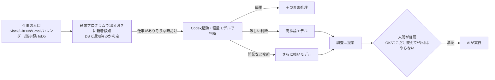

# AIに任せるのは「判断の手前まで」— 仕事の入口を常時監視して提案させる運用

> **TL;DR**: Slack・Gmail・GitHub・カレンダーなど「仕事が発生する入口」をAIに常時見張らせ、背景調査から「こう進めますか？」の提案までを先にやらせる運用。人間は提案を読んで承認・修正・却下だけを判断し、承認後の実作業は再びAIが進める（入江慎吾の実践記）。

AIに仕事を頼む前には、通知を開いて中身を理解し、過去のやり取りや前回の資料を探し、「AIに何と指示すればいいか」を考える工程がある。アプリ開発者の入江慎吾（note: iritec）は、この「仕事を始めるまで」が実は重く、1日に何度も届く通知ごとに発生するスイッチングコストこそが削れる部分だと述べる。仕事の入口はある程度決まっているので、その入口をAIに見てもらい、本人が気づく前に背景まで調べて提案してくれる状態を ChatGPT と Codex で組んで運用している。Claude や Claude Code でも似たことはできるだろうと本人も書いている。

## 先に調べさせる中身

Codex には Slack・Gmail・Googleカレンダーなど仕事で使うツールを接続しており、新しい仕事が発生すると次を先に調べる。

- 何を依頼されているのか
- 過去にどう対応していたのか
- 前回どの資料を使ったのか
- 普段どんな形式で共有しているのか
- 今回はどう対応するのがよさそうか

著者の例は、クライアント定例の前に資料を更新してPDF化しSlackで事前共有する仕事。以前はメンションを受けてから前回のGoogleスライドを探し、追加内容を過去のやり取りから調べ、書き換え・PDF化・共有までを自分でやっていた。いまはAIが調査して提案を出し、本人は「OK」「ここだけ変えて」「今回はやらない」と判断するだけで、承認すれば資料編集もそのまま進む。

会議準備にも同じ仕組みを使う。カレンダー・過去の議事録・Slack・メール・ToDoを読み、会議の1時間前に「今日これだけ見ておけば大丈夫」というまとめを用意させ、それを読んでからミーティングに入る。著者はこれだけでも頭の切り替えがかなり楽になったと述べる。

## 検知は普通のプログラム、判断はモデルを段階的に

監視対象は Slack・GitHub・Gmail・Googleカレンダー・議事録・ToDo の6つで、10分おきにチェックする。ただし毎回AIを起動すると無駄が多いため、最初の検知は通常のプログラムが担う。プログラムが新着を確認し、データベースで「すでに通知したものか」を判定して、仕事が発生していそうなときだけ Codex を起動する。

起動後もまず軽量なモデルで内容を判断し、簡単なものはそのまま処理、少し難しい判断が要るものはより高い推論レベルのモデルへ、開発のような複雑な作業はさらに強いモデルへ回す。すべての仕事に最高性能のモデルを使う必要はなく、これでコストをかなり抑えられると著者は述べる。検知を決定論的なコードに寄せてAI起動を絞る形は、[[concepts/claude-code-loop-types]] が Proactive ループで勧める「routine は小型高速モデルへ、判断は最上位モデルへ」と同じ配分だと考えられる。

## 全自動化せず「確認してから動く」

著者がこの仕組みで一番大事にしているのは **AIが勝手に仕事を完了させないこと**。Slackへの返信もメール送信も資料更新も技術的には自動化できるが、AIが判断を誤ったときにそのまま社外へ送信されうるのが怖いとして、流れを **検知 → 調査 → 提案 → 人間が確認 → 実行** に固定している。

AIには仕事の進め方を書いた「ルールブック」を渡している。著者が挙げる例は次のとおり。

- Slackで自分にメンションが来たら仕事の候補
- GitHubでは特定の人から作業完了のコメントが来たら確認する
- 返信文は相手の文体に合わせる
- 開発作業ではブランチを作って、動作確認できるところまで進める

運用しながら「このケースでは通知しなくていい」「この場合はここまで調べてほしい」「この種類の仕事なら先にこれを確認する」とルールを足していく。著者はこれを、AIそのものを賢くするというより **自分の仕事のやり方を少しずつAIに移植していく感覚** だと表現する。承認後にAIが進める作業は、メールやSlackの返信案作成、資料修正、Googleスプレッドシート更新、ブラウザ上の申請作業、開発ならブランチを切った実装と動作確認まで広がっている。

## 人間に残すのは方向と要否の判断

AIが作るものが8〜9割まで完成していることはかなり増えたと著者は述べる。それでも「本当にこの方向でいいのか」「もっとこうした方がいいのではないか」「そもそもこの仕事をやるべきなのか」は人間が考えた方がよく、そこが人間の関わる価値が高いところだという立場をとる。目指すのは人間を仕事から外すことではなく、AIが気づき・過去を調べ・状況を整理し・選択肢を考えて提案し、人間が判断し、判断後の作業をまたAIがやる形である。

AIエージェントを始めるなら、いきなり全自動にせず、**自分が毎日どこを見て仕事を見つけているのか**（Slack・メール・GitHub・カレンダー・議事録）から考え、その入口をAIに見てもらって「次これやりますか？」と聞いてくれる状態を作るところからでよい、と著者は勧める。

この運用は [[concepts/ai-secretary-gateway]] が「コピペ秘書」の先に置いた「常駐秘書」（向こうから連絡し、確認後に実行する段）を実際に組んだ一例と読める。外部に届く操作の手前で人間承認を挟む線引きは [[tools/line-harness]] の「送信のみ人間承認」とも同型だと考えられる。

## 問い

- 「すでに通知したか」を判定するDBと、ルールブックへの追記はどう結びついているか（通知不要ケースをルール側で持つのか検知コード側で持つのか）。記事では構成の詳細は語られていない
- 自分の環境で入口を棚卸しすると何になるか。このvaultの launchd 常駐処理（決定論で検知しAIを起動する構成）に「提案→承認」の段を足せるか
- 提案を承認するUIはどこか（Slack・Codexアプリ上など）。記事の画像内にしか示されておらず本vaultでは未捕捉

## 関連

- [[concepts/ai-secretary-gateway]] — AI秘書を仕事の窓口に限定し人間が決めることだけ戻す設計。本ページはその常駐版を実運用した例
- [[concepts/claude-code-loop-types]] — Proactive ループ（イベント/スケジュール起動・小型モデルと最上位モデルの使い分け）の公式整理
- [[tools/line-harness]] — 送信だけ人間承認に残すClaude Code運用。外部送信の手前で止める同じ境界
- [[tools/openai-codex]] — 本運用の実行基盤
