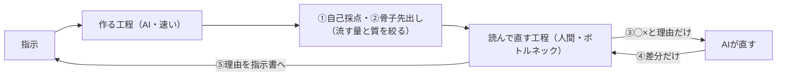

# AI協働のボトルネックは「読んで直す工程」｜『ザ・ゴール』の制約理論で見る

> **TL;DR**: AIが速くしたのは「作る工程」だけで、仕事全体の速さは人間の「読んで直す工程」で決まる。だから直す工程そのものを速くする前に、そこへ流れ込む量と質を変える（自己採点・骨子先出し・◯×と理由だけ返す・差分だけ返させる・直した理由を指示書に残す）、と @smark_x が主張する。

Claude Code に仕事を渡すと5分で返答が来て、読んで3か所直している間に次の返答が届き、読み終わっていない返答が溜まっていく。@smark_x はこの「AIのセッションに溺れる」状態の原因を、速くする場所の取り違えだと説明する。工程は直列につながっているので、1つのやり取りを速くしても全体は速くならない。これはゴールドラットの『ザ・ゴール』（1984年）が説いた制約理論そのもので、工場の速さはいちばん遅い工程（ボトルネック）で決まり、他の機械をどれだけ速く回してもボトルネックの手前に仕掛かりが積み上がるだけだ、と @smark_x は書く。AIセッションをもう1本走らせても、読み終わっていない返答の順番待ちが増えるだけになる。

## 読んで直す工程を短くする5つのやり方（@smark_x の実践）

『ザ・ゴール』のやり方はボトルネック自体を速くする前に、そこへ流す量と質を変えることであり、AI協働でも同じだと @smark_x は述べる。@smark_x が Claude Code で実際にやっているのは次の5つである。

- **①自己採点を「ボトルネックの手前」に置く** —— 指示書（mdファイル）に「出す前に条件に照らして自己採点し、外れている所を先に挙げる」と書いておく。ただしAIが採点できるのは「数字が入っているか」「この語を使っていないか」「1,200字以内か」のような数えられる条件だけで、「良い文章か」では効かない。条件に書けない「なんか違う」は必ず残り、それは自分にしか判定できない。だから検査を書く作業は、自分がボトルネックで見るべき所を絞り込む作業でもある
- **②一気に作らせない** —— 「見出しと言いたいことを1文ずつ。本文はまだ書くな」と骨子だけ先に出させ、方向だけ直す。本文になってから方向を直すと、直しの単位が「文」から「書き直し」に変わるからだ。骨子のOK基準は「読んで納得したか」でなく「この骨子の本文を直さずに出せると想像できるか」で、想像できないならAIでなく自分の方向が決まっていない。直しが多い原因はここだと @smark_x は見ている
- **③自分は◯×と理由だけ、直すのはAI** —— 「ここ×、理由が逆」とだけ返し、どう直すかは言わない。直し方を自分で考えた瞬間、作る工程の仕事がボトルネックに流れ込むからだ。理由を言えない直しは「好み」と言い切り、⑤には残さない（毎回変わって指示書が濁る）。「理由が言えた直し」だけが資産になる
- **④差分だけ返させる** —— 直させた後に全文を返させず「変えた所3点と、触っていない所1つ」と決めておく。差分では「文が変わったか」でなく「言った理由が満たされたか」を見る。理由は1つ、文は無数なので、読む単位を理由にすると読む時間がさらに減る
- **⑤直した理由を指示書に残す** —— 指示書に「直したことが残る欄」を置き、③の理由を「◯◯のときは△△」の形で書き足す。禁止だけを増やすと指示書が薄くなる。欄は10個までで、超えた分は①の採点条件に格上げして欄から消す。格上げのときに「毎回か、今回だけか」を分け、今回だけの直しは残さない（過去の案件の癖を引きずる）。@smark_x はこれを、直しの記録でなく自分の判断基準の写しとして指示書を育てるイメージだと説明する

@smark_x はこの5つで読んで直す時間がかなり減ったと書き、さらにそれ以上に生産性が上がる方法として音声入力（AquaVoice・Typeless）を挙げている。音声入力の文が要約調・きれいにまとめられすぎになるのを防ぐカスタム指示も紹介しているが、プロンプト本文は未捕捉である。

## 他ページとのつながり

「人間のレビューが新しいボトルネックになる」という観測は、Anthropic Institute がAI開発の加速について Amdahl の法則で論じた [[concepts/recursive-self-improvement]] や、深津貴之が「生成は課金で増やせるが確認速度は増やせない」と農業の比喩で語った [[concepts/development-as-agriculture]] と同じ構造である。本ページの位置づけは、その構造を個人の日々の Claude Code 運用に下ろし、ボトルネックへの流入を絞る具体策まで落とした点にあると考えられる。@yugen_matuni も [[concepts/reasoning-vs-japanese-fluency]] で、執筆のボトルネックは出力待ちでなく手直し時間だとしてモデル選択の基準を変えており、こちらは「流す質」をモデルの側で上げる打ち手にあたる。

⑤の「直した理由を指示書に残し、10個を超えたら条件に格上げする」は、同じ @smark_x が [[concepts/shikumika-vs-tejunsho]] で述べた「仕組み化とは直した結果が戻る場所を決めること」をAIへの指示書に当てはめた形と読める。①の「採点できるのは数えられる条件だけ」は、[[concepts/llm-japanese-style-hooks]] のような機械的な検査を手前に置き、人間は検査に書けない判断に集中するという分業とも重なる。

## 問い

- このwikiの運用で「読んで直す工程」に溜まっている仕掛かりは何か（ingest結果の確認・weekly の読み返しなど）。①の自己採点条件に書き出せる「数えられる条件」はどれだけあるか
- ⑤の「欄は10個まで、超えたら条件に格上げ」は、LESSONS.md のように追記だけで伸びていく判定事例ログにも使えるか
- ③の「直し方は言わない」は、直し方まで言ったほうが往復が1回で済む場面（数値の誤り・固有名の取り違え）とどう線引きするか

## 関連

- [[concepts/recursive-self-improvement]] — 人間のレビューが新ボトルネックになるというAmdahl構造を、AI開発全体の規模で論じたAnthropic Instituteの論考
- [[concepts/development-as-agriculture]] — 生成は増やせても確認速度は増やせないという同じ制約を、開発全体に広げた深津貴之の比喩
- [[concepts/shikumika-vs-tejunsho]] — 同著者の「直した結果が戻る場所を決める」仕組み化論。⑤の指示書の育て方の元になる考え方
- [[concepts/reasoning-vs-japanese-fluency]] — ボトルネックは出力待ちでなく手直し時間という同じ観測から、手離れの良いモデルを選ぶ方向へ進んだ事例
- [[concepts/exclusion-first-prompting]] — 同著者の「◯◯は出さなくていい」の2文型。出力の段階で量を絞る、②④と同じ方向の打ち手
