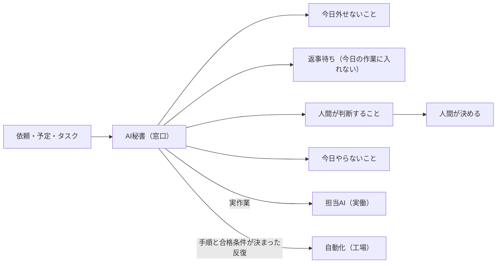

# AI秘書は「全部やる人」でなく仕事の窓口

> **TL;DR**: AI秘書の担当を「依頼を受け付け、予定・期限・返事待ち・判断待ちに分け、今日人間が決めることだけを戻す窓口」に限定し、実作業は担当AIへ、定型の反復は自動化へ渡す設計。本体プロンプトと最初のスキル「今日の秘書ブリーフ」の2枚をコピペすれば始められ、常駐化はその後の別工程。

AIに「明日の予定に、これ追加して」と頼むと「わかりました」と返るが、翌朝こちらからチャットを開かなければ何も始まらない。@dansyu_callenge はこの「わかりました」が仕事を預かった意味ではなかったと指摘する。チャットにカレンダー操作がつながっていなければ予定表には何も登録されず、新しいチャットでは前の会話を引き継げないこともある。それでも返事が自然なので、つい仕事を預けた気になる。翌日に予定を思い出すのも、返事が来ていない相手を確認するのも、どの仕事から手をつけるか並べ直すのも自分のままになる。欲しいのはタスクをきれいに書き直すAIではなく、仕事を受け取ったら「いつやるのか・誰の返事を待っているのか・どこで人間の判断が必要なのか」を分けてくれる人だ、というのが出発点になっている。

## 窓口・実働・工場の3分割

@dansyu_callenge は実務でAIを「窓口・実働・工場」の3つに分けており、AI秘書はその「窓口」に当たる。担当は次の5つに絞られる。

- 依頼を受け付ける
- 予定と期限を整理する
- 誰かの返事を待っている仕事を分ける
- 人間が決めないと進まない仕事を戻す
- 今日やることを絞る

資料を作る・記事を書く・画像を作るといった実作業はそれぞれの担当AIへ渡し、手順と合格条件が決まった繰り返し作業は自動で動く仕組みへ渡す。「受付の人へ、制作も開発も検品も全部任せる会社はない」というのが分割の根拠で、AI秘書に何でも背負わせない立場を著者は明確にしている。3分割の元記事と、AI社員シリーズ①にあたる「AI参謀」（相談を判断へ変える人）はリンク先にあり本vaultでは未捕捉。別著者の参謀型プロンプトは [[concepts/ai-strategist-prompt]] にある。

## 本体プロンプトとスキルの二層

構成は「AI社員＝役割を持つ本体」と「スキル＝その社員に覚えさせる具体的な仕事」の二層で、ChatGPT や Claude の同じチャットに順に貼る。

- **AI秘書本体**: 何を受け取り、どう整理し、どこで止まるのかを決めた「箱」。貼った時点で「明日の予定に15時から見積もり確認を追加して」「この3つ、今日やる順番に並べて」「返事を待っている仕事だけ出して」といった依頼を受け付けて整理できるようになる。ただしカレンダーへの自動登録はまだ起きず、チャットの中で予定を預かり状態を管理できる段階
- **最初のスキル「今日の秘書ブリーフ」**: 予定とタスクを並べるだけでなく、今日外せないこと・先に連絡すること・人間が決めることを1枚にまとめる。入力は「今日または明日の予定／期限があること／返事を待っていること／判断に迷っていること／使える時間」の5項目で、すべて埋める必要はなく、不明な項目をAI秘書が勝手に埋めない

プロンプト本文はX記事内の埋め込みで、本vaultには未捕捉。

## 散らかった仕事がどう分かれるか

著者が示す例では「10時からオンライン会議、請求書は今日中に送る、提案書は相手の返事待ち、新しい記事の企画も考えたい、自由に使える時間は3時間」をそのまま渡すと、次の5区分に分かれる。

| 区分 | 内容 |
| --- | --- |
| 今日外せないこと | 10時の会議に参加する／請求書を作成し送信前に内容を確認する／不足情報を先に確認する |
| 時刻が決まっている予定 | 10時：オンライン会議 |
| 返事待ち | 提案書は相手からの返事待ち。今日の作業へ入れない |
| 人間が判断すること | 請求書を実際に送信してよいか |
| 今日やらないこと | 新しい記事企画。期限が確認できず、今日外せない仕事ではない |

要点は2つある。第一に、全部を「今日やるリスト」に入れないこと。予定表が長くなっても使える時間は増えないので、秘書の仕事はきれいな長いリストを作ることではなく「今日やらないこと」まで分けることだと著者は述べる。第二に、請求書の送信は外部へ届く操作なので確認なしで終わらせず、「作成」と「送信」を分けて人間が判断する場所へ戻すこと。

## コピペ秘書と常駐秘書は別物

2つのプロンプトでできるのは、チャットの中で仕事を預かり・整理し・ブリーフを作るところまで。著者は、プロンプトを貼っただけでは次のことは起きないと線を引く。

- Googleカレンダーへ実際に予定を登録する
- 決まった時刻に向こうから連絡する
- DiscordやLINEから依頼を受ける
- ファイルやアプリを操作する
- 新しいチャットでも前の状態を覚え続ける
- 止まった時に自動で復旧する

著者自身は別の環境で、向こうから定時連絡し、Discordから依頼を受け、確認後に仕事を実行するところまで組んでおり、そこまで進めるにはプロンプトのほかに「AIを動かし続ける環境・連絡経路・権限・記憶を置くファイル・停止時の復旧」が必要だとする。推奨する順番は、まずチャットの中で仕事を預かれる秘書を作り、使い方が固まってからカレンダーや連絡ツールへつなぐこと。この順番なら「動かしたい機能より先に、何を任せ、どこで止めるかを決められる」。これは [[concepts/agent-autonomy-levels]] の「段を上げるのはモデルでなくツール・記憶・ループ」という整理と同じ切り口だと考えられる。

## スキルを追加して育てる

同じAI秘書へ仕事を1つずつ足していく。著者が挙げる追加候補は、朝のブリーフィング作成、締切と返事待ちだけの確認、会議前の資料整理、依頼内容を担当AIへ渡す形に整える、1日の終わりに未完了と持ち越しを分ける、新しいチャットへ渡す引き継ぎメモを作る、の6つ。「社員を増やす前に、まず1人へ必要な仕事を1つずつ覚えさせる」のがAI社員シリーズの基本だと著者は位置づける。追加スキルはLINEオープンチャットで順次配布予定と記事は述べている。

## 問い

- 本体プロンプトとブリーフ用スキルの本文（「どこで止まるか」の書き方）を記事から取得して確かめる
- 自分の運用で「窓口」を常駐化するとき、返事待ち・判断待ちの状態をどのファイルに持たせるか。[[concepts/agent-autonomy-levels]] が挙げる記憶破綻の3型に当たらない置き方は何か
- 「作成と送信を分ける」は [[tools/line-harness]] の「送信のみ人間承認」と同型の境界。外部に届く操作すべてに同じ線引きを使えるか

## 関連

- [[concepts/ai-employee-workflow]] — 7日間セットアップで自律動作するAIスタッフを立ち上げる手法（@eng_khairallah1）。本ページの「常駐する秘書」に相当する段階の作り方
- [[concepts/agent-autonomy-levels]] — チャット／ツール付き／マルチステップ／完全自律の4段。コピペ秘書は最初の段、常駐秘書は上の段に当たり、段を上げるのはプロンプトでなくツール・記憶・ループ
- [[concepts/claude-projects-blueprint]] — Claude Projects を「AI社員」として組む6パート設計図。役割を1つに絞り本体と参照資料を分ける発想が本ページの本体＋スキルの二層と重なる
- [[concepts/ai-strategist-prompt]] — 別著者（@akira_papa_IT）の「専属参謀」プロンプト。AI社員シリーズ①「AI参謀」と役割が近い
