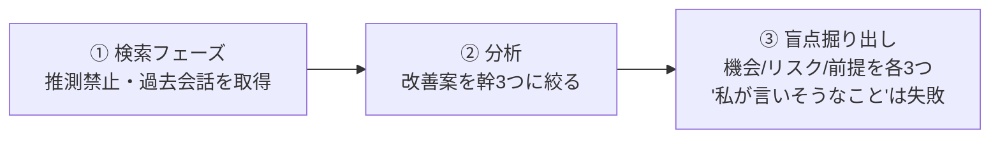

# AI参謀プロンプト（人生・事業の棚卸し）

> **TL;DR**: 全会話履歴を横断させ価値観の矛盾や事業同士の食い合いまで推論させて盲点を掘り出す「専属参謀」プロンプト。長く複雑なタスクほど差が開く [[models/claude-fable-5]] の本領を個人利用で引き出す型（@akira_papa_IT）。

@akira_papa_IT は、モデルがどれだけ賢くなっても残り続けるのは「指揮する力」の差だと述べる。「いい感じにアドバイスして」と頼むとAIは遠慮し、当たり障りのない・喜ばれそうな答えを返す。これを「優しいAI」から「参謀」に変えるのが**3つの縛り**で、押さえるべきはこの3点だけ、あとは自分用に改造してよいという設計になっている。

## 3つの縛り

**① まず検索して。記憶で語らないで** — 最近のAIは指示しないとメモリや検索ツールを使わず、ふんわりした記憶ベースで語りがち。最初のフェーズに「推測禁止。まずツールで過去の会話を取りに行くこと」と明記する。さらに「メモリから主要なプロジェクト名を自分で見つけて、それぞれ検索すること」という書き方にすると、誰が貼っても各自固有のキーワードでAIが勝手に深掘りする（汎用化のテク）。

**② 幹は3つまで。「全部大事」は参謀の敗北** — AIに改善案を求めると10も20も出て、しかも全部それっぽい。だが人間が実際に動けるのはせいぜい2〜3個。コアのアドバイスを最大3つに制限し、枝葉には「どの幹につながる枝なのか」を必ずラベル付けさせ、幹に繋がらない枝は「捨てましょう」という提案までさせる。優先順位の判断から逃げられなくする設計。

**③ 私が言いそうなことを出したら失敗** — ここが本体。盲点を掘り出す専用フェーズを作り、「見えていない機会」「見えていないリスク」「疑っていない前提」を最低3つずつ強制的に出させたうえで、「私が言いそうなことを出したら失敗です」の一文を添える。@akira_papa_IT は、この一文の有無で返答が「喜ばれそうな答え」から「唸らせる答え」に切り替わると述べる。

## メタ主張：AIは「使う」から「指揮する」へ

@akira_papa_IT はこのプロンプトの本質を「AIへの権限委譲の設計」だと位置づける。検索すること・幹を3つに絞ること・自分が言いそうなことは出さないこと——ここまで指示して初めてAIは参謀として動く。実際に自分でFable 5に実行させたところ「口では委譲すると言いながら、結局ご自身で抱えていますよね」と指摘されて痛かったが、それ以上の価値があったと振り返っている。

## 運用のポイント

- **過去履歴が多いほど精度が上がる**。履歴が少ないユーザーが貼るとPhase 0で「先に質問させてください」モードに切り替わり、最初の壁打ちとして機能する。
- Fable 5はトークン消費が速く週間枠（上限の50%）を意識する必要があるため、細切れの雑談でなく「今週の枠はこの一発に使う」重量級タスクへの一点投下が理にかなう、と @akira_papa_IT は勧める。
- おすすめは**3ヶ月ごとに再実行して前回との差分を見る定点観測**。7月8日以降にサブスク枠が終わっても従量課金や他の高性能モデルで動く（盲点の掘りの深さは多少変わる）。

## 観察ログ（未検証）

- 2026-07-06: Fable 5がサブスク枠内で使えるのは7月7日まで、以降はクレジット従量課金に切り替わる。ただしAnthropicのエンジニアが「キャパシティが確保でき次第、サブスクの標準機能として復活させることを目指す」と発言したと @akira_papa_IT が伝える（単一ソース・後で答え合わせしたい予測）。

## 問い

- 自分の数ヶ月分の会話履歴に対して実行したとき、本当に刺さる盲点が出るか。履歴の薄い領域では浅くならないか
- [[concepts/llm-council]]（複数AIの匿名レビュー）や [[concepts/ai-teacher-prompt]] と、単一プロンプトでの参謀化はどう役割が違うか
- 3ヶ月ごとの定点観測（差分レビュー）を自分のwiki／メモリ運用にどう組み込むか

## 関連

- [[models/claude-fable-5]] — 「長く複雑なタスクほど差が開く」本領を個人利用で引き出す対象モデル
- [[concepts/llm-council]] — 複数AIアドバイザーが匿名ピアレビューで盲点を炙り出すKarpathyパターン（参謀の複数版）
- [[concepts/finding-unknowns]] — 地図と領土のずれ＝unknownsを棚卸しする運用フレーム（盲点掘り出しと同系）
- [[concepts/self-evaluation-gap]] — AIに成果物をダメ出しさせて自己評価の甘さを補正する実践
- [[concepts/frontier-model-extraction]] — 同じ「Fable最終日」テーマの姉妹編。会話でなく判断の抽出で去るモデルに向き合う型（@EXM7777）
- [[business/ai-strategy-officer]] — 同じ「AIを戦略側に置く」型を副業の市場選定・商品決定に適用した委任論（@AInokuhaku）
