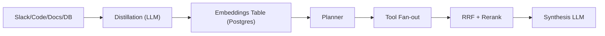

# Cerebrasの社内知識ベース設計

> **TL;DR**: Cerebrasが3ヶ月で社内定着させた知識ベースは、全データソースを単一の埋め込みテーブルに正規化し、Slackは全文検索＋埋め込み＋IDF＋鮮度減衰のハイブリッドで検索した上でRRF融合とリランキングを行い、MCPで検索プリミティブをそのままツールとして公開する設計だ。

> 📌 X bookmark: 12,615（2026-07-24 時点）

Cerebrasの従業員は1日1万5000件以上の質問をこの社内知識ベースに投げており、公開から3ヶ月で社内で最も定着したツールの一つになった、と著者（@hi_im_isaac_、@learnwdaniel、@gaozenghao）は説明する。四半期ごとに「全情報を1つのプラットフォームに集約しよう」という提案が出ては実現しないという組織あるあるを踏まえ、Cerebrasのチームは情報を発生源（Slack・GitHub・Jira・ドキュメント）に置いたまま、抽出側だけを工夫する設計を選んだ、と述べる。

## アーキテクチャの中核：単一埋め込みテーブル

著者らは、Slackスレッドからネットリスト（チップ設計データ）まで、あらゆるソースが同じPostgresの埋め込みテーブルに着地する設計にした、と述べる。各データソースは「データの中身・接続方法・取得頻度」を定義するだけで、生成される埋め込み行は出所を問わず同じインターフェースに従う。この単純さのおかげで社内の別チームも自前のコネクタを追加できる、という。

## Slackのハイブリッド検索

埋め込みだけでは不十分だったと著者は振り返る。Slackメッセージは情報密度の差が激しく（「hey yeah sure mike」と詳細な技術説明が同じ「1メッセージ」として扱われる）、短いメッセージがコサイン類似度で長い詳細な回答に勝ってしまう問題があった、という。そこで4つの検索手法を並走させる設計にした。

- **全文検索**: エラー文字列やホスト名など、埋め込みがぼかしてしまう完全一致トークンを拾う
- **埋め込み検索**: 語彙が異なる質問と回答（言い換え）を繋ぐ
- **IDF（逆文書頻度）**: 稀少トークンを含む短いメッセージの順位を上げ、「ありがとう」のような定型句を除外する
- **鮮度減衰**: 同じ質問に答える複数のスレッドがある場合、半年前より新しいスレッドを優先する

これらのスコアは単独で信頼せず、クエリ時に融合する（RRFの節参照）、と著者は説明する。

## Socket ModeによるSlack取り込みとdistillation

Slackボットをworkspaceにインストールし、Socket Modeで常時WebSocket接続を張ることでポーリングなしにリアルタイム更新を受け取る、と著者は説明する。メッセージイベントが届くと、そのメッセージ単体でなく所属スレッド全体（親メッセージ＋全返信）をSlack APIから再取得し、1行として書き戻す。そのため返信が1件来るたびにスレッド全体・参加者リスト・最終更新時刻が最新化される。

生のSlackテキストはPostgresの全文検索（GIN）インデックスで即座に検索可能になるが、ベクトル検索の精度を上げるためLLMによる「distillation（蒸留）」を挟む。スレッド全体から (1) エンジニアが実際に検索しそうな1行の質問文、(2) 短い要約、(3) 解決策、(4) 言及されたシステム・コード参照、を抽出し、これらを埋め込んで保存する。元の会話ログそのものは埋め込まず、スレッドを一貫したフォーマットに正規化したことで精度が大きく上がった、と著者は述べる。

## Bursting：スレッド要約からこぼれる情報を拾う

長いスレッド内の重要な発言がスレッド単位の要約に反映されないという問題に対し、著者らは「バースト」（同じ発言者による連続メッセージのまとまり）を個別に埋め込む仕組みを導入した。低品質なデータがDBに入らないよう、各バーストは (a) 相対的に稀少なトークンを含む（IDF 4.0以上）、(b) 合計200文字以上、(c) リアクションが付いている、というスコアリング条件の組み合わせで閾値をクリアしたもののみ埋め込む、という。

## コードリポジトリの埋め込み

40GBを超えるリポジトリもある中、著者らは当初コード埋め込みの必要性に懐疑的だった（Claude Codeのような「grepで十分」というツールの台頭を踏まえて）が、Cursorのセマンティック検索に関する知見を参考に試すことにした、と述べる。オープンソースのドキュメント埋め込みフレームワークCocoIndexを採用し、言語ごとの正規表現境界（クラス→メソッド→小ブロックの順にフォールバック）でコードを分割、コミットごとに変更されたチャンクだけを再埋め込みする差分更新にした。

## カスタムデータソースはプラグイン

自前のDBを持つチームがSlackやドキュメントシステムに移行せず既存データのまま同じクエリ面に参加できるよう、カスタムソースを「小さなPythonモジュール（プラグインスクリプト）」として扱う設計にした。共有スキーマに従って行を書き込みさえすれば、他の仕組みは変更なしで動く、という。

## プランニングとツールのファンアウト

クエリごとにまずLLMが軽量な「プランニング」を行い、関連しそうなツール・データソースを選ぶ。主なツール群は subsystem_index（ファイル単位の要約）・search（全ソース横断のベクトルパイプライン）・search_slack・search_code（ripgrep）・recent_prs・who_knows（専門家特定）。プランナーが選んだツールを並列実行し、共通の証拠フォーマットに正規化した上で最終的な統合LLMに渡す、と著者は説明する。

## RRFによるリランキング

複数の検索手法の結果リストは互換性がないため、まずReciprocal Rank Fusion（RRF）で統合する。各ドキュメントは、出現したリストごとに `weight / (60 + rank)` のスコアを加算され（デフォルトweight=1.0、平滑化定数60）、複数の検索手法で中位に安定して現れる文書が、1つの手法だけで1位の文書に勝てる設計になっている、と著者は述べる。重複チャンクを1ソースにマージし、ファイルごとの寄与上限を設けて多様性を確保した上位20件を小型のリランカーモデルに渡して0〜10点でスコアリングし、上位10件を残す。最終的に隣接セクションを補って文脈の欠落を防いだ「証拠パケット」を合成LLMに渡す。

## MCPとWeb UI：同じプリミティブを2つの面で提供

MCP統合では、search・search_slack・search_code・who_knowsといった検索プリミティブをそのまま独立したツールとして公開し、「1つの質問応答エンドポイント」の裏に隠さない設計にした。各ツールはできるだけLLMを介さない単純な設計にし、Claude Codeなど任意のMCPクライアントが自らオーケストレーション役を担えるようにしている、と著者は説明する。一方Web UIでは同じツール群をプランナー→エグゼキューター→シンセサイザーという1本のパイプラインに固定して提供し、ユーザーからは「質問して答えが返る」だけに見える。

## プロジェクト：全文検索の限界に対する組織的スコープ設計

コーパスが増えると「なんでも検索」は機能しなくなった、と著者は述べる。コンパイラチームのエンジニアはインフラのランブックを検索結果に含めたくない、という具合に、チームやイニシアチブに紐づく「プロジェクト」単位でSlackチャンネル・リポジトリ・DB・ドキュメントをまとめ、同じデータソースを複数プロジェクトから参照できる軽量な仕組みにした。

## 問い

- このwikiのquery運用（wiki/index.mdを読んでページを開く）は、本記事の「全文検索＋埋め込み＋IDF＋鮮度減衰」のハイブリッド設計と比べてどこが手薄か。特に鮮度減衰（古い情報が新しい情報に負ける仕組み）は自分のwikiにあるか。
- 「distillation（蒸留）で正規化してから埋め込む」という設計は、このwikiのページ構造（TL;DR＋本文＋観察ログ）にも当てはまる発想か。ソース生テキストでなく整形済みページを埋め込み対象にする設計と読み替えられるか。
- [[concepts/openai-data-agent-context-layers]]の6層設計と本記事のプロジェクト単位スコープは、どちらも「全部を1つの検索空間に置かない」という同じ結論に達しているのか。

## 関連

- [[concepts/openai-data-agent-context-layers]] — 同時期に公開された別企業（OpenAI）の社内データエージェント設計。スキーマ＋RAGの限界という同じ出発点から6層コンテキストという別解に至る
- [[business/dinii-ask-anything]] — RAGでは「過去に誰かが答えた問い」しか拾えないという同じ限界を、read-only調査型エージェントで補う日本の実装事例
- [[tools/slack-bolt]] — Socket ModeによるリアルタイムSlack取り込みの実装基盤
- [[concepts/agent-memory-layer]] — 全ツール・全ソースを単一の共有層に集約するという設計思想が共通
- [[concepts/company-brain]] — 単一埋め込みテーブルという本記事の実装が体現する「semantic file system」を、provenance/permissions/freshness込みで一般化した設計思想（@ashwingop）
- [[concepts/knowledge-graph-llm]] — 同じ「回答のゆらぎ・説明不能・社内知識の欠如」をナレッジグラフ側から解こうとする対案
- [[concepts/context-graph-retrieval]] — 埋め込みを捨ててエンティティと関係の走査に置き換える対案。本ページのハイブリッド検索が「似た文書を上手く引く」方向なのに対し、あちらは「経路を返す」方向へ振り切る
