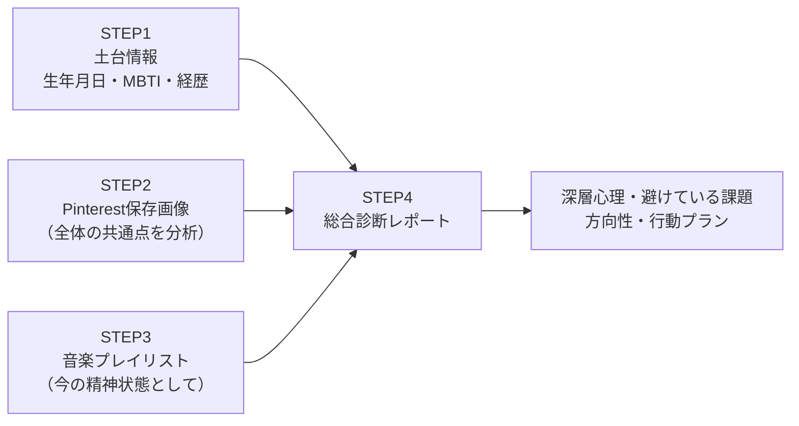

# 直感カルテ（AIによる自己解剖）

> **TL;DR**: 悩みを言葉で説明する代わりに、無意識に保存した画像・よく聴く音楽といった「直感の痕跡」をAIに分析させ、言語化できない本音・深層心理を浮き彫りにする自己分析手法。yutori片石社長（ゆとりくん）が公開し、EC実践者の寺田正信がクリエイティブ発注の言語化に応用した。

> 📌 X bookmark: 12,963（2026-07-10 時点）

この手法が解く問題は「人間は自分がすでに知っている言葉・気づいている範囲でしか思考できない」ことにある。片石氏（株式会社yutori社長・通称ゆとりくん）は「自分の内面を言語的なアプローチで掘っていくことってすごく難しい」と語り、言葉の代わりに直感——無意識に選んだ画像や最近よく聴く音楽——をAIに読み込ませて潜在的な本音を浮き彫りにする。紹介者の寺田正信（@terada_masanobu・2016年からAmazon/楽天等で自社ブランドを運営するEC実践者）は、AIに「私の悩みは何ですか」と答えを聞くのではなく「答えになる素材を渡して分析してもらう」順番こそが重要だと強調する。

記事によると片石氏はアパレル企業として史上最年少の30歳で上場し年商142億円（2026年3月期・前期比71.4%増）の経営者だが、AIの主用途は経営分析でも業務効率化でもなく、人間のカウンセラーには言えない本音をさらけ出す「自己解剖」だった。ツールはAIエージェントのGensparkを使用し、プロンプトはYouTubeで公開されている（プロンプト原文はソース記事内の画像のため本ページには未転記）。

## 手順のポイント（4 STEP）

1. **土台情報の入力** — 生年月日・算命学/四柱推命の診断結果・MBTI・簡単な経歴。ポイントは肩書きを盛らないこと。片石氏も「上場企業の社長」ではなく「会社経営」とだけ伝えた——肩書きが強すぎるとAIがそのイメージに引っ張られるため。
2. **Pinterest画像の分析** — 保存画像を一括アップし、1枚ずつではなく「画像全体の共通点」を分析させる。分析のために選ばないことが重要で、「なんとなく好き」で保存したものほど本音が表れやすい。AIが見るのは画像そのものでなく共通する世界観。
3. **音楽の分析** — SpotifyやApple Musicのプレイリストを、音楽の好みではなく「今の精神状態」として分析させる。
4. **総合診断** — 土台・画像・音楽の分析結果を統合し、現在の深層心理・避けている課題・次に向かうべき方向・具体的な行動プランを1つのレポートとして出力させる。

## 何が暴かれるか

片石氏が選んだダークファンタジー調の画像群に対し、AIは「自然光がほぼ存在しないことから、太陽の下に立つことの疲労を示している」「完璧に作り込まれた閉鎖的空間に閉じこもりたいという逃避の願望がある」と、経営者として矢面に立つ疲労感を指摘したと記事は伝える。音楽のBPM（テンポ）からは「今は立ち止まって悲しみを感じることを避けている」と分析され、指摘で終わらず行くべき場所・見るべき映画・次に作る音楽の方向性まで処方箋を出す。寺田氏自身が同じプロンプトで診断した結果は「着工が遅れる建築家」——企画・戦略・世界観の設計は好きだが投稿・出品・リリースの実行が遅い、という図星の一言だったと述べている。

## 本質は「なんとなく」を言葉に変える技術

寺田氏はこの手法の本質を自己分析ではなく「直感の言語化技術」だと再解釈し、ECのクリエイティブ発注に応用した。デザイナーへ「かっこいい感じに」と伝えても伝わらず修正10回超・制作費約5万円を捨てた経験に対し、参考画像を複数渡してAIに共通する世界観を言語化させるステップを挟むと、単なる「ピンク」が「少し色褪せたヴィンテージのフィルター越しのようなダスティピンク」になり、指示ではなくテーマそのものをチームで共有できるようになる。実際に自分のムードボードを分析させたところ「成功を誇示するラグジュアリーではなく『余白のある成功者』の世界観」と言語化され腑に落ちたという。

片石氏は内省を音楽作品に昇華し（痛みを資産に変える）、寺田氏は内省をデザイナーへの発注精度に変える——用途は違うが「頭の中の言葉にならない感覚をAIが言語化してくれる」点が共通の価値であり、寺田氏は「本当の効率化は、まず自分の内面を言語化することから始まる」と結論づけている。

## 観察ログ（未検証）

- 2026-07-09: 寺田氏はゆとりくん公開のGenspark用プロンプトをClaude Codeで実行しても「同じような分析結果を得ることができた」と報告（単一ソースの再現報告）

## 問い

- このvaultの sources/twitter/ ブックマーク群はまさに「なんとなく保存した素材」——同じ共通点分析を自分のブックマーク全体に適用したら、関心の深層や次に学ぶべき方向が言語化できるか
- 算命学・四柱推命・MBTIといった入力は分析の質にどう効いているのか。誰にでも当てはまる記述を自分事と感じるバーナム効果と、素材（画像・音楽）由来の固有な指摘とを切り分けられるか

## 関連

- [[concepts/llm-personality-injection]] — MBTI×LLMの基礎研究。直感カルテのSTEP1は性格モデルを応答スタイル制御でなく自己分析の入力素材として使う
- [[concepts/ai-emotional-reliance]] — 感情・内面処理のAI委託の心理的影響を問う研究側。カウンセラーに言えない本音をAIへ、を能動的手法にしたのが本ページ
- [[concepts/ai-strategist-prompt]] — 同じ自己の棚卸しを会話履歴（言語資産）から掘る参謀化。非言語素材（画像・音楽）から掘る本手法と対
- [[concepts/self-evaluation-gap]] — AIを自己批判の鏡として使う実践。自己認識の補正という同じゴールへの別ルート
- [[design/design-md]] — taste（趣味）は言葉で説明するより参照を与える方が伝わる、という同じ前提。こちらは参照素材そのものをAIに言語化させる逆方向
