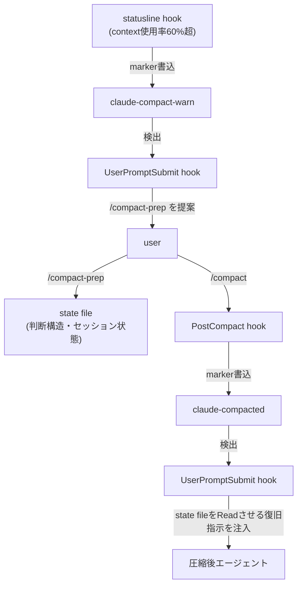

# Claude Code compact の判断構造喪失と復旧設計（compact-prep + 2段hook + 60%通知）

> **TL;DR**: Claude Code の compact は「何をやったか」の物語要約で判断構造（却下理由・現在フェーズ・セッション状態）を落とすため、圧縮前に state file へ退避し、marker ファイル経由の 2 段 hook で圧縮直後に自動復元する運用パターン（@u1 の実践）。

Claude Code の compact は手動（`/compact`）と自動（context 使用率が概ね 90〜95% 近辺で発火、と@u1 が観察）の 2 経路で走り、どちらも会話履歴を LLM に要約させて「要約＋直近ターン＋system prompt」で context を再構築する。@u1 はこの要約が「作業指示」と「作業ログ」の境界を失わせる点を構造的欠陥と指摘する。要約は「案 A を検討した」ことは残しても「なぜ却下して案 B を採用したか」は残さないため、圧縮後のエージェントが却下済み案を実装し始める。さらに一度圧縮すると raw ログには戻れない非可逆な操作である。@u1 が自身の 1 週間のセッションで観測した事故は 4 パターン：検証前デプロイ・却下済みショートカットの再実行・設計原則の失念・タスク目的の取り違え。いずれも単発の偶発ではなく標準 compact の仕様に対して構造的に発生する失敗だと@u1 は見ている。

対策系は 3 パーツからなる。

## (1) compact-prep skill — 判断構造の退避

`/compact` の前に user が明示的に叩く slash command。要約に載りにくい情報だけを固定パスの state file（`${TMPDIR}/claude-compact-state/<session_id>.md`）に決められたフォーマットで保存する。保存項目は Active Plan（planファイルのパスと現在フェーズ）・TaskList Summary・Session Decisions（採用案／却下案／却下理由）・Constraints and Blockers・Worker Topology（tmux の pane 分担）・Editing Files・Recovery Notes（圧縮後の自分への手紙）。設計の勘所は「機械的に強制する」ことで、session_id が取れなければ推測名でファイルを作らせない Hard gate、見出し順を固定して書き終わった後に読み返させ欠落を検知する Forcing function、副作用を絞る allowed-tools の 3 つで「書いたつもり」のまま state が壊れる経路を潰している。

## (2) PostCompact + UserPromptSubmit の 2 段 hook — 復旧指示の注入

Claude Code の PostCompact hook は additionalContext を返せない仕様のため、圧縮直後のエージェントに指示を直接注入する経路がない。そこで PostCompact hook は「圧縮が起きた」ことだけを marker ファイルに記録し、次の UserPromptSubmit hook が marker を検出したら additionalContext で復旧指示（plan file・state file を Read せよ／圧縮サマリーの next step は仮説として扱え／plan mode が解除されていたら再突入を確認せよ）を注入して marker を消す one-shot 構成にする。hook 間で state を共有する共通機構が Claude Code にはないため、file system 上の marker が唯一の通信路になる。通常ターンでは `test -f` 1 回で即 exit するので実質コスト 0、全体を fail-open（常に exit 0）にして hook が壊れても本体は止まらない。

## (3) 60% 通知 — 自動 compact の先回り

(1)(2) は手動 `/compact` 前提のため、宣言なしに走る自動 compact に先を越されると state file が保存されないまま raw ログが潰される。そこで既存の statusline hook に「使用率 60% 超で warn marker を書く」分岐を足し、UserPromptSubmit hook が warn marker を検出したら「/compact-prep を提案せよ」を注入する。閾値 60% の根拠は、自動 compact 発火点（90〜95%）から 30% のマージンを取りつつ、区切りの良いところまで作業を進める余力を残すため。マーカーは warn（通知したい）・warned（通知済み cooldown）・compacted（圧縮直後）の 3 種で、statusline・UserPromptSubmit・PostCompact の各 hook は単一責務＋marker の読み書きだけを持つ。ただし@u1 は、この 60% という数字は 1M context（Opus 4.7）前提でこそ意味を持ち、200K context では 60%＝120K token で残枠が少なすぎるため 80% 台まで閾値を上げる必要があると注意している。

## 観察ログ（未検証・任意）

- 2026-07-04: @u1 は効果として「1 セッションで 10 回ぐらい compact しても論理破綻が起きない」「圧縮起因の作業ロスがほぼゼロ」「却下案の再提案が消えた」「plan mode 維持・worker topology 忘却の解消」を報告（単一ソースの自己評価）
- 2026-07-04: @u1 は後日、この内容＋αを自動で入れて透過的に compact を強化するプラグインを作成したと発表（別ポスト 2073742408555343968・未取り込み）

## 問い

- このvaultの `handover` スキル（[[concepts/ai-session-handover]]）に「判断構造（採用案／却下案／却下理由）」の項目はあるか。state file の項目設計を取り込めるか
- 200K context 環境で閾値を 80% 台に上げた場合、通知から compact までの余力は実際に足りるか
- Claude Code 本体の compact が判断構造を保持する方向に改善されたら（または PostCompact が additionalContext を返せるようになったら）、この 2 段 hook は不要になるか

## 関連

- [[concepts/ai-session-handover]] — セッション文脈の明示的エクスポートパターン。本ページは「圧縮イベントに同期した退避＋自動復旧」で、引き継ぎを compact のライフサイクルに機械的に結線した発展形
- [[concepts/claude-code-instruction-methods]] — 7手段を「圧縮生存」軸で振り分ける公式フレーム。hooks がコンパクションを完全にバイパスする性質を、本ページは復旧経路として活用している
- [[concepts/codex-agent-loop]] — Codex 側の Compaction 実装（潜在表現を保持する圧縮）。テキスト要約ベースで判断構造が落ちる Claude Code compact との対比
