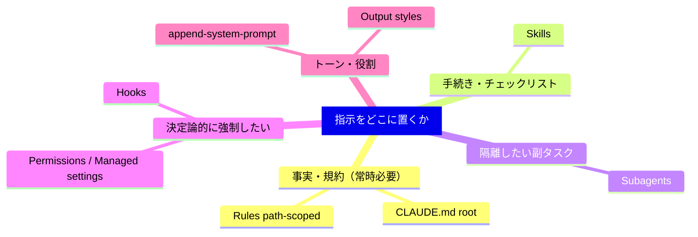

# Claude Code 指示の7手段（CLAUDE.md / rules / skills / subagents / hooks / output styles / append）

> **TL;DR**: Claudeの振る舞いを制御する7手段を「いつコンテキストに読まれるか・コンパクションで生き残るか・どれだけ強い権威を持つか・トークンコスト」で並べた、Anthropic公式の格納先決定フレーム。同じ指示でもこの軸で要件が決まれば置き場所が一意になる。

何でもCLAUDE.mdに書くと壊れる、という観察が出発点。共有リポのCLAUDE.mdは各チームが追記し誰も消さないため肥大し、全エンジニアの全セッションに無関係な行まで毎回ロードされてトークンを食い、本当に効かせたい指示への遵守を薄める。だから本質は7機能のスペック暗記ではなく、**各指示を「ロードのタイミング・永続性・権威」が要件に合う手段へ振り分ける**こと。下表が骨子で、コスト列はそのまま「肥大したCLAUDE.mdから何を逃がすべきか」の地図になる。

| 手段 | いつロード | コンパクション挙動 | コスト | 使いどころ |
|------|----------|----------------|-------|----------|
| **CLAUDE.md（root）** | セッション開始、全期間常駐 | メモ化（圧縮後に再読込） | 高 | ビルドコマンド・構成・規約・チーム規範 |
| **CLAUDE.md（サブディレクトリ）** | そのディレクトリ配下を読んだ時 | 触り直すまで消える | 低 | サブディレクトリ固有の規約 |
| **Rules**（`.claude/rules/`） | 開始時（非スコープ）/ ファイル一致時（path-scoped） | 圧縮時に再注入 | 中 | 横断的な制約（例: APIハンドラはZodで検証） |
| **Skills**（`.claude/skills/`） | 名前と説明は開始時、本体は起動時 | 起動済みは共有予算まで再注入・古い順に脱落 | 低 | 手続きワークフロー（デプロイ/リリース手順） |
| **Subagents**（`.claude/agents/`） | 名前/説明/ツール一覧は開始時、本体は呼出時のみ | 最終メッセージ（要約）だけ親へ戻る | 低 | 隔離した並列・副タスク（深い探索・ログ解析・依存監査） |
| **Hooks**（`settings.json`等） | ライフサイクルイベントで発火 | コンパクションを完全にバイパス | 低 | 決定論的自動化（lint・Slack通知・コマンドブロック） |
| **Output styles**（`.claude/output-styles/`） | 開始時、システムプロンプトへ注入 | 圧縮されない | 高 | 役割の大変更（コード assistant→汎用 assistant） |
| **append-system-prompt** | 開始時、CLIフラグで該当起動のみ | 圧縮されない | 中 | トーン・応答長・整形の好み |

## 検証済み事実

- 2026-06-20: 公式ブログ「Steering Claude Code」（claude.com/blog）が、振る舞い制御の手段を **CLAUDE.md・rules・skills・subagents・hooks・output styles・append-system-prompt の7つ**と整理。各手段は①コンテキストへのロード時点 ②圧縮（compaction）後の生存 ③権威の強さ で性質が決まる。
- **CLAUDE.md（root）はメモ化**：セッション開始で読まれキャッシュされ、圧縮時にキャッシュ破棄→再読込で復元する。サブディレクトリのCLAUDE.mdはそのディレクトリ配下を読むまでロードされず、path-scopedルールと同じ圧縮挙動（触り直すまで消える）。Anthropic推奨は**CLAUDE.mdを200行未満に保ち、オーナーを置きコードのようにレビュー**する。
- **Skillsは名前と説明だけが開始時にロードされ、本体は起動時（スラッシュコマンドかタスク自動一致）のみ**。圧縮時は起動済みSkillを全体共有予算まで再注入し、古いものから脱落する。
- **Subagentsの本体は親会話に一切入らない**。独立コンテキストで走り、戻るのは最終メッセージ＋メタデータのみ。最大5階層までネスト可、dynamic workflowsで数百の背景エージェントを編成できる。隔離が要らず各ステップを見て操舵したいならSkill、中間結果で会話を汚したくないならSubagentを選ぶ。
- **Output stylesはデフォルトのシステムプロンプトを置き換える**（`keep-coding-instructions: true` で回避可）。既定では「ソフトウェアエンジニア支援」という役割や変更スコープ・コメント方針・検証習慣などの重要指示まで落ちる。書く前に組込みスタイル（Proactive / Explanatory / Learning）の検討を推奨。
- 決定論が要る場面の指針：「毎回XしたらY」は指示でなく**hook**、「絶対Xするな」というガードレールは指示でなく**hook＋permissions**（`PreToolUse` フックがexit code 2で呼び出しをブロック）。組織全体の強制は上書き不能な **managed settings** のみが担える。非スコープのRuleは「中身をCLAUDE.mdに書く」のと機構的に同一（常時ロード・常時課金）なので、`src/api/**` 限定なら必ず `paths:` でスコープする。

## 問い

- このwikiの CLAUDE.md は今どの行が「常時必要な事実」で、どの行が「手続き（Skill化すべき）」「決定論的強制（hook/permission化すべき）」か。7手段の地図で棚卸しすると何がCLAUDE.mdから逃がせるか。
- 「200行未満・オーナー・コードレビュー」基準で見て、現状のCLAUDE.md（役割ルーター＋操作手順）は肥大の兆候があるか。操作手順は既に各スキルが正本なので、CLAUDE.md側は索引に徹せるか。
- launchd auto-sync の暴走（[[memory/feedback_autosync_race]]）のような「絶対こうなってほしくない」案件は、CLAUDE.mdの注意書きでなくhook/permissionで決定論的に止めるべきではないか。
- output styles を入れると software-engineer 既定が落ちる、という指摘は重要。このリポでスタイル変更を避け append-system-prompt で足すだけにする線引きをルール化できるか。

## 関連

- [[concepts/cursor-instruction-methods]] — Cursorの5手段を「適用タイミング×再利用範囲×コンテキスト分離」で整理した姉妹フレーム。本ページはClaude Code版で、軸が「ロード時点×圧縮生存×権威」に寄る（観察ログで既にこの記事の到来を予告していた）
- [[concepts/claude-code-context-hierarchy]] — Memory/Slash/Permissions/MCPの4層（Enterprise→Global→Project→local）。本ページの手段別軸と直交する別の整理軸
- [[concepts/claude-md-persistent-contract]] — CLAUDE.mdを「永続契約」と捉え5領域に整理するフレーム。本ページの「CLAUDE.mdは事実・索引に徹せ」と同方向
- [[concepts/claude-md-rules]] — CLAUDE.md行動ルール12条。常時ロードの指示として置くものの具体例
- [[concepts/claude-skills]] — Skill＝永続的職務定義。7手段のうち「手続き」を担う機構の詳細
- [[tools/claude-code-subagents]] — 独立コンテキスト・フォーク起動の実装側
- [[concepts/claude-code-hooks-async]] — Hooksの非同期サブエージェント起動パターン（決定論的自動化の応用）
- [[concepts/agents-md-canonical]] — 指示文（CLAUDE.md等）と実行機構（skills/agents/hooks/MCP）は別物という線引き。本ページの振り分け判断の前提
- [[concepts/loop-engineering]] — 「最小のAGENTS.mdが正義」（@rsensui引用のETH Zurich研究: 肥大で成功率低下・推論コスト+20%超）として本ページの「CLAUDE.mdは200行未満」基準を別ルートで裏付け
- [[concepts/skills-over-memory]] — メモリと CLAUDE.md を同じ「常時ロードの肥大」問題として束ね、教訓はスキルへPRせよと説く実践論。本ページの格納先決定フレームの動機側
