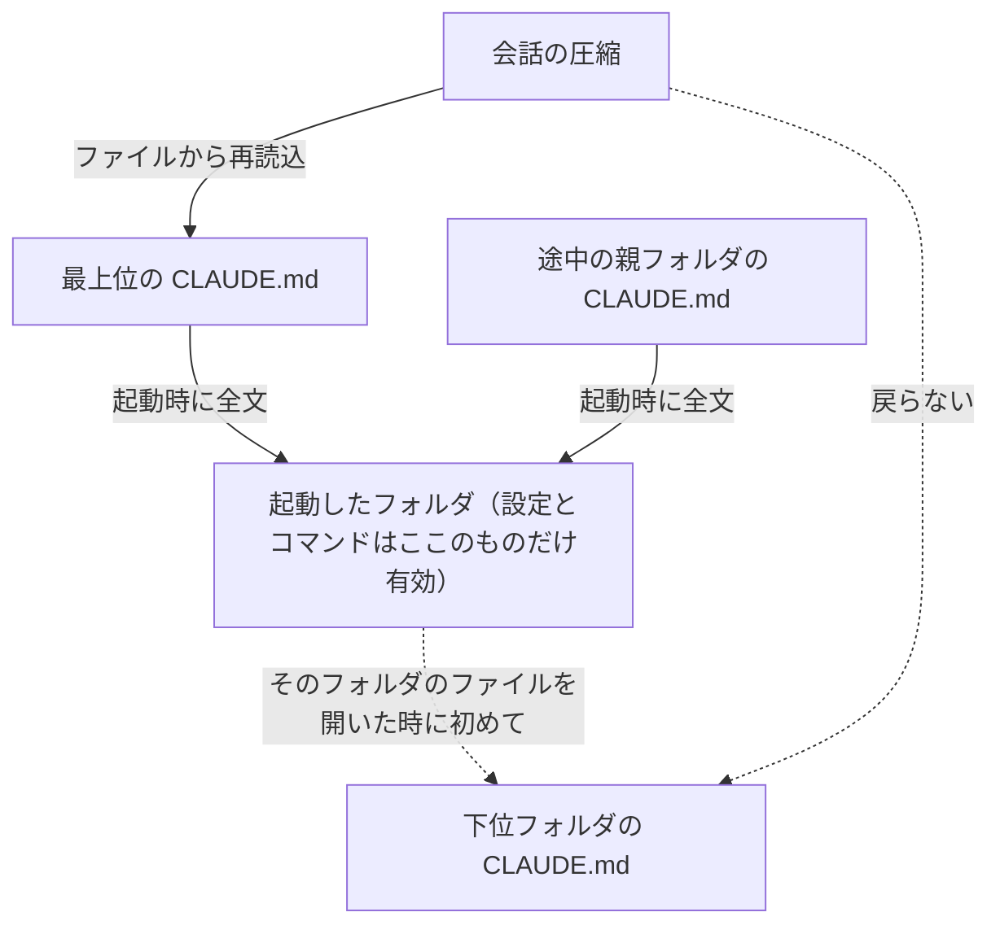

# Claude Code 起動ディレクトリ設計

> **TL;DR**: どのフォルダで起動したかが、その日に届くファイル範囲・起動時に読まれる説明書・効く設定・使える手順書を同時に決める。説明書は親から降りてくるが設定は降りてこず、圧縮後に自動で戻るのも上位の説明書だけ。

同じ頼み方なのに日によって精度がぶれるとき、多くの人はプロンプトを長く丁寧に書き直す方向へ進む。@yasu_ai_good は、その当たり外れの主因はプロンプトではなく**どのフォルダで起動したか**だとし、公式ドキュメントの仕様を引きながら診断手順を先に置く。まず `/context` を打ち、出てきた画面の「Memory files」の欄を見る。そこに自分が書いた CLAUDE.md が並んでいなければ、それは読まれていない。中身の出来ではなく、置き場所と起動場所が噛み合っていないだけだ、と同氏は書く。

## 起動フォルダが一度に決める4つ

同氏は公式ドキュメント（`code.claude.com/docs/en/large-codebases`）の整理として、起動位置で次の4つが同時に入れ替わると説明する。

- 読み書きできるファイルの範囲
- 起動した時点で読まれる説明書（CLAUDE.md）
- 効いてくる設定
- 使えるようになる手順書（スラッシュコマンド等）

最上位で起動すれば配下すべてに手が届く代わりに、起動時に読まれる説明書は最上位のものだけになる。作業したいフォルダで起動すれば範囲はその中に限られる代わりに、そのフォルダと**すべての親フォルダ**の説明書が読まれる。広く届くが説明は薄いか、狭いが説明は濃いか——毎回どちらかを選んでいることになる。

落とし穴は3番目だと同氏は指摘する。設定は起動したフォルダのものしか読まれず、説明書のように親から引き継がれることはない。**説明は上から降りてくるのに、設定は降りてこない**。「ちゃんと設定したのに効かない」の多くはここに由来する。設定側の階層（Enterprise / Global / Project / local）の全体像は [[concepts/claude-code-context-hierarchy]] を参照。

## 上の階の貼り紙は全部読む、下の階は入ったときに読む

CLAUDE.md はフォルダごとに置けるが、置けば全部が最初に読まれるわけではない。作業フォルダとその上のすべての親フォルダのものは起動時に全文が読まれ、下位フォルダのものは Claude がそのフォルダのファイルを開いたときに初めて読まれる（出典として同氏は `code.claude.com/docs/en/memory` を挙げる）。読む順は最上位から作業フォルダへ向かい、**上書きではなく積み重ね**になる。親と子が矛盾していると、どちらかが勝つのではなく両方がそのまま渡り、Claude は黙って片方を選ぶことがある。人間の新人なら「どっちですか」と聞く場面で問い返しが来ない、という点を同氏は危険視する。

もう一段効くのが圧縮時の挙動だ。会話が長くなって内容が圧縮されると、最上位の CLAUDE.md はファイルから読み直されて再び渡されるが、下位のものは自動では戻らず、次にそのフォルダのファイルを開くまで抜けたままになる。**長い作業の後半で急に作法を守らなくなる**現象の正体はだいたいこれで、ずっと守らせたいことほど下ではなく上に書く、と同氏は結論づける。この「ロード時点と圧縮後の生存」という軸を7つの指示手段に横展開したのが [[concepts/claude-code-instruction-methods]]。

ここから実務の読み替えが3つ出る。着手した瞬間から効かせたいことは起動する場所かその上に書く。逆に常時は要らないことを上に書くと毎回その読み込みを払う。親と子で言うことを食い違わせず、ときどき見比べて古い行を消す。

## 索引を持たないから、名前が入口になる

Claude Code はフォルダを事前に読み込んで索引を作らない。公式ブログはこれを agentic search と呼び、人間のエンジニアと同じようにフォルダをたどり、ファイルを開き、参照をたどると説明する。維持すべき索引がないぶん常に「今そこにある状態」から動ける利点がある一方、同じ記事には、目的のものにたどり着けるかはその場所がどれだけよく整えられているかに左右される、という但し書きもある（[[concepts/claude-code-large-codebase]] でも同じ性質を扱っている）。

探し方は2本立てで、公式のツール一覧では**名前のパターンでファイルを見つける道具**と**中身を検索する道具**が別々に用意されている。つまりフォルダ名・ファイル名は飾りではなく探索の入口そのものだ、と同氏は言う。「資料1.md」「新規ドキュメント.md」「最新版_最終.md」が並ぶフォルダは名前で当たりを付けられず、1つずつ開いて確かめる分だけコンテキストが削られる。公式が命名規則そのものを定めているわけではないが、探し方がこうである以上、名前に情報を持たせるほど無駄な開封が減るのは仕組み上そうなる、という論の立て方をしている。同氏の実務ルールは「最新」「最終」を名前に使わない（どれが本当に最新か名前で判定できなくなる）、そして**自分が探すときに打つ単語で名前を付ける**（それは Claude が打つ単語とだいたい一致するから）。

## 話しかける前に載っているもの

公式には作業開始時点で何がどれだけ載るかを目で確かめられるページ（`code.claude.com/docs/en/context-window`）があり、同氏はその例示内訳をそのまま引く。基本の指示 4,200／前回までの覚え書き 680／環境の情報 280／使える外部ツールの名前 120／手順書の説明文 450／個人の CLAUDE.md 320／そのフォルダの CLAUDE.md 1,800、合計およそ 7,850。20万に対して4%弱なので例そのものは重くないが、**このうち自分で太らせられるのは CLAUDE.md と手順書の説明文の2つ**という点が要点になる。

CLAUDE.md について公式は1ファイル200行未満を目標とし、長いファイルは場所を食うだけでなく遵守率をむしろ下げるとする。ベストプラクティスにはさらに実務的な判定基準があり、1行ごとに「これを消したら Claude はミスをするか」と自問し、しないなら削れ、と書かれている。書きたいことを書く場所ではなく、**書かないと事故ることだけを書く場所**だという整理だ。混同されやすい点として、Claude が自分で書き溜める覚え書きのほうはフォルダごとに分かれず、作業しているフォルダのまとまり全体で1つを共有する——フォルダを分ければ記憶も分かれるわけではない、と同氏は線を引く。

## 上には地図、下には作法

公式が勧める構造は凝ったものではなく2階建てだと同氏は言う。最上位の CLAUDE.md にはどこでも通用すること（全体の地図と共通の決まりごと）を書き、各フォルダの CLAUDE.md にはそのフォルダだけの作法を書く。下に全体の話を書くと上と重複し、両方が毎回読まれる。書き方は**後から確かめられる粒度**まで下ろす——「きれいに整える」ではなく「字下げは半角スペース2つ」、「ちゃんと確認する」ではなく「終わったらこのコマンドを実行する」。

書き足すタイミングとして公式が挙げる4つを、同氏は「4つとも『同じことがもう一度起きた』が引き金」とまとめる。同じ間違いを2回目にしたとき／あとから見返して知っておくべきだったと気づいたとき／前と同じ指摘をまた打ち込んだとき／新しく入った人に同じ説明が必要になったとき。最初から完璧を目指さず、同じ手間が2回出た日に1行だけ足すほうが結果的に短く保てる、という育て方を推す。

崩れるのは作った直後ではなく1ヶ月後なので、整理とセットで「やらないこと」を決めておく。階層を3段以上にしない（深いほど下の説明書が効き始めるまでの時間が長い）／下書きと完成品を同じフォルダに入れない／最上位にファイルを直接置かない／1回の会話に関係のない用事を混ぜない。最後の1つは公式ベストプラクティスが強い調子で書いている項目で、無関係な作業の間はリセットせよ、同じ問題で2回直しても直らなければその会話は失敗した試行で汚れているのでわかったことを織り込んで始め直すほうが速い、とされる。フォルダを分けることと会話を分けることは、**今の用事に関係ないものを持ち込まない**という同じ目的の別手段だ、というのが同氏のまとめ方になる。見直し頻度については、CLAUDE.md の変更を通常の資料と同じレビュー対象にすること、そしてモデルが大きく更新されたあとに棚卸しすること（古いモデルの弱点を補うルールが新しいモデルでは無駄になるため）が挙げられている。

非エンジニアがゼロから棚を作る場合の役割別フォルダ構成は [[concepts/claude-code-work-folder]] が具体形を示している。本ページの「名前に情報を持たせる」「下書きと完成品を分ける」はその構成を選ぶ理由の説明にあたる。

## 今日やる3ステップ

同氏はフォルダの移動を最後に置き、現状把握から始める順序を勧める。

1. `/context` で Memory files を確認する。意図したファイルが並んでいなければ、置き場所か起動場所のどちらかがずれている
2. プランモード（Shift+Tab）に入ってから、Claude 自身にフォルダの地図の下書きを作らせる。各フォルダの1行説明／名前から中身が想像できないもの／同じ役割が2箇所以上に分かれている場所——の3つを書き出させ、移動の提案はまだ求めない
3. 最上位に CLAUDE.md を1枚置く。中身は「全体の地図」だけでよく、作法は空でよい

## ブラウザ側も同じ方向へ

同氏はこの記事の中身を「AIに渡す前に、渡す範囲を自分で決めておく」の一点に要約し、ブラウザ側のAIも同じ方向に動いていると接続する。OpenAI の2026-08-13リリースノート「Google Drive is now in Library」は、フォルダを選んでその中のファイルをまたいで作業させられると案内している（原文は "You can also select a folder and ask ChatGPT to work across the files it contains."）。渡す単位がファイルからフォルダへ上がった以上、フォルダの中身の整い方と名前の付け方がそのまま答えの質になる、という読み替えになる。

## 観察ログ（未検証）

- 2026-08-18: ChatGPT のフォルダ指定機能は Plus・Pro・Enterprise・Edu・Healthcare・Business の Web 版のみで Free と Go は対象外、共有ドライブ未対応、と同氏は書く（リリースノートの二次引用。提供範囲は変わりやすいので利用前に一次情報を確認する）

## 問い

- このリポの `CLAUDE.md` は最上位1枚に集約されているが、`scripts/`・`.claude/skills/` 配下に下位 CLAUDE.md を置くと「圧縮後に戻らない」性質が効いてくる。長時間セッションで守らせたいルールは本当に最上位にあるか
- `sources/`・`wiki/` のファイル名は「自分が探すときに打つ単語」になっているか。日付＋slug 形式は名前で当たりを付けるのに足りているか
- 起動位置を vault ルートに固定している現状は「広く届くが説明は薄い」側の選択にあたる。ingest 作業とリポ開発でそれぞれ別の入口を用意すべきか

## 関連

- [[concepts/claude-code-instruction-methods]] — 同じ「ロード時点×圧縮後の生存」という軸を CLAUDE.md 以外の6手段（rules/skills/subagents/hooks/output styles/append）へ広げた公式フレーム。本ページはその軸を起動位置の側から見た形
- [[concepts/claude-code-context-hierarchy]] — 設定の4層（Enterprise→Global→Project shared→local）。本ページの「説明は継承されるが設定は継承されない」はこの階層と直交する落とし穴
- [[concepts/claude-code-large-codebase]] — インデックスを持たない探索と、サブディレクトリ起動で精度を出す指針。本ページはその起動位置の話を非エンジニアの作業フォルダまで一般化したもの
- [[concepts/claude-code-work-folder]] — 役割別フォルダ（inbox/reference/draft/output/archive）の具体形。本ページの命名規則・分離原則が「なぜその棚割りか」の説明になる
