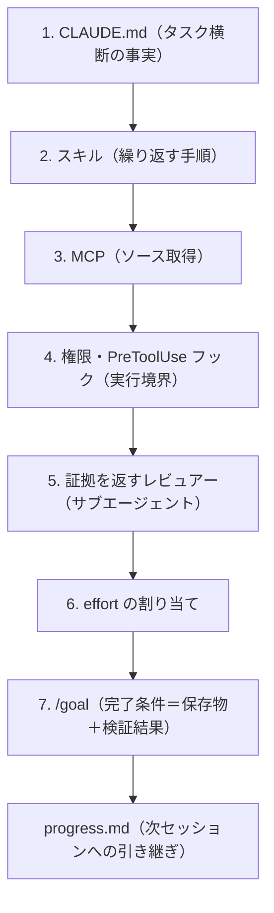

# Claude Code で長時間タスクを完走させる7層ハーネス

> **TL;DR**: Opus 5.5 の長いタスクを「開ける成果物・検証できる証拠・翌日続けられる進捗記録」で終わらせるために、Claude Code の既存機能（CLAUDE.md・スキル・MCP・権限とフック・レビュー用サブエージェント・effort・`/goal`）を7層に割り当てて組む再利用前提のセットアップ（@beamnxw）。

途中で止まった長い実行は予算を食うだけで何も残さない、というのが @beamnxw の出発点である。そこで「実行を始める前に、出力（成果物・証拠・進捗）をワークフローに組み込む」ことを提案する。ハーネスは「モデルの周りにある指示・ツール・権限・状態・チェックを調整するもの」と定義され（[[concepts/harness-engineering]] の「モデル以外のすべて」と同じ見方）、本記事はそれを Claude Code の設定ファイル4つ・任意の外部接続1つ・タスクごとのゴール1つに落とした実装手順版にあたる。例は文書作成ワークフローで、参照資料を `sources/`、作業中の下書きを `drafts/`、承認済みを `published/` に置く。なお記事中の貼り付け用スニペット（CLAUDE.md・SKILL.md・settings.json・エージェント定義・起動コマンド・`/goal` 文）は画像または埋め込みで、ソースには本文テキストしか残っていない。

## 7層の中身

**1. ワークスペースに必要な事実を置く**: ルートの CLAUDE.md にはタスクをまたいで有効な情報（出力先・ソース要件・文体規約）だけを書き、一時的な締め切りや未解決の疑問はタスク側に置く。@beamnxw は、`@path` インポートで分割しても読み込みはセッション開始時なので「整理には使えるが、たまにしか使わない手順はスキルへ」と区別する。1回の下書きで見つかった好みは、今後にも適用すると確認してから常設ルールに昇格させる（[[concepts/claude-md-rules]]）。

**2. 繰り返す手順をスキルに保存する**: 「読む→作る→レビューする→保存する」を `.claude/skills/write-draft/SKILL.md` にし、`$ARGUMENTS` でトピックを差し替える。各ステップに観察可能な結果（ソースの選定・保存されたファイル・書き手が解決できる指摘）を持たせ、「正確性を確認する」のような判断が開いたままの指示を避ける。公開の承認は下書き準備と分け、手順の改善はスキルを直す形で行う（例: 発表日と提供開始日の取り違えが続くならチェックを足す）。

**3. ソースへのアクセスを与える**: MCP 接続は特定のステップに役立つときだけ足す。長いタスクに頼る前に既知のページを1つ取得して中身を確かめ、取得失敗時は文書 ID と失敗理由を残して認証・アクセスを確認してから再試行する。使わないサーバーは `/mcp` で無効化する（[[tools/claude-mcp]]）。

**4. 行動ルールを実行層に置く**: 変更してよいファイルと承認が要る操作を `.claude/settings.json` の権限で定義し、引数やタスク状態で判断が変わるものは PreToolUse フックで検査する。例では `published/` 配下への Edit を拒否し、`/permissions` で実効ルールを確かめ、ダミー文書の編集が拒否されることを試す。@beamnxw は、ファイルツールの制限は任意の Python/Node プロセスには及ばないので、必要なら OS のサンドボックスで縛ると注意している。外部書き込みがタイムアウトしたら、1回目が完了している可能性があるので再試行前に書き込み先を確認する。

**5. レビュアーに証拠を返させる**: `.claude/agents/evidence-reviewer.md` に読み取り・検索ツールだけを持つサブエージェントを置き、下書きのパス・関連ソースの場所・検査すべき主張を渡す。各指摘は「主張と開いたソース」を結び、「誤り」判定には矛盾する証拠と適用できる修正を、「未解決」判定には欠けている証拠を求める。修正は本体エージェントが行い、意味が変わったら隣の文も再確認する（[[tools/claude-code-subagents]]）。トランスクリプトでなく環境に残った成果物を検査する、という Anthropic の評価ガイダンスに沿っていると @beamnxw は説明する。

**6. 作業に effort を割り当てる**: 本体は Opus 5.5 の既定 `medium` で始め、レビュアーだけ `high` を要求する。@beamnxw は「考える深さについての指示文を書いても effort 設定は変わらない」と区別し、受け入れチェックの通過数と必要だった修正を記録して effort を仕事単位の判断にするよう勧める（[[concepts/effort-level-selection]]・[[concepts/claude-code-model-effort]]）。初回の前に `/context`・`/agents`・`/permissions` で読み込み状態を確認する。

**7. 何を証明すべきかを伝える**: 完了を「保存された成果物と検証結果」で定義し、`/goal` に渡す（[[tools/claude-code-goal]]）。`/goal` は会話に表れた証拠をターン間で評価するので、エージェントが結果を示す必要がある。ターン数の条項はモデル評価なので、厳密な実行時間・支出の上限には実行制御が要る、と @beamnxw は書く。期待する出力は `drafts/article.md`・`drafts/checks.md`・`progress.md` の3つ。

## 引き継ぎと計測

`progress.md` には意味のある段階ごとに「現在のファイル・完了したチェック・未解決の問い・次の行動」を記録し、新しいセッションで再開させて、最初からやり直すなら欠けた判断やパスを補う（[[concepts/ai-session-handover]]）。ルートの CLAUDE.md は compaction 後に再読込されるので、恒常的な事実はそこに置く。復旧について、`/rewind` は追跡しているファイル編集を戻せるが、シェルでの変更や多くのサブエージェントの編集は別途の復旧が要り、永続的な履歴は git が持つ、と @beamnxw は整理している。

計測は「受け入れた成果物」単位で行う。`/usage` と `/context` を見て、委任したレビューと再試行もタスクの総量に含め、レビュー時間と必要だった修正も記録する。設定変更を試すときはタスクと受け入れ基準を固定して1要素だけ変える。@beamnxw は、Anthropic の Opus 5.5 発表で早期テスターが報告した 60% のトークン削減はその実験に属する数字で、自分のハーネスの節約は完了タスクの計測で確かめるべきだと釘を刺している（[[models/claude-opus-5-5]]）。

## 問い

- このリポの wiki-ingest は「スキル＋/tmp/ingest_result.json」までで、7層のうち証拠を返すレビュアー（主張とソースの対応表）を持たない。ingest 後に `checks.md` 相当の主張–ソース対応表を出させると、捏造事故の検出が速くなるか。独立審判を撤去した経緯と矛盾しない形（判定でなく対応表の提示に留める）は作れるか
- 「受け入れた成果物あたりのトークン＋レビュー時間」で effort を比べる計測を、weekly 生成など定型タスクで1回やってみる価値はあるか
- [[concepts/harness-engineering-roadmap]] の14ステップのうち、本ページの7層はどこまでをカバーし、ループ層・システム層のどこが抜けているか

## 関連

- [[concepts/harness-engineering]] — ハーネス＝モデル以外のすべて、という全体論。本ページはそれを Claude Code の設定ファイルに落とした実装手順
- [[concepts/harness-engineering-roadmap]] — 1体から自己改善システムまでの14ステップ。本ページは1体のハーネス層の具体例
- [[tools/claude-code-goal]] — 7層目で完了条件を渡す機能。会話に表れた証拠で評価する仕様が本ページの「証拠を返させる」設計の前提
- [[concepts/effort-level-selection]] — effort を仕事単位で決める判断の実験記録
- [[concepts/ai-session-handover]] — progress.md による引き継ぎと同じ課題を扱う手法集
- [[tools/claude-code-subagents]] — 証拠を返すレビュアーを置く仕組み
- [[models/claude-opus-5-5]] — 対象モデル
