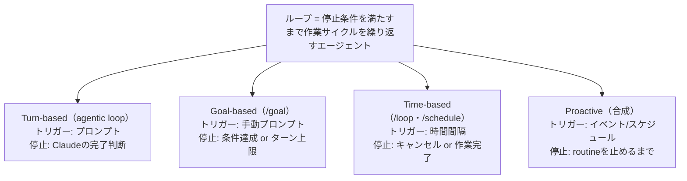

# Claude Code 公式ループ4類型（Getting started with loops）

> **TL;DR**: Claude Code チームによるループの公式定義は「停止条件を満たすまで作業サイクルを繰り返すエージェント」。トリガー・停止条件・使用プリミティブ・適合タスクの4軸で Turn-based / Goal-based / Time-based / Proactive の4類型に整理し、「最も単純な解決策から始めて選択的に使う」を原則に置く。

> 📌 X bookmark: 25,526（2026-07-07 時点）

X 上では「プロンプトでなくループを設計せよ」が流行語になる一方、「ループとは何か」の答えが発信者ごとに食い違う——という状況認識から、Claude Code チームとしての定義を確定させるために書かれた公式記事。執筆は同チームの @delba_oliveira で、@ClaudeDevs 公式アカウントが2026-07-06に公開した。コミュニティ側の定義乱立は [[concepts/loop-engineering]] や [[concepts/goal-loop-routine]] が扱ってきた問題そのもので、本記事はそれに対するベンダー公式の回答にあたる。全タスクに複雑なループは不要で、最も単純な解決策から始めてパターンは選択的に使え、という但し書きが全体を貫く。

## 4類型

| 類型 | トリガー | 停止条件 | 適合タスク | 使用量の管理 |
|---|---|---|---|---|
| **Turn-based**（agentic loop） | ユーザーのプロンプト | Claude がタスク完了 or 追加文脈が必要と判断 | 定常プロセス外の短いタスク | 具体的なプロンプト＋スキルで検証を強化しターン数を減らす |
| **Goal-based**（`/goal`） | リアルタイムの手動プロンプト | 目標達成 or 最大ターン数到達 | 検証可能な終了基準を持つタスク | 明確な完了基準＋「5回試したら止まる」等の明示的ターン上限 |
| **Time-based**（`/loop`・`/schedule`） | 指定した時間間隔 | ユーザーのキャンセル or 作業自体の完了（PRマージ・キュー空） | 定期作業・外部システムとの接続 | 間隔を長くする・時間でなくイベントに反応させる |
| **Proactive** | イベント or スケジュール（リアルタイムの人間不在） | 各タスクはゴール達成で終了、routine 自体は止めるまで走る | バグ報告・issue トリアージ・移行・依存更新など定型作業の継続的な流れ | routine は小型高速モデルへ、判断は最上位モデルへ |

Turn-based は毎プロンプトが1つの手動ループで、文脈収集→行動→自己チェック→応答のサイクルをチームは agentic loop と呼ぶ。手動でやっている検証手順を SKILL.md に符号化すると Claude が自己検証できる範囲が広がり、チェックが定量的なほど自己検証しやすいと記事は述べる。

Goal-based は「もう十分か」の判断を Claude 自身にさせない仕組みで、停止しようとするたびに評価器モデルが条件を照合し、未達なら作業へ送り返す。だからテスト通過数やスコア閾値のような決定論的基準が最も効く（実装は [[tools/claude-code-goal]]）。

Time-based の `/loop` はローカル実行なのでPCを閉じると止まる。クラウドへ移すなら `/schedule` で routine 化する。

Proactive は単独機能でなく合成で、`/schedule` で新着レポートを確認し、`/goal` で完了を定義し、dynamic workflows（[[concepts/claude-code-dynamic-workflows]]）でトリアージ→修正→レビューをオーケストレーションし、auto モードで許可確認なしに回す構成例が示される。

## 品質はループの周囲のシステムが決める

記事は「ループの出力品質はそれを取り巻くシステムに依存する」とし4点を挙げる。①コードベース自体を綺麗に保つ（Claude は既存の慣習に従うため）②スキルで「良い」の定義を符号化し自己検証させる③フレームワークのドキュメントに届きやすくする④コードレビューには別のエージェントを使う——新鮮なコンテキストを持つレビュアーはメインエージェントの推論に影響されずバイアスが少ない。個別の結果が基準を満たさないときは、個別修正で止めずシステム側に符号化して以後の全イテレーションを改善せよ、と結ぶ。④は [[concepts/loop-anatomy]] の Generator/Evaluator 分離と同旨。

## トークン管理

- 適切なプリミティブとモデルを選ぶ。小タスクに複数エージェントやループは不要
- 成功・停止基準を具体的に定義する。早すぎる完了も遠回りも防ぐ
- 大規模実行の前に小さなスライスで試走する。dynamic workflows は数百エージェントを起動しうる
- 決定論的作業はスクリプトにする。毎回コードを再導出するよりスクリプト実行が安い
- routine を必要以上の頻度で回さない。監視対象の変化頻度に間隔を合わせる
- 使用量をレビューする。`/usage` はスキル・サブエージェント・MCP 別の内訳、引数なしの `/goal` はここまでのターン数とトークン使用量、`/workflows` はエージェント別の使用量を表示し、エージェントはいつでも停止できる

「決定論的作業はスクリプト」はこの vault の決定論 vs AI の線引き方針と同じ原則であり、「間隔を監視対象の変化頻度に合わせる」は launchd ingest の間隔設計にそのまま適用できると考えられる。

## 問い

- 自分の launchd ingest ループは4類型のどれとして最適化すべきか。time-based からイベント駆動へ移す余地はあるか
- 「個別修正で止めずシステムに符号化する」は LESSONS.md 追記の運用と同型だが、符号化した教訓が後続イテレーションを実際に改善したかを測る術はあるか
- 公式4類型と [[concepts/goal-loop-routine]] の3動詞・[[concepts/loop-engineering]] の4条件テストを1枚の実務チートシートに統合できるか

## 関連

- [[concepts/loop-engineering]] — コミュニティ発のループ工学の正本（5段階史・4条件テスト・6構成要素）。本ページはその公式定義版
- [[concepts/goal-loop-routine]] — goal/loop/routine の3動詞の使い分け。公式4類型は turn-based と proactive を加えた上位集合
- [[concepts/loop-anatomy]] — 1ターンの解剖学（5ムーブ×6パーツ）。「別エージェントでレビュー」は Generator/Evaluator 分離と一致
- [[tools/claude-code-goal]] — Goal-based ループの具体実装（評価器モデルによる停止判定）
- [[concepts/claude-code-dynamic-workflows]] — Proactive ループの合成部品（トリアージ→修正→レビューのオーケストレーション）
- [[tools/loop-library]] — すぐ使えるループのカタログ。本ページの類型で分類し直せる
- [[tools/makeloop]] — `/loop` プロンプト生成器。time-based ループの設計を自動化する側
