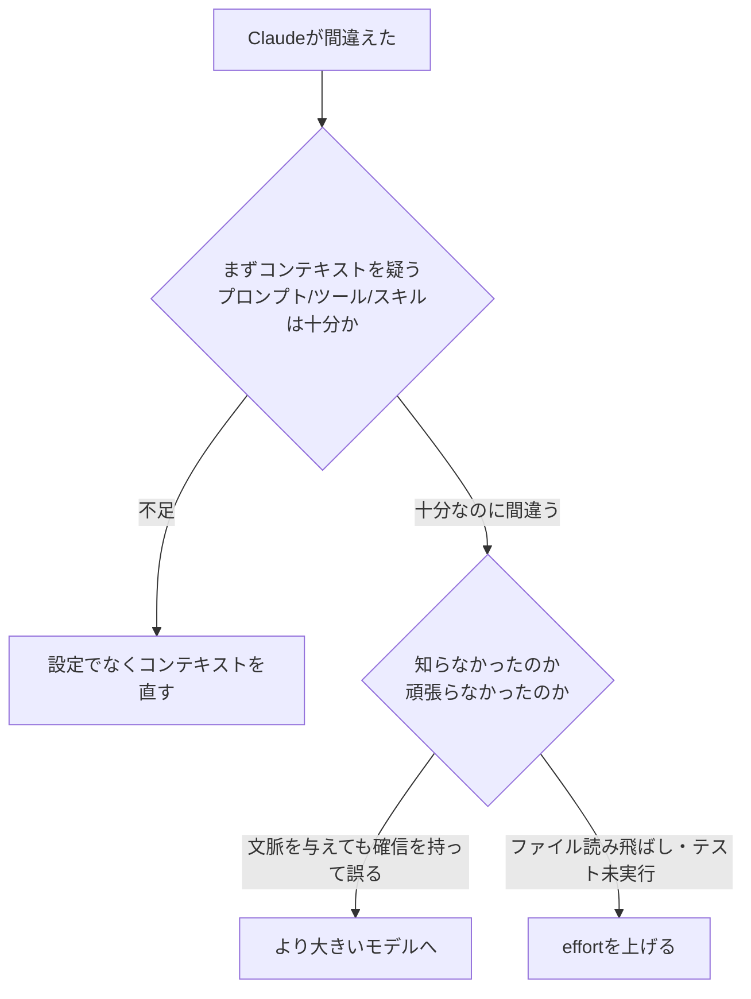

# モデル選択と Effort（knowing more vs trying harder）

> **TL;DR**: モデル設定は「どの凍結済み重みが応答するか＝何を知っているか」を、effort 設定は「完了と見なす前にどれだけ徹底的に働くか」を決める別次元のつまみ。Claude が間違えたらまずコンテキストを疑い、次に「知らなかったのか（モデル）／頑張らなかったのか（effort）」で切り分ける。

「大きいモデル＝賢い出力」は正しいが「高 effort＝長く考える」は不正確だ、というのが出発点。effort は思考時間だけでなく、読むファイル数・検証の量・ユーザーに戻る前にマルチステップタスクをどこまで進めるかという「リクエスト全体の仕事量」を制御し、低 effort では自力でトークンを使って調べるよりユーザーに文脈を尋ねる方へ倒れる——と Claude Code チームの Lydia Hallie（@lydiahallie）が公式記事で解説する（@ClaudeDevs が2026-07-08公開）。

## モデル設定＝どの重みが応答するか

プロンプトはトークン化されて整数列になり、モデルは訓練時に固定された重み（数十億のパラメータ行列）を通して次トークンの確率を計算する。重みは推論時には読み取り専用で、プロンプトも CLAUDE.md も重みを変えない——文脈投入は「操舵」であって「教育」ではない。訓練時に存在しなかったライブラリは重みに無く、docs を文脈に入れても効果はそのリクエスト限り。存在しない API を自信満々に呼ぶ幻覚は「検索の失敗」ではなく、訓練パターンから尤もらしいトークン列が生成された結果だと Hallie は説明する。モデル設定が実際に決めるのは、①どの重みセットが処理するか②出力トークン単価、の2つで、何トークン生成されるかは決めない。そこを決めるのが effort。

## Effort＝どこまで徹底するか

思考・ツール呼び出し・ユーザー向けテキストはすべて同一の生成ループから出る出力トークンで、同一レートで課金される。effort はプロンプトと並んでリクエストの入力としてモデルに渡され、各レベルでの振る舞いは訓練で重みに焼き込まれている。その効果は「完了と見なすために必要な徹底度・確信度の閾値」を毎ターン設定すること。高 effort では計画が深く広くなり二重チェックが増えるが、計画は固定されず途中の結果で更新される——3仮説のデバッグ計画で1つ目にバグが見つかれば残りはスキップされる。一方で単純タスクの使用量を人工的に膨らませる「overthinking」は品質劣化要因として訓練時に監視している、とチームは明言する。

推奨は「デフォルト effort を使い、変えるならタスク単位でなく一般的な好みとして扱う」。Opus 4.8 のデフォルト effort は Opus 4.7 のデフォルト比で、同程度のトークン量のままより良い結果を出すとチームは自社テストを報告している。結果が悪いときの第一手は設定変更でなくコンテキストの見直し（プロンプトの曖昧さ・ツール・スキル）で、effort を上げたくなるタスクの修正はたいてい上流にある。

## 使い分け: 知らなかったのか、頑張らなかったのか

- **モデルを上げる**: 問題が本当に難しいとき（微妙なバグ・未知ドメイン・アーキテクチャ判断）。どれだけ文脈を与えても小モデルが「確信を持って間違う」なら上げるシグナル。大モデルは曖昧さの処理も上手く、小モデルには実行を細かく指示する方が効く
- **effort を上げる**: ファイルを読み飛ばした・テストを実行しなかった・二重チェックしなかったなど「試行の不足」で間違えたとき。特にデフォルト未満の effort を選んでいた場合

Hallie の比喩では、Fable は「他の誰にも解けない問題を扱う専門医」、Opus は「経験豊富な専門家」、Sonnet は「優秀な万能選手」で、effort は誰であれその人が費やす時間を決める。Opus 低 effort は「専門家との5分間」、Sonnet 高 effort は「午後いっぱい使える万能選手」にあたる。

## コストとの相互作用

同一 effort の定型作業では大小どちらのモデルも正解するが、大モデルは検証を多めに入れ単価も高い——定型区間で小モデルへ落とすのは品質コストゼロの節約になる。逆に難しいマルチステップ作業では、小モデルが能力の限界へ向けて反復を燃やす間に大モデルは少ないステップで同じ品質へ到達し、タスク単位の総コストは逆転しうる。チームのテストでは Fable は Opus/Sonnet がどの effort レベルでも到達できないジョブを完了しており、それが最長・最難のタスクに Fable を温存する理由でもある（[[models/claude-fable-5]] の「長く複雑なタスクほど差が開く」特性と一致）。effort はトークン消費を形作るが上限ではなく、唯一のハードキャップは max_tokens。トークン予算や「簡潔に」という指示は、壁でなくモデルが従うよう訓練されたガイダンスとして機能する。

## 問い

- headless 実行（launchd ingest）は「ユーザーに聞けない」環境なので、低 effort の「聞く方へ倒れる」性質と相性が悪いはず。自動実行系のデフォルト effort はどう設定すべきか
- [[concepts/llm-model-selection-strategy]] の工程分解（上流大・下流小）に「確信を持って間違うならモデル、試行不足なら effort」の診断軸を重ねると、工程ごとの effort 既定値まで設計できるか
- 「effort はタスク単位でなく一般的な好みとして扱え」という公式推奨は、rigor を都度選ぶ自分の運用と矛盾するか

## 関連

- [[concepts/llm-model-selection-strategy]] — 「モデル×エフォートの二軸」を工程分解で運用する実務戦略。本ページはその公式の理論版
- [[models/claude-fable-5]] — 専門医側の実体。どの effort でも他モデルが届かないジョブを完了するという公式主張の対象
- [[concepts/advisor-executor-pattern]] — モデルの知識差を前提に高価モデルの出番を絞る配線パターン
- [[models/claude-opus-4-8]] — 専門家側。デフォルト effort が 4.7 比で同トークン量のままより良い結果という公式報告
- [[concepts/token-management]] — トークン消費を経営イシューとして扱う上位論点
