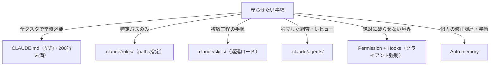

# CLAUDE.md 多層設計

> **TL;DR**: CLAUDE.md単体に全てを書くのをやめ、常設の契約（CLAUDE.md）・パス別Rules・遅延ロードSkills・独立Reviewer・Permission/Hooksの強制境界へ役割分担し、精神論を観測可能な契約文へ書き換える設計論。

現行仕様ではCLAUDE.mdはシステムプロンプトの一部ではなくユーザーメッセージとして渡されるため、モデルは内容を尊重しようとするが厳密な順守は保証されない——だから必ず守らせたい境界はPermission・Sandbox・PreToolUse Hookなどクライアント側で強制される仕組みへ移す必要がある、と@ai_ai_ailoverが整理する（記事は2026年8月28日時点のAnthropic公式Docsを基準にしたと明記）。「あなたは世界最高のエンジニアです」型の人格盛りが弱いのは達成を観測できないからで、強いルールは「変更に最も近いテストを先に実行し、実行できなかった検証は成功と書かず未実行の理由を報告する」のように検査可能な契約の形をとる。[[concepts/claude-md-rules]]が測定値で示した方向を、書き換えの対比例（弱い設定→強い設定）として一般化したものと考えられる。

もう一つの柱は「巨大CLAUDE.mdはむしろ弱い」で、長くなるほど重要な規則がノイズに埋もれる。対策は単なる短縮ではなく、常時必要な情報（目的・推測できないコマンド・非自明な設計判断・完了条件・重大な禁止）だけを常設し、それ以外を遅延ロードに逃がすことだと述べる。

## 7層の役割分担

@ai_ai_ailoverの推奨構成は次の7層で、比喩として「CLAUDE.mdが憲法、Rulesは部署別規程、Skillsは標準作業手順書、Subagentsは専門部署、Permission/Hooksは物理的な入退室管理」と表現される。

- `~/.claude/CLAUDE.md` — 全案件共通の個人ルール
- プロジェクト直下 `CLAUDE.md` — リポジトリ固有の契約。実用上200行未満に抑える
- `.claude/rules/` — pathsのglob指定で対象ファイルを扱ったときだけ適用される条件付きルール（認証・DB・フロントエンドなど）
- `.claude/skills/` — 必要時だけ読み込まれる複数工程の手順。`disable-model-invocation: true` で人間の明示起動限定にもできる
- `.claude/agents/` — 独立コンテキストの調査・レビュー担当
- `.claude/settings.json` + Hooks — モデル判断に依存しない強制境界。Permissionはdeny→ask→allowの順で評価され、PreToolUse Hookの exit 2 はAllowルールより優先してブロックする
- Auto memory — 個人の修正履歴・学習の補助記憶。マシンローカルでありチーム規約の配布には使わない

## 証拠ベース完了と Writer/Reviewer 分離

同梱の汎用テンプレート「Project Contract」の最重要点は、人格でなく証拠ベース完了を定義していることだと著者は強調する。テストしたと言うならコマンドと結果、修正したと言うなら差分と再現条件、未実行なら未実行と明記させ、モデルの「成功しました」だけで完了判定しない。

また、長時間実装したClaudeは自分が採用した前提に引っ張られるため、差分だけを見せる敵対的レビュアー（adversarial-reviewer）サブエージェントを分離し、要件・正しさ・セキュリティ・互換性・未検証事項に影響する実質的欠陥のみをBLOCKER/MATERIAL/OPTIONALで報告させる。「何か問題を見つけろ」とだけ命じると好みのスタイル指摘の量産と過剰実装を誘発する。組み込みのExplore/PlanエージェントはCLAUDE.mdを読み込まない仕様のため、プロジェクトルールを踏まえたレビューは専用のカスタムReviewerで行うべきだと記事は述べる。

## 入れてはいけない設定

著者は「何があっても質問するな」「すべての変更で詳細計画を作れ」「常に全テストを実行せよ」「好きにパッケージを追加してよい」「自動でCommit・Push・Deployまでやれ」「bypassPermissionsの普段使い」の6つを挙げ、いずれも自律性や速度の名の下に不可逆操作・信頼境界の変更を無防備にすると警告する。正しくは「安全で可逆な仮定は明示して進み、不可逆操作・外部副作用・セキュリティ境界変更だけを質問する」の形にする。

## 導入手順

現在のCLAUDE.mdの各行へ「この行を消すとClaudeは実際に間違えるか」を問い、Noなら削除する。残りを「コードから分かる→削除／特定パスだけ→Rules／複数工程→Skill／絶対禁止→Permission・Hook／今回だけ→プロンプト／個人だけ→CLAUDE.local.md」へ分類し、同じ修正を二回したら三回目に怒るのでなく仕組みへ昇格させる。設定後は /context・/memory・/permissions・/hooks・/doctor で「本当にロードされたか・禁止操作が実際に止まるか・完了報告に証拠が付くか」まで確認する。

[[concepts/claude-code-instruction-methods]]（公式の7手段振り分けフレーム）と到達点はほぼ重なるが、本記事は振り分けた中身を検査可能な契約文へ書き換える対比例と、コピペ可能な実装物一式（Project Contract全文・adversarial-reviewer定義・settings.jsonのallow/ask/deny実例・破壊コマンド遮断のPreToolUse Hookスクリプト）を提供する点が実装ガイドとして独自。

## 観察ログ（未検証）

- 2026-08-29: 記事がClaude Platform Docs由来と主張する仕様3点は一次未確認——①CLAUDE.md内のブロックHTMLコメントはコンテキスト注入前に除去される（コードブロック内は対象外）②4MiB超のCLAUDE.mdは読み飛ばされる ③組み込みExplore/PlanはCLAUDE.mdを読み込まない

## 問い

- 観察ログの仕様3点を公式Docsで裏取りする。特にHTMLコメント除去が本当なら保守メモの置き場所の定石が変わる
- 自分のグローバルCLAUDE.md・このvaultのCLAUDE.mdに「消すと間違えるか」テストを適用したら何行残るか
- 「同じ修正を二回したら仕組みへ昇格」は、このvaultのLESSONS.md運用・auto memory運用とどう対応づくか

## 関連

- [[concepts/claude-code-instruction-methods]] — 公式フレーム版の7手段振り分け（ロード時点×圧縮生存×権威×コスト）。本ページは同じ結論を「検査可能な契約への書き換え」と実装テンプレートで補う
- [[concepts/claude-md-persistent-contract]] — CLAUDE.md=永続契約という同じ捉え直しの非エンジニア向け5領域版
- [[concepts/claude-code-context-hierarchy]] — 複数階層のCLAUDE.md結合・遅延ロードを階層構造の側から整理した公式仕様ページ
