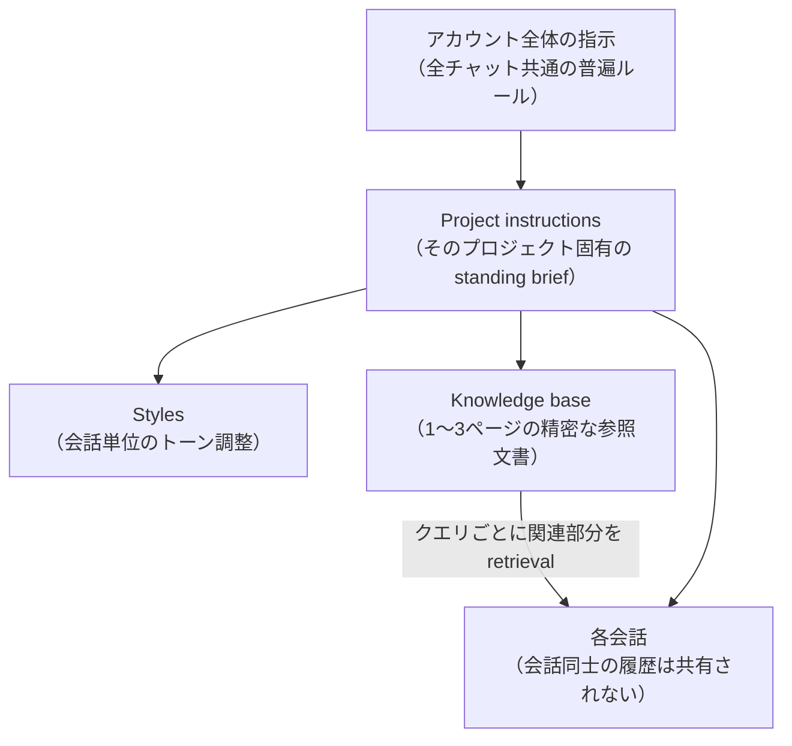

# Claude Projects セットアップ実践（精密知識ベース・retrieval テスト）

> **TL;DR**: Claude Projects を機能させる鍵は「1〜3ページの精密な知識ファイル・standing brief 型の指示・retrieval テスト・更新習慣」の4点にあり、最大の失敗は知識ベースを物置にして検索精度を希釈すること（@cyrilXBT）。

Project の実体は「custom instructions（全会話に自動適用される常設ブリーフ）・knowledge base（毎回参照できるファイル群）・scoped conversations（同じ指示と知識を継承するチャット群）」の3要素で、@cyrilXBT は「会話同士はメッセージ履歴を共有しない。引き継がれるのは指示とファイルだけ」という点が設計のすべての前提だと強調する。毎朝同じ従業員に同じブリーフィングをして夜に忘れられる状態（検索バー的な使い方）を、指示とファイルの常設で断ち切るのが Projects の価値。

## 最大の失敗: 知識ベースを物置にする

@cyrilXBT が最大の誤りとして挙げるのは、ブランドマニュアル全冊・半年分の議事録・40ページの戦略資料を全部投げ込むこと。Project knowledge は全文が毎回ロードされるのではなく**クエリごとに関連部分が retrieval で引かれる**ため、緩く関連する資料を積むほどシグナルが希釈され、コンテキストウィンドウもファイルで圧迫される。処方箋は逆張りで、**各文書を1〜3ページに絞る**——「3ページのブランドボイスガイドは40ページのブランドマニュアルに毎回勝つ。シグナル密度が高くノイズが低いから」と述べる。ファイル名も「notes」でなく「Brand Voice Guide v3」のように記述的に付け、retrieval が正しい文書を引けるようにする。

## セットアップの要点

- **1 project = 1 関心事**: バックエンドコードとマーケ文章、クライアントAとBを混ぜない。「全部入りのメガプロジェクト」は脱出したかった汎用チャットボットの再現になる。名前も「Work」でなく「Newsletter」のように具体的に付ける。
- **指示はプロンプトでなく standing brief**: 「あなたは親切なアシスタント」ではなく、自分を全く知らない読み手に向けた完全なブリーフを書く。ROLE / WHAT THIS PROJECT IS FOR / HOW TO RESPOND / WHAT TO ASSUME / NEVER のテンプレート構造を提示。特に「確認質問をせず、合理的な仮定を置いて明示し、先に進め」の一文は、毎セッションの前置きの往復を消す高レバレッジな指定だとする。
- **retrieval テストをしてから信用する**: アップロード後に「Project knowledge のブランドボイスガイドに基づくと書き出しはどうすべきか。使った該当箇所を引用して」と各重要文書について確認する。ジェネリックな答えが返るならファイル未処理・命名の曖昧さ・文書の埋没が起きている。「動くと思っている project」と「動くと知っている project」を分ける5分の工程。
- **会話ごとにモデルを選ぶ**: Project はモデルを固定しない。定型ドラフトは速いモデル、深い推論が要る会話は上位モデルと、同じ指示・知識のまま会話単位でエンジンを切り替えられる。
- **思考の会話にも使う**: 完成タスクだけでなく、判断の理由を声に出して考える会話を Project 内で行うと、数週間かけて出力パターンだけでなく判断パターンまで合ってくると述べる。
- **メンテナンス習慣**: 古い知識は「自信を持って間違った文脈」を生み、無文脈より悪い。ポジショニングや仕様が変わったらファイルを差し替え、指示は四半期ごとに見直す。

## Cowork Projects（2026年アップデート）

@cyrilXBT によると、Projects はデスクトップのエージェント型アプリ Claude Cowork 内にも存在し、チャット版にない3つを加える——セッション間で持続する**スコープ付きメモリ**（「先週のレポートの続きを」が通じる）・実ファイルを読み書きする**専用ローカルフォルダ**・定期実行の**スケジュールタスク**。セットアップの論理は同じだが、会話に情報を与えるだけでなく実ファイルに対して仕事を実行する分、天井が高い。

## instructions と knowledge の分離原則

Content / Code / Client / Research の4テンプレートに共通するパターンとして、**振る舞いのルールは instructions に、参照資料と実例は knowledge に**置く分離を挙げる。行動ルールを知識ファイルに書いたり参照文書を指示欄に貼ったりする混在が、原因の見えない性能低下を生む。またパーソナライゼーションは「アカウント全体の指示（普遍ルール）→ Project instructions（プロジェクト固有）→ Styles（会話単位）」の3層が同時に適用されるため、普遍的な好みをアカウント層に逃がすと各 Project の指示が差分だけに集中できる。

## 問い

- 「1〜3ページが40ページに勝つ」は retrieval の仕様に依存する主張。knowledge base の retrieval 粒度が変われば逆転しないか
- retrieval テスト（引用させて確認）は、自分の wiki の Query 操作やスキルの動作確認にも流用できる型ではないか
- [[concepts/claude-projects-blueprint]] の6パート設計図とこのセットアップ原則を1枚に統合すると、どちらに含まれない要素が残るか

## 関連

- [[concepts/claude-projects-blueprint]] — 同じ Claude Projects の「AI社員化」6パート設計図。こちらは何を書くかの構成論、本ページは retrieval・精度・維持の運用原則
- [[concepts/claude-best-practices]] — Projects・Custom Instructions を含む Claude 活用18ステップの総合
- [[concepts/chatgpt-custom-instructions]] — ChatGPT 版の「カスタム指示/メモリ/Projects の使い分け」。3層パーソナライゼーションと同型の整理
