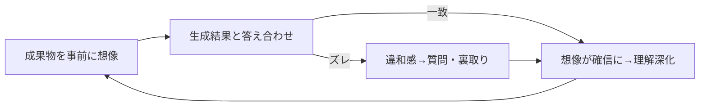

# 認知的負債（Cognitive Debt）

> **TL;DR**: AIの生成速度に人間の理解が追いつかないとき、その理解不足は開発者の頭の中に蓄積する「認知的負債」になる——shin1x1氏は「説明できないものは出さない」という個人的なリリース基準でこれに対抗する。

AIエージェントに実装を任せると、人間が確認する待ち時間を省くほど成果物のペースはエージェントの生成速度そのものになる。だが shin1x1 氏（個人ブログ、2026-07）は、この理解を手放して得られる速度よりも、失う三つのもの——違和感に気づく検証能力、触ることへの恐怖が膨らまない変更のしやすさ、システムを改善していくための元手——の方が大きいと述べ、止まってでも理解を確保する運用に至っている。

理解には粒度や抽象度があり、0か1かの二択ではない、と shin1x1 氏は指摘する。成果物を事前に想像しておけば生成結果との答え合わせができ、ズレがあれば違和感として質問が生まれ、一致すれば想像が確信に変わる。どちらに転んでも理解は深まる。逆に理解を手放すと答え合わせ自体ができず、判断の根拠がないまま成果物が積み上がり、理解しないままの成果物が増えるほど次の成果物はさらに想像できなくなるという自己強化ループが働く。

同種の問題意識は他の論者にも見られる。Geoffrey Litt氏は「Understanding is the new bottleneck」というエントリで、AIがコードを書く速度が上がるほど人間がシステムを理解する速度が新しいボトルネックになると指摘する。Margaret-Anne Storey氏は「How Generative and Agentic AI Shift Concern from Technical Debt to Cognitive Debt」というエントリで、生成AI・エージェントの普及によって懸念はコードに宿る技術的負債から開発者の頭の中に宿る認知的負債へシフトすると論じ、緩和策の一つとして「AIが生成した変更は、リリース前に少なくとも一人の人間が完全に理解していることを必須にする」を挙げている。Storey氏が引くPeter Naurの「プログラムとは、ソースコードそのものではなく、開発者の頭の中に生きる理論（theory）である」という言葉を借りれば、理解を手放さないとはこの理論を持ち続けることだとshin1x1氏は述べる。

実践面では、変更の目的・実現方法の骨子・影響範囲と検証方法の三点を自分の言葉で説明できることを理解の目安とし、AIの説明は出典に自ら当たって裏取りし、動くコードやコマンドで挙動を確かめ、「何を聞くべきか」自体をエージェントに出させる、といった手段で理解を補っているとshin1x1氏は述べる。なお本エントリの前提として、ある程度成果物を想像できるだけの経験があることを挙げており、経験が浅いうちは並列で回さず一つのタスクをAIと一緒に進めながら理解を作ることを勧めている。

## 問い

- 「理解の抽象度をどの粒度で握るか」という基準を、自分のwiki運用やスクリプト開発にどう適用しているか。ingest結果やvalidate_wiki.pyの出力をどこまで自分の言葉で説明できるか
- Geoffrey Litt氏・Storey氏の「認知的負債」という言葉は今後どう定着していくか、他の論者の言及を追いたい

## 関連

- [[concepts/recursive-self-improvement]] — 「人間のコードレビューが新たなボトルネックになった」というAmdahlの法則の観測と、本ページの「理解がボトルネックになる」という指摘は同じ現象の別側面
- [[people/uncle-bob-martin]] — 「エージェントが書いたコードは一切読まない」という対極の戦略を明言する実践者。理解を手放す方に賭けた事例として対比になる
- [[concepts/ai-quality-amplification]] — AI開発は速さでなく品質のスケールが本質という論点と接続
