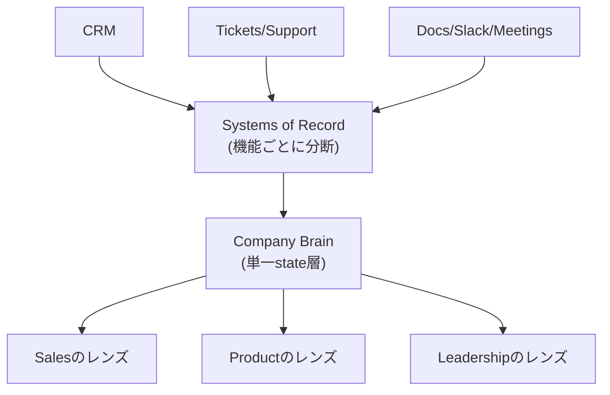

# Company Brain（企業の共有状態層）

> **TL;DR**: システムオブレコードが機能ごとに分断してきた企業データを、provenance・permissions・鮮度・関係性を保持する単一の状態層（factual memory / semantic file system）に統合し、役割ごとに異なるレンズ（ontology）で読み出す設計思想。

Sentraに在籍する Ashwin Gopalakrishnan（@ashwingop）は、CRM・チケット・ドキュメントといったシステムオブレコードが分断してきたのは単なるベンダー乱立ではなく、営業・サポート・プロダクト・財務・法務・経営がそれぞれ同じ顧客対応の出来事から異なる構造（ontology）を必要とした結果だと論じる。1通のクレーム対応メールは、営業には解約リスク、カスタマーサクセスにはエスカレーション、プロダクトにはロードマップシグナル、経営には運用プロセスの綻びとして映る。事実は同じでも、有用な真実は見る立場で変わる。

## Company Brain: semantics と ontology の分離

同氏は Company Brain を「ストレージ」ではなく、エンティティ・関係・コミットメント・意思決定・provenance・矛盾・権限・結果を保持する生きた構造化状態として定義する。ここでの semantics（意味）は「これは何か」を示し、ontology（オントロジー）は「それが誰にとってなぜ重要か」を示す——同じアーティファクトを複数の妥当なレンズで読める点が、機能ごとに別ツールへ真実を分割してきた従来のシステムオブレコードとの違いだとする。

もう一つの主張は、LLM自体を「脳」として扱うべきではないというものだ。モデルは文脈に対して有用な続きを生成するよう訓練されているが、企業の永続的な真実は役割ごとに異なる解釈を安全に配れる、検査・修正・バージョン管理・権限管理・評価が可能な状態層を必要とする。RAMを恒久ストレージ扱いするようなものだ、と同氏は比喩する。推論はLLMが担い、状態はCompany Brainが保持する——両者を分離することで、モデルはプロンプトに貼られた断片からではなく、会社の現在の現実に対して推論できるようになる。

## 第一層としてのFactual Memory：semantic file system

同氏はCompany Brainの三層（factual memory・interaction memory・action memory）のうち、factual memory を第一層と位置づける。「これは何か・何が起きたか・出典はどこか・誰が所有するか・いつ変わったか・どう機能するか」という基本的な問いに答える層である。これは単なるRAGでは足りないと同氏は指摘する。RAGは断片を検索できるが、企業には provenance（出所）・permissions（権限）・ownership（所有者）・freshness（鮮度）・source-of-truth の境界・アーティファクト間の関係という永続構造が要る。この関係性を持つメモリ層を同氏は「semantic file system」と呼び、顧客の通話がアカウントに、アカウントが未解決チケットに、チケットがプロダクト領域に、プロダクト領域が担当者に、担当者が意思決定につながるといった連鎖の質が、そのままメモリの質を決めるとする。

## 個人の記憶から会社の記憶への「創発」

Company Brainは中央集権的なリポジトリとして構築すべきではない、というのが同氏のもう一つの主張だ。人はドキュメント・Slack・会議・チケット・ローカルメモ・スプレッドシートで自然に働いており、中央アーカイブへの入力を強いる設計は失敗する。個人メモがチームドキュメントになり、チームドキュメントがロードマップの意思決定になり、意思決定が顧客への約束になる——この遷移を通じて会社の記憶は個人の外側へ「創発」していくべきで、一部の成果物は個人のまま残り、一部がチーム共有記憶になり、さらに小さな一部が会社の記憶になる、と同氏は説明する。

## パーソナライズされた応答

同氏は、同じ質問でも役割によって返す答えが変わるべきだとする。ICが「請求連携を引き継ぐが何を知るべきか」と聞けば仕様・過去のチケット・既知のリスク・担当者・顧客への約束・最近のインシデント・未解決の意思決定を統合した答えを、マネージャーが「オンボーディングを阻んでいるのは何か」と聞けばチケット・ステータス・オーナーシップ・エスカレーション・未解決の依存関係を、経営層が「エンタープライズの解約について何を知っているか」と聞けばCRM・サポート・更新メモ・通話要約・アカウント履歴・ダッシュボード指標を、それぞれ重み付けを変えて統合すべきだとする。さらにCompany Brainは検索ボックスで待つのではなく、顧客通話の前に未解決の約束を、ロードマップ編集時に関連する顧客要望を、チケット割当時に過去のインシデントを、プロアクティブに差し出すべきだとする——これが「待つ」ナレッジベースと「参加する」メモリの違いだと同氏は結論づける。

## 問い

- Company Brainの「state層とreasoning層の分離」は、このLLM wiki（`sources/`不変＋`wiki/`生成物）の設計と同型か。frontmatterの`sources`/`updated`はprovenance/freshnessの代替になっているか
- [[concepts/palantir-ontology]]の「動詞（アクション）」に相当する書き戻し機能をCompany Brainは持つか、それとも読み取り専用の意味層に留まるか
- 個人ワークスペース→チーム→会社という「創発」モデルは、[[concepts/agent-memory-layer]]が指摘する「到達点の保存に偏り過程が失われる」問題にどう答えるか

## 関連

- [[concepts/palantir-ontology]] — 「データとAIの間に業務文脈を保持する中間層」という同型の発想。Palantirは名詞＋動詞、Company Brainはsemantics＋ontologyで構造化
- [[concepts/agent-memory-layer]] — 全エージェントの下に単一メモリ層を敷く設計思想。個人版のCompany Brainとも言える
- [[concepts/openai-data-agent-context-layers]] — スキーマ＋RAGの限界という同じ出発点から6層コンテキストという別解に至った企業事例
- [[concepts/cerebras-knowledge-base]] — 全ソースを単一埋め込みテーブルに正規化する社内知識ベースの実装例。Company Brainの「semantic file system」の一実装形態と読める
- [[business/dinii-ask-anything]] — 社内問い合わせ代行という形でfactual memoryの一部を先取り実装した日本企業の事例
