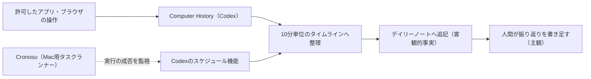

# 客観ログと主観の振り返りを分けて積むデイリーノート

> **TL;DR**: PCの活動履歴を自動で拾う機能（Codex の Computer History）でその日の作業を客観的なタイムラインに変え、デイリーノートでは事実の列挙と自分で書く振り返りを別々に置く。記録そのものも定期実行にし、実行できたかどうかを外から監視する。

日次の振り返りが続かない原因を、@shotovim は記憶の取り出しコストに置く。忙しく手を動かした日ほど、夜に日報やデイリーノートを書く段になると直前の作業しか思い出せない。この「思い出す」工程をシステムに委ねれば、振り返りの時間を記憶の再構成でなく次の意思決定に使える、というのが記事の主張である。

## 事実と主観を同じノートで分けて書く

Computer History を有効にすると、許可したアプリケーションやブラウザでの操作ログがバックグラウンドに記録される。@shotovim は、そこへ指示を与えて各時間帯の主な作業内容を客観的なタイムラインとして出させ、Obsidian のデイリーノートへ集約している。プロンプトの構成は好みでよいとしたうえで、著者自身は作業・運用と娯楽を分け、10分ごとの記録単位で出力させる設定にしていると書く。

著者が推奨するのは、Computer History が列挙した事実と、自分で考えた振り返りをノート上で分けて書くことである。事実の列挙だけでも十分だが、その日一日がどうだったかという主観の感想を足すと振り返りの質が上がり、デイリーノートとしての完成度が高くなる、と述べる。デイリーノートは毎日続けてこそ長期的な価値が出るが、書く内容を思い出せないことが継続を阻む——その詰まりを、事実の側を機械に任せることで解く構図になっている。

## 記録プロセス自体を定期実行し、実行を監視する

日次の記録を手動でAIに指示していると確実に続かないため、履歴の抽出からノートへの追記までをスケジュールして完全に自動化する、と著者は書く。スケジューリングには Codex 内のスケジュール機能を使い、実行の成否は Mac 用タスクランナー「Cronosu」で監視している。成功したか失敗したかが直感的にわかる点を著者は利点に挙げる。

この監視が効いた実例として、著者は振り返りを一日の終わりにスケジュールしていたところ、Mac がロック状態になっていて Computer History による追記ができていなかったことに Cronosu 経由で気づけた、と述べている。自動化の層をもう一段外から見る仕組みがないと、記録が止まったこと自体に気づけない。

記事がまとめる役割分担は、客観的事実の収集・整理が Computer History、定常プロセスの自動化が Cronosu、成果の評価と次の行動の決定がデイリーノート、の3つである。

## 観察ログ（未検証）

- 2026-09-12: Mac がロック状態だと Computer History による追記が行われなかった、という著者の報告。記録が欠ける条件が他にもあるかは示されていない

## 問い

- このvaultでは[[tools/claude-code-obsidian-sync]]がエージェントの会話履歴を記録しているが、対象はエージェント内の作業に限られる。ブラウザ閲覧や他アプリを含めた一日全体のタイムラインを足すと、週次の振り返りで拾える素材は増えるか
- 「機械が書く事実」と「人間が書く主観」を分ける形は、このwikiの本文とインライン帰属・観察ログの分離と同じ構造をしている。同じ分け方を日次の記録にも適用すると何が変わるか
- 定期実行の成否監視をどこに置くか。このvaultは launchd で自動同期しているが、実行できなかった日に気づく経路は用意されているか

## 関連

- [[concepts/obsidian-personal-os]] — 同じ @shotovim が実践を寄せている Obsidian 運用の設計側。あちらはフォルダ構造と自動ワークフローの全体像、本ページは日次の記録1本に絞った実装
- [[tools/openai-codex]] — Computer History とスケジュール機能の提供元
- [[tools/claude-code-obsidian-sync]] — エージェントの会話履歴を Obsidian へ自動記録する別実装。記録源がエージェント内に閉じる点が本ページとの差分
- [[concepts/session-history-mirror]] — 溜めたセッション履歴を後から掘って自己分析に使う手法。本ページは記録を作る側、あちらは記録を読む側にあたる
- [[concepts/second-brain-operations]] — 溜めた記録を維持ループへ載せる運用設計
