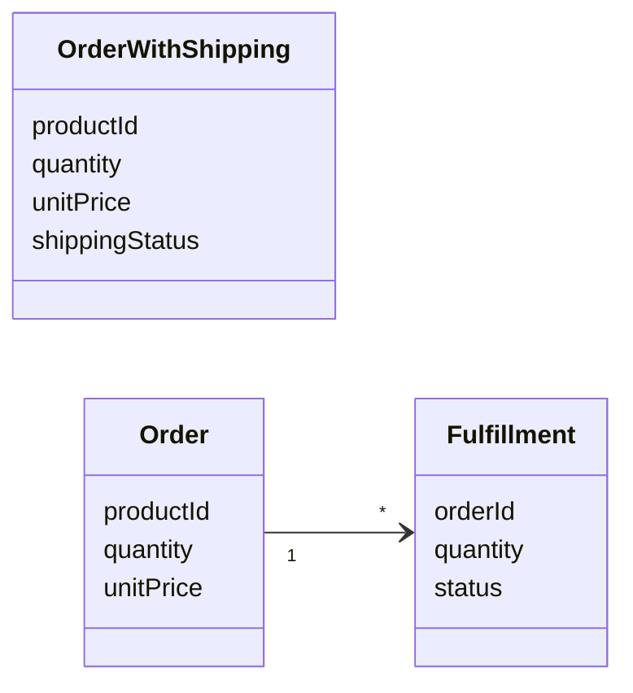

# 概念設計（Concept Design）

> **TL;DR**: そのアプリケーションの世界に「何が存在するか」をどう切り分けたかが、その後どんな仕様を普通に書けて、どんなバグが書けてしまうかを決め続ける。

同じ仕様を満たす実装でも、その後の運命は実装力ではなく「システムの中に何という概念を置いたか」で分かれる、とZennのtakeshi_teshima（X: @DiadochosT）は述べる。一つの型に二つの意味を背負わせたまま進むと、個々の実装は正しくても、仕様が増えるたびに帳尻合わせがコードと運用のあちこちへ波及していく。takeshi_teshimaはこの層を、クラスをきれいに分けるとかDDDを導入するといった設計技法の「少し手前」にあるものだと位置づける。所与の要件をどう実装へ落とすかではなく、現実の出来事をどういう概念で捉えるかの話だからである。

## 二つの世界線：ECサイトの再送対応

takeshi_teshimaが挙げる例は小さなECサイトである。第一の世界線では、注文明細に配送状態まで持たせた（上図の `OrderWithShipping`）。配送中の破損で「同じ商品をもう一つ送ってほしい」という要望が来たとき、`quantity` を2にはできない。顧客が買ったのは1個だからだ。結局 `unitPrice: 0` の注文をもう1件作ることになる。

動きはする。しかし、購入点数に数えるのか、売上集計では除外するのか、返品処理ではどうするのか、後から作る推薦システムでノイズにならないか——という判断が、以後コードや運用のあちこちに散らばる。

第二の世界線では「何をいくつ、いくらで買ったか」を `Order`、「その約束をどう履行したか」を `Fulfillment` と名付け、別々の概念として置いた。破損時の対応は、失敗したFulfillmentを事実として残し、もう一度届けるためのFulfillmentを1つ作るだけになる。売上を見るなら `Order`、配送コストを見るなら `Fulfillment` を見ればよい。takeshi_teshimaが強調するのは、第二の世界線は再配送機能をうまく実装したわけではない、という点である。売買と履行を最初から別物として認識していたので、Fulfillmentを1つ増やすという当たり前の操作だけで現実をそのまま表現できただけだ、と説明する。

## まだ聞いていない仕様が、もう入っている

その後、物流チームから「3個の注文のうち1個だけ先に発送し、残り2個は入荷後に発送したい」という別の要望が来たとする。第二の世界線ではコードを一切変えなくてよい。Orderに分割発送モードを足す必要も、`partiallyShipped` のようなフラグも要らない。1つのOrderに2つのFulfillmentがあるだけである。

takeshi_teshimaは、これを偶然ではないと説明する。人が思いつく仕様は、その人が現実をどう認識しているか——メンタルモデル——の範囲内で自然なものになる。コードが表現している概念が現実の捉え方と噛み合っていれば、後から出てくる自然な仕様が既存の概念に収まるのはむしろ当然の帰結だ、という論理である。**概念設計が適切だと、まだ生まれていない未来の仕様が、すでに実装済みになっていることがある。**

## バグが生まれる前から消えてしまう

もう一つの効果は、防ぐべきバグの母数そのものが減ることだとtakeshi_teshimaは言う。交換品を0円のOrderとして表現すると、そのレコードは「本当の購入」と同じ場所に存在する。誰かが `SELECT SUM(quantity) FROM orders` というごく自然なクエリを書けば、交換品まで数えてしまう。`WHERE unit_price > 0` を足すのも危うい。クーポンによる本物の0円購入が将来現れれば、今度は正しい購入が消える。

本質的な問題は条件式が足りないことではなく、「購入ではないもの」がOrderとして存在してしまっていることである。概念が分かれていれば、正しさを後続コードを書く人の注意力に委ねなくてよくなる。ルールを全員が守っているのではなく、交換品という配送上の出来事が、そもそも売買を表す場所に入り込まないからだ。

## 概念テスト：新機能を既存概念の言葉で言い直す

概念は実装だけでなく、新機能を考える道具にもなる。要望が来たとき、すぐ画面やAPIやDBの話に落とさず、まず「システムの世界では、誰が、何に対して、何をすることになるのか」を既存の概念で言い直してみる。その文章が、それぞれの概念にとって「できて当然のこと」になっているかを見る。takeshi_teshimaはこれを**概念テスト**と呼ぶ。

電子書籍アプリの例では、「Bookが、自分が棚の何番目に表示されるかを持つ」は妙である。同じ本が別の本棚にも置かれうるし、本棚がなくてもBookはBookだからだ。「BookshelfがBookを並べる」あるいは「Bookshelf上にBookのPlacementがある」と言い換えれば自然になる。この違和感はコードを一行も書かずに見つけられ、判断する人が実装者である必要すらない、とtakeshi_teshimaは指摘する。プロダクトデザイナーが体験をシステム内の概念で正確な文章にしてみればよい。どう言い換えても誰かに不自然な責務を負わせなければ表現できないなら、機能そのものがおかしいか、その機能によって初めて姿を現した名前のない概念があるのかもしれない。

副次的な効果として、機能を概念の言葉で表現しておくと「なぜその形なのか」も残る。当時の企画書も議論も知らない何年後かの読み手が、概念そのものから意図をかなり復元できる。概念は、その機能をどう理解すべきかという意図を、時間や組織の境界を越えて運ぶ語彙にもなる、という主張である。

## 概念の境界を見つける2つの手掛かり

機械的に正解を出す方法はない、と断ったうえで、takeshi_teshimaは記事の例に現れている手掛かりを2つ挙げる。

**関係者・関係部署の視点に立つ**。注文受付担当にとって注文は「顧客が何を、いくつ、いくらで買ったか」だが、物流担当の目には「何を、いくつ、まだ届ける必要があるか」に見える。同じ注文について話しているのに、頭の中で操作している概念は同じではない。担当する人・組織・システムコンポーネントが違うなら、別々の主体が別々の理由で別々のタイミングに変更するものであり、そもそも異なる概念ではないかと疑う価値がある。組織の境界をそのままクラスの境界にせよという話ではないが、扱う人が変わった途端に語彙も操作も関心事も変わる場所には概念の境界が隠れていることが多い。

**「それしかない」名前をつける**。「注文商品」「購入商品」「発送商品」は日常会話なら曖昧に混ぜても通じるし、コードでも `OrderItem` と置けばしばらく困らない。だが「顧客が何を、いくつ、いくらで買うと成立させた明細」と「その約束のうち何を、いくつ届けるかを表す履行の単位」まで丁寧に言語化すると、同じ名前で呼び続ける方が難しくなる。takeshi_teshimaは、DDDでいうドメイン言語に注意を払う価値は業界用語をコードへ持ち込めることだけではなく、**言葉の違いが概念の違いを発見するセンサーになる**ことだと述べる。営業は「受注」、倉庫は「出荷」、サポートは「再送」と言う。同じレコードの状態を違う言葉で呼んでいるように見えて、関係者は最初から違う対象を頭に浮かべているのかもしれない。

名付けは境界を詰める作業でもある。Fulfillmentという名前を選んだ時点で、そこに「顧客がいくら払ったか」を持たせてよいはずがないと名前自体が教えてくれる。逆に配送状況や再送の記録は持って当然のものになる。命名が曖昧なまま詰め切れないなら、そもそも概念レベルで何かが矛盾しているのかもしれない、というのがtakeshi_teshimaの見立てである。

## KISS/YAGNIとは矛盾しないのか

Fulfillmentを最初から切り出すのはYAGNI違反ではないか、という反論をtakeshi_teshimaは自ら補遺で扱っている。最初の `Order` も当初の仕様（配送状況を確認できること）は満たしており、仕様というテストだけを見ればどちらも正解である。KISS/YAGNIを「いま必要なコード量が最も少ない方を選ぶ」とだけ解釈すると第一の世界線が魅力的に見えるが、これらは余計な機能や抽象化を作らないための原則であって、現実を無理なく表現できる概念設計に沿うことは余計ではない、と整理する。**まず現実を無理なく表現できる概念を置き、その制約の内側で最もシンプルで直接的な実装を選ぶ**——そう考えれば両者は矛盾しない。

## 練習問題：一つの型が二役をしている箇所

記事の補遺には、概念の切り分けを試す小問が3つ置かれている。

| 仮実装 | 後から来る仕様 | 記事の切り分け |
|---|---|---|
| `Subscription { status: active \| cancelled }` | 解約後も支払済みの月末までProを使える／未契約者にもPro 1か月無料付与 | **Subscription / Entitlement**（契約していることと利用権を持つことは、最初は一致していただけ） |
| `Document { body, approved: boolean }` | 承認後に本文を編集したら再承認が必要 | **Document / Revision / Approval**（承認はDocument全体でなくRevisionへの判断。編集後のRevisionは無効化されたのでなく一度も承認されていない） |
| `Job { status: running \| succeeded \| failed }` | タイムアウトしたら自動再試行 | **Job / Execution**（Jobは実行させたい仕事の定義、Executionはその一度の実行。Retryという状態ではなくExecutionが2回あっただけ） |

記事が挙げる次に読むべき一冊は Jackson, D. (2023) *The Essence of Software: Why Concepts Matter for Great Design*（邦訳『優れたデザインにとってコンセプトが重要な理由』中島震訳・丸善出版）。命名については仙塲大也『改訂新版 良いコード／悪いコードで学ぶ設計入門』第11章あたりが対応する、としている。

## 問い

- このvaultの `sources` / `wiki` / `outputs` は概念テストに通るか。「ソース」と「ページ」と「出力」は本当に別概念として切れているか、それとも `wiki/` が知識ページと機械生成ログの二役を背負っていないか
- 「言葉の違いは概念の違いのセンサー」をAIエージェントの運用に転用できるか。CLAUDE.mdやスキルの中で同じものを別の語で呼んでいる箇所は、概念が2つある兆候かもしれない
- 概念テストは実装者でなくても回せるとされるが、AIエージェントに「この機能を既存概念の言葉で言い直せ」と投げたとき、不自然さを検出できるのか、それとも器用に言い換えて違和感を消してしまうのか

## 関連

- [[concepts/palantir-ontology]] — 「その世界に何が存在するか（名詞）」から出発する同じ問いを、企業スケールのオントロジーとして実装した中間層。こちらは1アプリの型設計、あちらは組織横断の世界モデル
- [[concepts/behavioral-specification]] — 実装前に人間が確定させるべき「正解・不正解の判定基準」。概念テストは仕様の正誤でなく、その仕様が既存の概念と矛盾せず語れるかを見る一段手前のテスト
- [[concepts/ai-quality-amplification]] — AIは品質の増幅器という論。本記事が命名の参考文献に挙げる仙塲大也（@MinoDriven）の主張であり、概念設計のズレも同じだけ増幅されると考えられる
