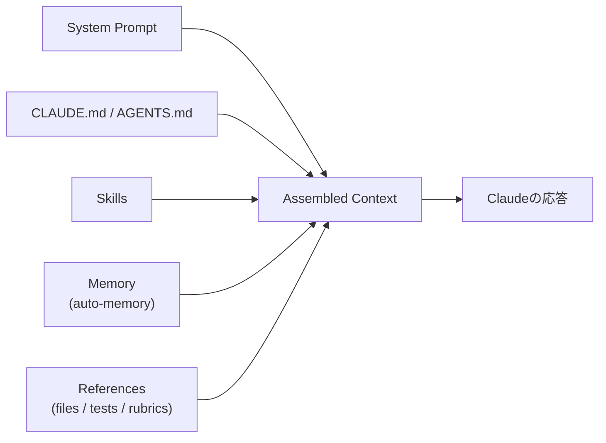

# コンテキストエンジニアリング（Context Engineering for Claude 5 models）

> **TL;DR**: モデルの判断力向上に合わせてClaude Codeのシステムプロンプトを80%以上削減した経験から、Anthropicが「ルールを与える→判断に委ねる」など6つの逆転（Then→Now）で示すコンテキスト設計原則。

> 📌 X bookmark: 23,351（2026-07-25 時点）

新しいモデル世代が出るたびに「以前は効いていた制約が今は逆に足枷になる」という発見が起きる、とAnthropic Claude CodeチームのThariq（@trq212）は述べる。Claude Code初期はファイル削除のような最悪シナリオを避けるため強いルールをシステムプロンプトに書き込んでいたが、Opus 5・Fable 5世代では判断力が上がり、同じ制約がむしろ矛盾する指示同士の衝突を増やすだけになった。社内の使用ログを読むと「必要に応じてドキュメントを残せ」と「コメントは絶対に書くな」のようにシステムプロンプト・スキル・ユーザー要求が食い違うケースが頻発していたとThariqは報告する。

## 6つの逆転（Then → Now）

| かつて | 今 | 理由 |
|---|---|---|
| ルールを与える | 判断に委ねる | 新モデルは矛盾する指示から意図を汲み取れる |
| 例を与える | インターフェースを設計する | 例は探索空間を狭める。パラメータ設計の表現力を上げる方が効く |
| 全部前もって渡す | プログレッシブディスクロージャー | 検証・レビュー手順は専用スキルへ、ツールは遅延ロードへ分離する |
| 繰り返し言う | シンプルなツール記述 | システムプロンプトとツール説明の二重記載をやめ、ツール説明側に一本化する |
| CLAUDE.mdに記憶させる | auto-memoryに任せる | ユーザーが手動で書く運用から、Claudeが関連メモリを自動保存する運用へ |
| シンプルな仕様書 | リッチな参照資料 | Markdownの仕様書から、HTMLアーティファクト・コード・テストスイート・ルーブリックへ拡張する |

各逆転についてThariqが挙げる具体例:

- **ルール→判断**: 過去のシステムプロンプトは「コードではデフォルトでコメントを書くな。複数行のドキュメント文字列や複数行コメントブロックを書くな」のように強く縛っていた。新しいシステムプロンプトでは「周辺コードのコメント密度・命名・イディオムに合わせて書け」という一文に置き換わったとThariqは説明する。
- **例→インターフェース設計**: ツールの使い方を教えるなら例を積むのでなく、パラメータの表現力を設計せよとThariqは言う。Todoツールのstatusをpending/in_progress/completedのenumにするだけで、Claudeはどう使うべきかを自然に理解する。
- **前もって全部→プログレッシブディスクロージャー**: 検証・コードレビューの詳細手順はシステムプロンプトから切り離し、必要な時だけ呼ばれる専用スキルへ移した。ツールにも「deferred loading」という仕組みがあり、エージェントは検索してから完全な定義を取得してから使う設計になっているとThariqは述べる。これにより、すぐには使わない大量のツールがコンテキストを圧迫しなくなる。CLAUDE.mdやSKILL.mdについても「既知のすべての慣行を詰め込む中央リポジトリにする」という発想は誤りで、必要な時にロードされるファイルの木構造にすべきだとThariqは述べる。
- **繰り返す→シンプルなツール記述**: 旧世代モデルは指示を繰り返さないと聞き逃すことがあったため、システムプロンプト内にツールへの言及とツール説明側の指示が重複していた。新モデルではこの重複を削り、ツールの使い方はツール説明側に一本化したとThariqは説明する。
- **CLAUDE.md記憶→auto-memory**: 以前はユーザーがホットキーでCLAUDE.mdへ手動で書き込む運用を推奨していたが、今はClaudeが作業や利用者に関連するメモリを自動的に保存する、とThariqは述べる。
- **シンプルな仕様書→リッチな参照資料**: plan modeのMarkdownファイルやコードベース内の仕様書という従来のベストプラクティスに対し、Thariqはartifacts機能で作られたHTMLアーティファクトのような複雑な参照も渡せるようになったと述べる。コードそのもの（別コードベースの関数、詳細なテストスイート）も仕様になり得る。ルーブリック（良いAPI設計とは何か、のような基準）も参照の一形態で、動的ワークフローと検証エージェントを組み合わせてClaudeに好みを判定させられるとThariqは述べる。

## 各層への適用ガイド

Thariqは、システムプロンプト・CLAUDE.md・スキル・参照資料という4層それぞれに実践的な指針を示す。

- **システムプロンプト**: プロダクトの文脈そのものに強く結びつく層。Claude Codeを使う限り基本的に触ることはないが、独自のエージェントハーネスを作るならここに最も時間を使うべき層になる。
- **CLAUDE.md**: リポジトリの目的を軽く説明する程度に留め、大半のトークンは「コードベース固有の落とし穴」に使う。ファイルシステムやリポジトリを見れば分かる「自明なこと」は書かない。検証手順のような詳細が複数あるならスキルへ切り出しCLAUDE.mdから参照する。
- **スキル**: Claudeが必要な時に見つけられる軽量ガイドとして設計する。重要な領域を除き過剰な制約を避ける。長いスキルはプログレッシブディスクロージャーを徹底し、複数ファイルへ分割する。自分・チーム・プロダクト固有の意見や知見をエンコードするのに向く。
- **参照資料**: `@`メンションでファイルを含められる。仕様・モックアップ・コードベース全体を渡せるが、一般に説明文やスクリーンショットより「コードで書かれたファイル」の方が高精度な指示になる。HTMLモックアップはデザインの説明文より良い結果を生む、とThariqは述べる。

Anthropicはこの簡略化を自動化する`claude doctor`コマンドをリリースし、システムプロンプト・スキル・CLAUDE.mdを自動で適正サイズへ調整する支援をするとThariqは紹介する。

## 検証済み事実

- 2026-07-24: Anthropic Claude CodeチームのThariq（@trq212）が、Claude Opus 5・Fable 5世代でシステムプロンプトの80%以上を削減し、コーディング評価に測定可能な劣化がなかったと公表。

## 問い

- このvaultのCLAUDE.mdは既にこの記事のガイドに沿っているか。「自明なことを書いていないか」「進捗ドキュメントを溜め込んでいないか」を照らして棚卸しする価値があるか
- プログレッシブディスクロージャー原則を`.claude/skills/wiki-ingest/SKILL.md`に当てはめると、どの節を分割・遅延ロード化できるか
- 「シンプルな仕様書→リッチな参照資料」の転換を、wiki自体をClaudeへの参照資料として機能させる方向に応用できるか（現状はMarkdownテキストのみ）

## 関連

- [[concepts/claude-md-rules]] — Karpathy由来の12条ルール体系。本記事の「ルールを与える→判断に委ねる」逆転が対象化する旧来ベストプラクティスそのもの
- [[concepts/claude-md-persistent-contract]] — 同じ「明示ルールの列挙」アプローチの非エンジニア向け再構成。本記事の指摘（過剰制約のリスク）が直接当てはまる
- [[concepts/claude-skills]] — スキル設計論。本記事の「プログレッシブディスクロージャーとしてのスキル」という位置づけを補強
- [[concepts/skills-over-memory]] — auto-memoryと肥大化したCLAUDE.mdの関係を扱う。本記事の「CLAUDE.md記憶→auto-memory」の逆転と同じ問題意識
- [[concepts/claude-code-context-hierarchy]] — 4層（Memory/Slash commands/Permissions/MCP）の「どこに置くか」の構造。本記事は「何を置くべきか」という上位の設計思想
- [[concepts/graph-engineering]] — エンジニアリングスタックの一段上、複数ループを束ねる調整層（@akshay_pachaar）
- [[concepts/lean-prompt-rules-adaptation]] — 本記事が示すlean prompt化を利用者側から実測した続報。応答形式規定の消失で旧rulesが噛み合わなくなる実害と3つの書き直し対策（@u1）
