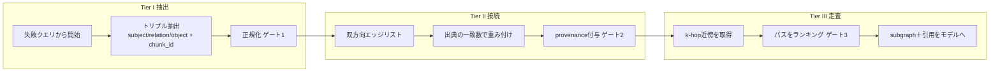

# コンテキストグラフ検索（RAGから経路を返す検索へ）

> **TL;DR**: 検索の単位をチャンクからエンティティと関係に変え、答えを「文章」でなく「引用付きの経路」として返す9ステップ。@0xMorlex は、RAGの限界は埋め込みの質ではなく構造にあると論じる。

「Redisが落ちたら何が壊れるか」をチャンク検索器に尋ねると、コーパスの中で Redis という語を含む一文が返ってくる。だがその一文に答えは入っていない。答えは互いに一度も言及し合わない4つの文書にまたがって散らばっており、類似度検索には文書から文書へ歩く手段がないからだ。@0xMorlex はこれを**チューニングの問題ではない**と切る。埋め込みが引けるのは「問うた対象に言及しているテキスト」であって、対象そのものでも、答えを実際に支えている関係の連鎖でもない。単一事実の照会ならそれで足りるが、multi-hop（複数ホップ）の問いに対しては構造的に道具の選択が間違っている、というのが同氏の主張である。

## Tier I — 抽出：文章をエンティティと関係に割る

**01. RAGが答えられない問いから始める**。グラフを作ることから始めてはいけない、と@0xMorlex は言う。先に書き出すべきは、いま使っている検索器が失敗するクエリのほうで、そのクエリがグラフに必要なエンティティと関係を定義する。失敗するクエリには形がある——それらは multi-hop である。「Redisが落ちたら何が壊れるか」は実のところ「Redisが支えているものに依存しているものに依存しているものは何か」であり、各ホップが1本の関係、答えは経路であって文章ではない。

**02. 埋め込みでなくトリプルを取り出す**。RAGはチャンクを埋め込むが、コンテキストグラフは各チャンクを読んで subject / relation / object の三つ組を抽出する。本番の抽出器はLLM呼び出しになるが、記事のデモでは出力を再現可能にするため決定論的なパターンを使っている。ここで@0xMorlex が強調するのは、各トリプルに付ける `chunk_id` が後付けの飾りではないという点である。これが最終的な答えを引用可能にするものであり、RAGがチャンクをプロンプトに連結した瞬間に捨てているものでもある。

**03. 正規化しなければグラフは砕ける（第1ゲート）**。「The Auth Service」「auth service」「AuthService」は1つのエンティティである。グラフがこれを3つとして扱えば、引いたエッジはすべて別のノードに着地し、経路は永遠に繋がらない。小文字化・冠詞の除去・空白の畳み込み・エイリアス表の適用という地味な工程が、そのグラフがグラフなのか、それとも3つの分断された断片なのかを決める。同氏は、自作の GraphRAG が何も有用なものを返さない最大の原因はこれだと述べる——ノードは全部そこにあるのに、互いに触れていないだけだ、と。

## Tier II — 接続：重みと出典を持つグラフに組む

**04. エッジリストは双方向に持つ**。グラフの実体は順方向・逆方向の2つの隣接マップになる。「Xは何に依存しているか」に答えるために順方向を、「何がXに依存しているか」に答えるために逆方向を辿るからである。両方向を持てばメモリは倍になるが、「片方向にしか検索できない」という一群のバグが消える。ナレッジグラフではそれは常に正しいトレードだと@0xMorlex は言い切る。

**05. 出典がいくつ一致したかでエッジを重み付けする**。別々の2チャンクがどちらも「認証サービスはトークンキャッシュに依存する」と言っているなら、そのエッジは単一の出典しか持たないエッジより強い。これは裏付け（corroboration）であり、記事の実行例では auth-service から token-cache へのエッジが2チャンク由来で重み2を持つ。複数の経路が同じ問いに答えうるとき、裏付けのあるエッジで組まれた経路のほうを信じる——その重みが、ステップ08でのランキング根拠になる。

**06. すべてのエッジに provenance を付ける（第2ゲート）**。各エッジは、それが由来したチャンクの集合を運ぶ。これがコンテキストグラフを「示唆的なもの」から「答えられるもの」に変える性質で、グラフが経路を返すとき、各ホップの領収書も一緒に返ってくる。「エッジを引用できないグラフは、包装を良くしただけの主張の山だ」と@0xMorlex は書く。

## Tier III — 走査：passage でなく path を返す

**07. k-hop 近傍で取り出す**。ここで検索は類似度であることをやめ、歩行になる。問いに対する文脈は「最も似ている上位k件のチャンク」ではなく、「問いが名指したエンティティから k ホップ以内にある部分グラフ」である。

**08. passage でなく path をランキングする（第3ゲート）**。multi-hop の問いは逆到達可能性で答える——Redisが壊れるなら、逆向きのエッジを辿って一緒に壊れる上流をすべて見つける。結果は文書のランキング済みリストではなく、経路のランキング済みリストであり、各経路は読んで検算できる因果の連鎖になっている。記事の例では3つが壊れ4つが無事と出るが、@0xMorlex は**チャンク検索器には「無事なほうのリスト」がそもそも作れない**と指摘する。無事であることはコーパスのどこにも書かれておらず、構造の中にしか現れないからである。

**09. 部分グラフを引用付きで組み立てる**。最後の工程はモデルにテキストの壁ではなく部分グラフを渡す。答えの経路上のノード、それらを繋ぐエッジ、各エッジの背後にあるチャンクIDがコンテキストウィンドウの中身になり、モデルの仕事は「この山から答えを探せ」から「この連鎖を読んで言い換えろ」に縮む。@0xMorlex はこの縮小こそが本当の利得だとする。散らばった事実を繋ぐという難所を、プロンプトの外に出して、自分で作って点検できる構造の中に移したことになる。

## グラフを作るべきかのテストと、小さく始める順序

@0xMorlex は「全員がグラフを作るべきだ」という結論を明確に否定する。ほとんどの検索は single-hop であり、単一事実の照会に対してはRAGのほうが単純で安く正しい。テストはステップ01そのもの——**自分の最も難しい問いは lookup（照会）か chain（連鎖）か**。lookupならチャンクを埋め込んで先に進めばよく、chainなら「あなたはすでにグラフに問いを投げている。まだそれを作っていないだけだ」となる。

作ると決めたら小さく始める。関係の型を1つ、正規化されたエンティティ表を1つ、走査を1つ。2つ目のエッジ型を足す前に「Xは何に依存しているか」が引用付きの経路を返すところまで持っていく。順序も動かせない——抽出が接続を養い、接続が走査を養うため、正規化されていないノードの上での走査は何も返さないと同氏は述べる。

なお記事の本文では、この3ゲート構成を同氏自身の他の記事（ループ、グラフ、スウォーム）と「同じ形」だと自己参照しており、「引用のないコンテキストグラフはステップが増えただけのRAGだ」と結ぶ。エンジン部分はフレームワーク非依存で約150行という主張だが、コード本体は本ソースの範囲では未確認である。

## 問い

- このwiki自体は `[[ ]]` リンクによる粗いグラフだが、ステップ03の正規化（エンティティ解決）とステップ06の provenance に相当する仕組みが弱い。ページのソース欄はチャンク単位でなくページ単位のため、リンク1本ごとの出典を辿れない。どこまで実装する価値があるか
- 自分がwikiに投げる問いは lookup と chain のどちらが多いか。ステップ01のテストを実際の質問ログに当ててみる
- 双方向エッジ（「何がXに依存しているか」）は、このwikiでは「どのページがこのページを参照しているか」に対応する。バックリンクの自動集計だけで chain クエリの何割が拾えるか

## 関連

- [[concepts/knowledge-graph-llm]] — 同じ「RAGでは届かない」問題をナレッジグラフで解く日本語入門書の紹介。あちらが課題の列挙と書籍の構成、こちらが9ステップの実装手順
- [[concepts/cerebras-knowledge-base]] — 同じ問題への別解。グラフを作らず単一埋め込みテーブル＋全文検索とIDF・鮮度減衰のハイブリッドで解く
- [[concepts/graph-engineering]] — 同じ「グラフ」という語だが対象が違う。あちらのノード・エッジはエージェントの実行順序とデータの流れを指す
