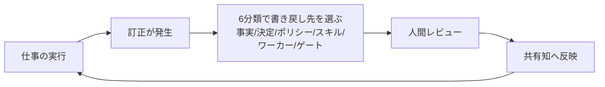

# 訂正のルーティング（Company Brainを賢くする帰還ループ）

> **TL;DR**: チームがAIに与えた訂正・決定・うまくいった手順を個人チャットに閉じ込めず、「事実→会社知識／戦略選択→決定記録／繰り返す好み→ポリシー／実証済み手技→スキル／反復手順→ワーカー／危険操作→機械的ゲート」の6分類で書き戻し先を選び、人間レビューを経て全員の共有知に昇格させるcompany brain構築法（@VibeMarketer_）。

マーケター VibeMarketer（@VibeMarketer_）が解こうとする問題は、社内で最も賢いAIが「特定の1人のためだけに働いている」状態である。営業リードが決め手の反論を教え、マーケターが古い製品主張を直し、創業者が同じ文を5回書き直す——会社は毎日AIに考え方を教えているのに、その学習のほぼすべてがプライベートチャットの中で消え、各人が「少しずつ違うバージョンの会社」と働くことになる、と同氏は述べる。

同氏の中心的な主張は、**出力の修正より訂正そのものの方が価値が高い**という点にある。提案書の古いポジショニングをその場で直せば文書は良くなるが、他は何も良くならない。問うべきは「なぜ古いポジショニングがまだそこにあったのか」であり、原因の層（会社概要が古い・決定が記録されていない・古いキャンペーンが承認済みの表現より上位に来る）を直せば、訂正は提案書を超えて生き残る。

また同氏は、会議メモや過去資料を集めて検索箱を載せる従来型ナレッジ基盤を「AIに情報は与えるが判断は与えない」と退け、有用なcompany brainは**Memory（今効いている事実と決定）・Judgment（良い仕事を形づくるルールと基準）・Capability（再実行できるスキルとワーカー）・Learning（レビュー済みの訂正）**の4つを接続して持つべきだとする。

## 訂正の振り分け表

同氏が示す書き戻し先の対応は以下（原文からの転記）。

| 訂正の種類 | 書き戻し先 |
|---|---|
| 欠けている・古くなった事実 | 会社知識（company knowledge） |
| 新しい戦略的選択 | 決定記録（decision record） |
| 繰り返し現れる好み | ポリシー |
| 実証済みの手技 | スキル |
| 反復可能な手順 | ワーカー |
| 危険な操作 | 機械的ゲート |

振り分けた変更は共有前に人間がレビューする。ループは「仕事→訂正→ルーティング→レビュー→共有→より良い次の仕事」で、これを回し続ければすべてのプロジェクトが会社を少しずつ賢くして終わる、と同氏は述べる。

## 地図を先に渡し、詳細は仕事に引かせる

構築面で同氏が最初に置くのは、全エージェントが最初に読む小さな「company map」ファイルである。会社の一段落説明・今の優先事項3つ・情報源の優先順位（source order）・各フォルダへの案内・行動ルールだけを書き、タスクごとに必要な部屋（コンテンツ用なら承認済み主張とボイス、コーディング用ならアーキテクチャ決定）へ入らせる。コンテキストは増やすほど混乱も増える——古いキャンペーンが現行ポジショニングと競合し、履歴がポリシーに見え始める——ため、**解決策はプロンプトに記憶を積むことではなくナビゲーションの改善だ**と同氏は主張する。mapのルールにある「推測を会社知識にしない（never turn a guess into company knowledge）」は、書き戻しループの品質を守る側の規律にあたる。

初期構成も最小でよいとする。company-brief・priorities・decisions・people・projects・policies・skills・workers・learnings の9要素を挙げつつ、維持できないものは空のままにし、「誰も使わない美しいアーカイブより、毎週の痛いミスを1つ消す小さな脳」から始めることを勧める。なお同氏はチーム展開の受け皿として自社製品HQ（hqforwork.com）を提示しており、記事全体がその導線を兼ねる点は割り引いて読む必要がある。

## 問い

- このvaultの書き分け（LESSONS.md／memory／CLAUDE.md／スキル本体）は6分類のどれに対応するか。「危険な操作→機械的ゲート」に相当する層（hook・permission）への昇格ルートは自分の運用に明示されているか
- 「推測を会社知識にしない」はこのwikiの「根拠なし追記は不可」と同じ規律だが、共有前の人間レビュー工程は個人wikiには無い。一人運用でレビューの代わりになる仕組み（Tierログ・検証済み事実節）で足りているか
- HQのような専用製品なしに、gitリポ＋PRレビューでこのループはどこまで代替できるか

## 関連

- [[concepts/company-brain]] — 同名概念の理論・状態層設計側（semantics/ontology分離・provenance/permissions/freshness）。本ページはその「作り方」の最小実装と訂正ループに焦点
- [[concepts/skills-over-memory]] — 「各教訓はどこに住むべきか」という同じ仕分け問題の個人エージェント版。好み→ポリシー／手技→スキルの振り分けが対応する
- [[concepts/agent-reflection-layer]] — 判断ログ→週次レビュー→パターン昇格という同型の「レビューを経た昇格」ループ。本ページはそれを個人からチーム横断へ広げた形
