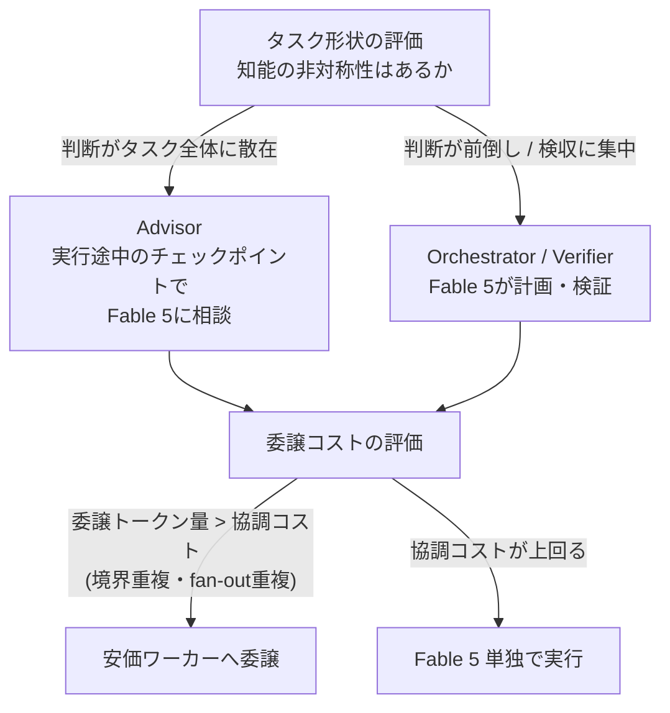

# コスト効率ハーネス（委譲の損益分岐）

> **TL;DR**: Fable 5 と安価モデルの組み合わせは「タスク形状（知能の非対称性）の見極め」と「委譲のコーディネーションコスト」の損益計算で決まる——Lance Martin が Parameter Golf と BrowseComp の2実験で示した設計指針。委譲は常に得ではなく、ワーカーが吸収するトークン量が協調コストを上回るときだけ引き合う。

多くのタスクは、必要な知能の水準がトークン全体で均一ではない（知能の非対称性）。Lance Martin（LangChain のエンジニア）は、ハーネスがこの非対称性を認識してフロンティアモデルを差す位置を選べると述べ、Fable 5 の配置を **Orchestrator**（安価ワーカーに委譲する司令塔）・**Advisor**（安価な実行役が助言を仰ぐ相談役）・**Verifier**（/goal や Outcomes ループでの検証役）の3パターンに整理する。パターン自体は [[concepts/advisor-executor-pattern]] と同じ枠組みだが、この記事の柱は「どのパターンを・いつ使うと引き合うか」を実測で確かめた点にある。

## 実験1: Parameter Golf — 判断は前倒しでなく散在させる

Parameter Golf は、エージェントが訓練コードを編集・実行して次の実験を決める ML エンジニアリング課題（16MB 以内のモデルを 8xH100 で10分以内に訓練）。Martin は [[tools/claude-managed-agents|Claude Managed Agents]] 上で Sonnet 5 を実行役にし、初期計画と20実験中2回のチェックポイントで Fable 5 に相談させた。結果、Fable 5 と Sonnet 5 の組み合わせは **Fable 5 単独の改善幅の約90%を約34%のトークンコストで達成**した（Martin の実測・3構成の validation loss 比較）。

意外だったのは事前アドバイスの寄与で、Fable 5 の初期の実験ランキングは実際に効いた手法と反相関だったと Martin は報告する。価値はチェックポイントでの再優先順位付けにあった。Sonnet 5 は限界的な改善にヒルクライムし続け、一歩引いて再ランクする傾向がないため、Fable 5 のチェックポイントが軌道修正を与える。探索的なタスクは各結果が「次に試す価値のあること」を塗り替えるので、判断は前倒し（up-front）でなくタスク全体に散在（scattered）させる必要がある、というのが Martin の解釈。

## 実験2: BrowseComp — 委譲のコーディネーションコスト

知能の非対称性があっても委譲が常に得とは限らない。委譲には協調コストがかかると Martin は指摘し、その内訳を2つ挙げる。

- **境界の重複課金（boundary duplication）**: モデル間の境界を越えるトークンは最低2回課金される。リードがブリーフを書き、ワーカーがそれを読む。ワーカーがレポートを書き、リードがそれを読む。
- **fan-out の重複（fan-out overlap）**: 多くのハーネスでワーカー同士は通信せず、調査が部分的に重複する（Walden Yan が昨年この問題を論じた記事を Martin が参照）。

複数制約の Web 検索評価 BrowseComp での実測では、易しいサブセット BrowseComp200（1問あたり約0.37Mトークンの読み込み）では **Fable 5 単独の方が安く、オーケストレーションは60%割高で性能向上なし**。一方フル評価セット（1問あたり約31Mトークン）では委譲が引き合い、**Fable 5 orchestrator + Sonnet 5 workers がスコア96%をコスト46%で達成**した。協調コストはハンドオフごとに概ね固定なので、安価ワーカーの便益は各ワーカーが吸収するトークン量に比例して初めてコストを相殺する。

## コスト効率ハーネスを書く4つのガイダンス

Martin が Fable 5 にコスト効率ハーネスを書かせるとき与えている指針。Fable 5 はこの種のガイダンスがあれば自分の知能をいつ・どう使うかをうまく判断できると述べる。

1. **タスク形状を調べる**: タスク全体で必要な知能を評価する。判断が散在するなら安価な実行役＋Fable 5 advisor、判断が前倒し・検収型なら Fable 5 orchestrator / verifier。
2. **委譲ヒューリスティクスを与える**: ワーカー選択の事前知識を渡す。Theo が各モデルを「taste」と「intelligence」でランク付けした例を Martin は挙げる。
3. **協調コストを評価する**: 委譲するトークン量が協調コストを相殺できるか確かめる。Fable 5 は $/token が安いモデルよりトークン効率が高くなりうるため、委譲の便益は慎重に見積もる。
4. **prompt caching を確実にする**: モデルごとにプロンプトキャッシュは独立で、これを誤ると委譲コストが暴発する。Cognition の指摘を引きつつ、リクエストごとに新しいワーカーを生成してコンテキスト書き込みを払い直すのでなく、同じワーカーに呼び出しをルーティングしてキャッシュを蓄積させよと述べる（[[concepts/prompt-caching]] の読み込み0.1倍・書き込み1.25倍の価格構造が根拠）。

Tarun Amasa（@trq212）の「Claude がタスクに応じて自分でハーネスを書く」という発信（[[concepts/finding-unknowns]] の著者）を引き、これらの考慮点はその場でハーネスを書く Claude 自身への入力にもなると Martin は結ぶ。

## 観察ログ（未検証）

- 2026-07-10 (Lance Martin): Fable 5 の事前の実験ランキングは実際に効いた手法と反相関（Parameter Golf 単一実験の観察。前倒し計画の限界の根拠として追跡価値あり）

## 問い

- このvaultの Workflow / subagent 運用で、委譲トークン量が協調コスト（ブリーフ＋レポートの往復課金）を上回っているか実測できるか
- 「Fable 5 はトークン効率が高いため安価モデルへの委譲が必ずしも安くならない」はコーディング等ほかのタスク種にどこまで一般化するか
- [[concepts/advisor-executor-pattern]] の静的な3パターン選択と、この記事の「タスク形状から動的に選ぶ」指針を1つの判断フレームに統合できるか

## 関連

- [[concepts/advisor-executor-pattern]] — 同じ Advisor/Orchestrator 枠組みのパターン紹介側。本ページは「いつ委譲が引き合うか」の経済分析
- [[concepts/llm-model-selection-strategy]] — 工程分解型モデル配分。タスク形状の評価と同型の発想（別著者の収斂）
- [[concepts/prompt-caching]] — ガイダンス4「キャッシュミスが委譲コスト暴発の主因」の技術的基盤
- [[tools/claude-managed-agents]] — 実験基盤。サブエージェントのキャッシュ維持をネイティブサポート
- [[concepts/multi-agent-patterns]] — fan-out overlap 等の協調コストが生じるマルチエージェント設計の一般論
