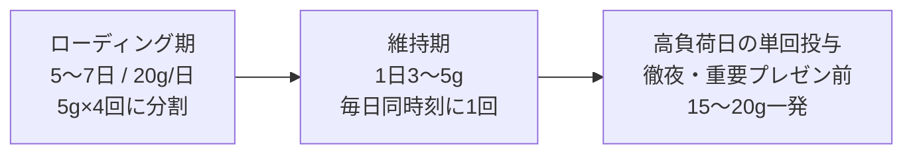

# クレアチンと認知パフォーマンス

> **TL;DR**: 筋トレ用サプリとして知られるクレアチンには、脳の ATP（細胞のエネルギー通貨）再生を高め、睡眠不足や高負荷の状態で起きる認知機能の低下を抑える用途がある。低コストで知的労働者の「夕方の脳のガス欠」対策として注目されている。

夕方に頭が回らなくなる一因は、ニューロンの ATP（エネルギー）が枯渇して情報処理が滞ることにある。クレアチンは体内でホスホクレアチンという形で蓄えられ、消費された ADP を ATP へ高速に再生する回路を補強する。筋肉で起きるこの作用は脳でも同様に働くため、エネルギー需要が高まる局面ほど効きやすい。

効果が顕著に出るのは、脳がストレス下にあるとき。睡眠不足・断眠・高い精神的負荷といった「燃料が枯渇しやすい」状況で、クレアチン補給は認知機能の落ち込みを和らげる方向に働くとされる。逆に十分に休めていて枯渇していない健常者では、体感差は小さくなりうる。

摂取は3フェーズで設計する。**ローディング期**（最初の5〜7日、1日20gを5gずつ4回に分割）で体内の貯蔵量を満タンにし、以降は**維持期**（1日3〜5gを毎日決まった時刻に1回）で水位を保つ。維持量を超えて飲んでも余剰は尿として排出されるだけで上乗せ効果は乏しい。加えて、徹夜や重要なプレゼンなど「脳に高負荷がかかると分かっている日」の直前に**15〜20gを単回投与**して一時的にブーストする使い方がある。1ヶ月分でも数千円とコストが低いのが実用上の利点。

## 観察ログ（未検証）

- 2026-06-19 @goho___: 20代後半から夕方15時以降に「脳のガス欠」とブレインフォグを感じていたが、クレアチン摂取後に会話のレスポンスが速くなり、18時を過ぎても朝と同じ集中を保てるようになったと報告。自身を ADHD 気質と説明（著者の自己申告・体感）
- 2026-06-19 @goho___: クレアチン摂取開始後、1日の労働時間がほぼ半減したにもかかわらず月商が2.5倍になったと主張（単一ソース・自己申告の数字・因果は未検証）
- 2026-06-19 @goho___: ローディング初日に20gを一度にプロテインへ混ぜて飲み激しく腹を下したと報告。「一度に大量摂取せず分割するのが鉄則」という注意喚起（体験談）
- 2026-06-19 @goho___ が紹介: Rhonda Patrick 博士が取り上げた研究では、21時間の睡眠不足という過酷なストレス下でも高用量クレアチンを摂取すると認知機能の低下を防ぎ、むしろ通常時以上のパフォーマンスを発揮できたとされる（孫引き・原典未確認）
- 2026-06-19 @goho___: 維持期の用量については高須幹弥医師の解説が分かりやすいと言及（出典リンクは本文中の参照のみ）

> 補足: 元ポスト末尾は著者自身の「X顧問」サービスへの集客（オープンチャット誘導）で締められている。本ページはサプリと認知パフォーマンスの知識部分のみを取り込み、宣伝部分は対象外とした。

## 問い

- クレアチンの認知効果は、十分な睡眠をとった健常者でも有意に出るのか。それとも睡眠不足・高齢・ベジタリアン（食事由来クレアチンが少ない）など枯渇しやすい人に限られるのか
- 「夕方の生産性低下」への対処として、サプリ摂取と [[concepts/mental-conditioning]] の戦略的休息は競合するのか補完するのか。先に試すべきはどちらか
- 高負荷日の単回15〜20g投与は、消化器への負担（初日に腹を下す失敗例）と効果のトレードオフをどう評価すべきか

## 関連

- [[concepts/performance-habits-40s]] — 加齢に伴うパフォーマンス低下を「引き算」の習慣で抑える自己管理論。栄養面からの足し算であるクレアチンと対になる視点
- [[concepts/mental-conditioning]] — 脳の疲労・集中力低下に休息設計の側から介入するアプローチ。エネルギー供給（クレアチン）と回復（休息）の両輪
