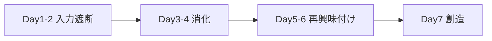

# 7日間クリエイティビティ回復プロトコル

> **TL;DR**: 創造性の枯渇は才能の欠如でなく、条件づけ・生産性優先・情報過多という3つの「心を狭める要因」の蓄積であり、7日間の入力遮断→消化→再興味付け→創造というプロトコルで意識的に元へ戻せる、というDan Koe（@thedankoe）の実践論。

> 📌 X bookmark: 15,406（2026-07-23 時点）

Koe は自身が数週間「脳が焼き切れた」状態に陥り、直前の月まで楽に書けていた文章が急に出てこなくなった経験から出発する。原因をAIの多用（vibe codingのスロットマシン的消費）・執筆ルーティンの崩壊・ストレスの複合と自己分析し、創造性を「才能」でなく特定の「意識の状態」として再定義する。

## 心を狭める3つの要因

Koe は創造性が失われる原因を3つの「心の狭窄要因（Narrowers of the Mind）」に分解する。

- **条件づけ（Conditioning）**: 子供は自由な発想をするが、親・教師・SNSからの否定的フィードバックの蓄積により、20歳を迎える頃には大多数が「他人と同じ考え・信念」に収束していく、とKoeは言う。創造性には信念を緩く持ち、アイデアを即座に否定・断罪しない態度が要る。
- **生産性優先（Productivity as a priority）**: 産業化以降、生産性が最上位の価値になり、誰もが「パズルの一片」だけを知る専門家になった。常時締め切りに追われるストレス下の脳は生存モードに入り、新しい繋がりを見出せなくなる、とKoeは主張する。
- **無限の入力とゼロの処理時間**: 食べ過ぎが体を鈍らせるように、情報の摂りすぎは「精神の代謝」の処理能力を超えてしまう。創造性は入力の不足でなく処理時間の不足が問題だ、とKoeは言う。

## 真の退屈がもたらす3つの効果

Koe は、多くの人が「退屈している」と感じている状態は実際には過剰刺激（overstimulation）であり、真の退屈はその離脱期間の先にあると整理する。真の退屈がもたらす効果として次の3つを挙げる。

- **新奇性への入口**: Carl Jung のシャドウワーク（自分の不快な側面と向き合う作業）になぞらえ、退屈に座ることで無意識の洞察が浮上し、外的条件づけの下にある本当の欲求が見えてくる、とKoeは言う。
- **ドーパミン受容体の再感作**: 快楽を断つと「快楽の踏み車（hedonic treadmill）」が逆回転し、単純な喜び（散歩中の空の色、料理の香り）が再び鮮明に感じられるようになる。
- **明晰さ**: Naval Ravikant の「一人静かに部屋に座っていられないことが人類の全問題の根源」という言葉を引用し、退屈は経験を処理・統合する「センスメイキング」の時間を作ると説明する。

## 7日間プロトコル

- **Day1-2 入力を減らす**: 労働時間を1日4時間程度に区切りアラームで強制終了する。最も無意識に頼っている情報源（通勤中のポッドキャスト、寝る前のスクロール等）を1つ選び断つ。ヘッドホンなし・スマホなしで散歩する。
- **Day3-4 すでにあるものを消化する**: 本を1章だけゆっくり読み、引っかかった一文で立ち止まる。10分間何もせず座る（瞑想アプリは使わない）。散歩を続け、これまで気づかなかったディテールに注意を向ける。
- **Day5-6 再び人生に興味を持つ**: アイデアが浮かんでもメモを取るのを我慢し、その思考の流れに乗り続ける。5分の「近況報告」ではない本物の会話を1つ持つ。
- **Day7 生まれたもので創造する**: 計画を立てずに何かを作る(執筆・絵・20分の音声メモ・レシピなしの料理)。作ったものはすぐ公開せず、最低24時間置いてから判断する。

Koe はこの7日間の設計を、アイデアを生む「生成的思考」とそれを判断・編集する「評価的思考」を意図的に分離する仕組みだと位置づける。両者を同時に行うと、生成側の潜在力が抑え込まれるという。

## プロジェクトを持つことの重要性

Koe は最後に、意味のある「取り組む対象（プロジェクト）」がなければ、7日間プロトコルで凪いだ心もただ漂うだけだと述べる。良いプロジェクトの条件として (1) 自分にとってまだ未解決である、(2) 本気で気にかけている、(3) 文章・コード・会話など何らかの形で共有可能である、の3つを挙げる。プロジェクトを持つと、街で耳にした会話や本の一文までもが「創造の燃料」に変わる、とKoeは言う。

## 問い

- 3つの狭窄要因（条件づけ・生産性優先・情報過多）は自分のwiki運用（毎日のingest・大量情報の処理）にも当てはまるか。真の退屈を意図的に作る時間をどこに置けるか。
- 「生成的思考と評価的思考を分離する」という発想は、Weekly Insightsの執筆プロセス（情報収集→統合）にも応用できるか。

## 関連

- [[concepts/mental-conditioning]] — 同じく「休息」を意志力でなく構造で設計する発想。ただしこちらは不安の鎮静が目的、本ページは創造性の回復が目的
- [[business/human-nature-persuasion]] — 同著者Dan Koe（@thedankoe）による人間本性理解のメタスキル論
