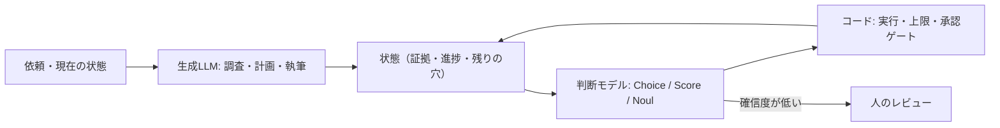

# 判断レイヤー｜生成するモデルと、次を決めるモデルを分ける

> **TL;DR**: エージェントの中の「次はどのワーカーか」「このソースは関連するか」「公開してよいか」といった小さな判断を、文章を生成するLLMから切り離し、選択肢・点数・真偽を確率付きで返す専用モデル（TypeSafe AI の [[models/jev]] 等）に任せる設計。「LLMが仕事を作り、Jevが次を決め、コードが実行する」の三分業になる。

エージェントを組むと、有用な作業の前後に「ワーカーを選ぶ・結果を確かめる・続けるか決める」という分岐が大量に挟まり、その一つひとつが生成モデルの呼び出しになる。@0xCodila はこれを Chief of Staff（司令塔役のエージェント）の日常として描き、分岐の判断を独立したコンポーネントに切り出せば、検査も価格付けも差し替えもできるようになると主張する。@29meat_ai も同じ点を、問い合わせ対応の例で説明する。人間向けのチャットは「請求に関するご相談のようです」という文章を返すが、裏側のプログラムが必要としているのは「請求担当に送る」という判断のほうで、判断レイヤーはこの「文章を読み解いて別プログラム用の形に変換し直す工程」を減らす。

## 何を判断モデルに渡し、何を渡さないか

@0xCodila の切り分けでは、「朝のブリーフィング用に新しいAIエージェントツールを3つ調べて下書きを作る」という仕事の中にある「ソースは足りたか」「次はどのワーカーか」「下書きはレビューに回せるか」が判断モデルの担当になる。ソースの取得・段落の執筆・ファイル保存は既存のツールと生成モデルのまま残し、「10アクションで止める」のような厳密なルールはコードに書く。判断モデル自身は文章を書かず、コードを生成せず、理由を散文で説明しない。

@29meat_ai は、判断モデルが画像や音声を直接理解するわけではない点を強調する。音声操作なら文字起こし、ゲームなら状態の取得、ブラウザなら画面要素の整理を周辺の仕組みが担当し、判断モデルにはテキストの状態と選択肢だけが届く。[[tools/jev-ultrafast]] の番号付き要素テーブルや、[[tools/laya-mlx]] で planner が候補と説明文を作ってモデルは選ぶだけにする分業は、この「周辺が整える」部分の具体例にあたる。

## 設計上の勘所（@0xCodila の10ステップから）

- **問いの型を使い分ける** —— Choice は一覧から1つを選び、確率分布と確信度を返す。Score は定義した尺度（例: 無関係・部分的に関連・直接答えている の3段階で0〜2）で評価する。Noul は yes/no に「yes の確率」を0〜1で返し、0.5付近は迷いを意味する
- **問いの本文と選択肢の説明に要件を書く** —— 判断モデルは質問IDを見ないので、フィールド名を `safe_to_publish` にしても指示にはならない。「研究者が終わった」と書くより、ソース・発見・残りの穴を元の依頼と別フィールドで渡す
- **メニューを毎回作り直す** —— browser-use は操作のたびに観測したコントロールの一覧を作り直して選ばせる。司令塔でも「今存在し、空いているワーカー」から選択肢を組み、状態が変わったら選択肢を更新する。@0xCodila の言い方では、そうしないと判断モデルは「昨日のメニュー」から選ぶことになる
- **候補が多いときは絞ってから選ぶ** —— 明らかな不一致はコードで落とし、残りを Score で採点し、上位から Choice で選ぶ（Choice の上限は255択と紹介されている）
- **同じ状態を見る問いは並列に投げる** —— ワーカー選択・緊急度・承認チェックが同じ状態で答えられるなら同時に送る。投機的な分岐（候補ごとに先に問い、選ばれた分岐の答えだけ使う）も使える。ただし問い同士は互いの答えを読めないため、新しい検索結果が必要な判断は検索を先に済ませる
- **止まる場所を用意する** —— 夜間運用ではソース収集と下書きまでを許し、公開は別の承認チェックに回す。アクション数と支出の上限、進捗の保存を持ち、中断後は最後に完了したアクションを確かめてから再開する。確信度の高い答えは、ファイルが保存された・メッセージが送られたことの証明にはならない
- **完了判定を分ける** —— browser-use は Jev が DONE を選んだ後に結果を独立に確認する。@0xCodila はこの分離を自分の完了チェックにも借りるよう勧める

翌日 @0xCodila は、自分で組んだ構成を「prompt → GrokBot → Jev の判断 → GrokBot の実行 → 結果」の5段で示し、セットアップは7分だと投稿している（手順は添付動画にあり未捕捉）。GrokBot が作業を運び、分岐だけを Jev が決めるという、本ページの三分業をそのまま一本の流れにした形である。

@zodchiii は同じ並列化を費用の面から裏づける。TypeSafe のクックブックでは13問を1呼び出しにまとめると12.2倍安く10.0倍速かったとし、よくある失敗に「1問1呼び出し」「文書をまるごと状態として送る」「日付・件数・大小比較をモデルにさせる」「`jev-latest` で閾値を調整する」「Noul と Choice の答えが一致すると思い込む」を挙げる。仕様と公式が公開する苦手の一覧は [[models/jev]] にまとめた。

確信度は正答率ではない。@0xCodila は最初のレビュー閾値を0.85に置き、自分のワークフローのラベル付き例で調整するとしている。@29meat_ai も、決められた形式で答えることと判断を間違えないことは別で、「質問」「感想」「要望」の選択肢を守って返せても感想を質問に分類する可能性は残ると書く。

## 使いどころの広がり（@29meat_ai の30事例）

@29meat_ai は公開から3日の実装・試作を30本集め、完成した市販サービスではないと断ったうえで紹介している。用途は大きく次の系統に分かれる。

- **ブラウザ・PC操作** —— Google Flights の検索（[[tools/jev-ultrafast]]）、音声指示でのブラウザ操作、Chrome拡張への組み込み（Vercel AI Gateway 経由）、OCRで画面を文字にしてクリック先を決める構成、AXe を使った iOS シミュレータ操作
- **分類・振り分け** —— ライブコメントを質問・感想・要望に分ける、表計算で「Urgency」列を作ると各行に緊急度を付ける、SQLの行ごとに自然文の条件で絞り込む、タスクを担当ボット・モデルに割り当てる司令塔
- **点検・採点** —— PR を秘密情報の混入・テスト削除など14項目で確率判定する、投稿を61の質問で約1秒で採点する
- **コンテキスト整理** —— Claude Code に渡すログを「今後の判断に必要か」で選別する使い方と、「instant compaction」と紹介された文脈整理。@29meat_ai は要約文を作る処理と残す情報を選ぶ処理は別物で、判断モデルは後者を担うと整理する
- **リアルタイム制御** —— Super Mario Bros.・Doom・Slay the Spire 2・Subway Surfers（50ゲーム並列）・Minecraft・ロケット回避・運転判断・取引ボット

@29meat_ai が注意を促すのは、派手な数字と試作の範囲を分けることだ。Doom デモは TypeSafe AI 自身が専用の従来型ボットのほうが上手な場合があると説明し、費用は約7ドル／時間と示している。運転判断の「Tesla FSD を1時間以内で再実装」という投稿者の表現は公道での安全性を確かめたものではなく、取引ボットの公開リポジトリには模擬モデルと模擬約定の設定もある。@29meat_ai 自身はゲームより「ログを整理する・依頼を分類する・開くファイルを選ぶ」といった、人が毎回小さく下している判断のほうに持ち帰れる価値を見ている。

## コストの見方

@0xCodila によると、Jev 1.13 の価格は入力100万トークンあたり0.042ドルで出力課金はなく、1判断1,000トークンなら1万判断で0.42ドルになる。ただしフライト検索の0.0039ドルはJevの入力90,558トークンとテキスト生成役の料金を合わせた値で、ブラウザ側のコストは入っていない。@0xCodila は「完了したタスクあたりの請求額」で追うべきだとし、安い判断がワーカーを誤った分岐へ送れば判断そのものより高くつくと指摘する。@29meat_ai も、単発では安くても毎秒10回呼ぶDoomのような使い方では速度と総費用をセットで考える必要があると書く。

この「生成は高いモデル、分岐は安い専用モデル」という配分は、[[concepts/llm-model-selection-strategy]] の工程分解型モデル配分や [[concepts/cost-effective-harness]] の委譲コスト論を、モデルの種類そのものを分ける方向へ一段進めたものと考えられる。また「分類器は確率的、許可されたルートは決定論的」とする [[concepts/graph-reliability-design]] のルーター設計に、分類器の実体として判断モデルを入れる形とも読める。

## ハーネスに2層で入れる（@0xMovez の整理）

同じ日に @0xMovez も「Split → Playground → SDK → Handoff → Questions → Dynamic Menu → Parallel → Guardrails → Cost → Deploy」という、@0xCodila とほぼ同じ章立て・同じ事例の10ステップ記事を出している。どちらが先に書いたかはソースからは分からない。@0xMovez の記事で上乗せされているのは、判断モデルを個々のエージェントではなく**ハーネス（モデルの外側でループ・ツール・権限を回す仕組み）**に組み込むという視点である。

@0xMovez によれば、Claude Code・Codex・Cursor といったコーディング用ハーネスは、危険な操作を実行前に分類するステップをそれぞれ持っていて、この分類器がエージェントへの信頼を少しずつ築いてきた。ただしこれまではハーネスのクローズドな部分に閉じていた。安くて速い分類器モデルが出たことで、同じパターンをどのエージェントにも持ち込めるようになった、というのが @0xMovez の主張だ。具体例として挙がるのが LangChain の AutoModeMiddleware で、ツール呼び出しのたびに Jev が危険な判断かを確かめ、安全チェックに生成トークンを使わないと紹介されている。

@0xMovez はこれを2層として描く。上の層はリクエストを処理できる最も安いモデルを選ぶ**モデルルーター**（単純なタスクは速いモデルへ、複雑なタスクは推論モデルへ。LangChain の用例として紹介）、下の層は危険なツール呼び出しを実行前に止める **Auto Mode ゲート**である。どちらの層も文章を生成しない。[[tools/jev-model-router]] は上の層を Claude Code に当てはめた実装にあたる。[[concepts/harness-engineering]] の「エージェント = モデル + ハーネス」という見方からすると、判断レイヤーはハーネス側の部品の置き換えであり、モデルを替えずに挙動を変える打ち手と考えられる。

## 本番運用の型（@akira_papa_IT の実装レシピから）

@akira_papa_IT の日本語チートシートは、判断を型付きの値で受け取れることを、生成LLMでは組みにくかった運用の型に結びつけている。いずれも @akira_papa_IT の紹介で、効果の数字は自己申告または出典不明である。

- **重み付けはコードに置く（Composite Scoring）** —— 「課金してくれそうな見込み客か」を Yes/No で丸投げせず、予算規模・導入時期・課題の一致度を個別の Score で測り、最終的な重み付けの計算式はコード側に書く。ビジネスのルールが変わってもプロンプトでなく計算式を直せば済む
- **判定基準をコードとしてレビューする** —— Choice の `criteria` を TypeScript のオブジェクトとしてモジュール化し、カテゴリの追加・変更を普通のPRで議論する。戻り値を型にすれば `switch` の書き漏れを網羅性チェックで弾ける
- **CIで判定を回帰テストする** —— 典型ケース10件と境界ケース5件をゴールデンデータとして保存し、`criteria` を直すたびに Vitest で既存の分類が壊れていないかを確かめる。`confidence` が low のときに人へ回す振る舞いもテストしておくのが肝だと @akira_papa_IT は書く
- **同一判定をキャッシュする** —— 入力 State と `criteria` を正規化して SHA-256 でハッシュし Redis に保存する。`criteria` を直したらキーの版を上げて古いキャッシュを捨てる。@akira_papa_IT は Jev を「決定的な確率計算の純粋関数」と説明するが、同じ入力で同じ確率が返るかは公式の記述で確かめていない
- **2軸で振り分ける** —— 確率と確信度の組み合わせで自動処理・人への回付を分け、確信度が低いときは人のサポート窓口へ回す

5つ目の2軸の振り分けは、上の「確信度は正答率ではない」という注意と合わせて読む必要がある。確信度が高くても判定が誤っていることはありうるので、人へ回す条件は確信度だけでなく操作の重さ（@zodchiii の閾値の動かし方）でも決めるのが安全と考えられる。

## 観察ログ（未検証）

- 2026-09-18: @0xCodila が紹介する事例として、Hassan が Jev で AI 論文1,018本を分類し総額0.08ドル・1本あたり中央値256ms、Vercel の fx チームが安全性分類で GPT-5.6-luna より約5〜18倍速く精度も上がったと報告。いずれも一次資料未参照
- 2026-09-18: @0xMovez が「同じモデルでもハーネス次第で78%と42%に分かれる」と述べ、Alex Volkov が約100万トークンの Claude セッションを1秒で8.6万トークンに圧縮した（要約でなく関連度フィルタ）、Riley Brown がメール500通を3.5セントで分類したと紹介。78%/42% は比較対象のベンチマーク名が書かれておらず、いずれも一次資料未参照

## 問い

- このwikiの ingest で、カテゴリ判定・粒度判定のような「選択肢が決まった判断」を判断モデルに切り出せるか。LESSONS.md の判定事例をラベル付き例として閾値を調整できるか
- 公式が「英語で最も精度が高く、他言語は自分のデータで検証を」と案内している（@29meat_ai の紹介）以上、日本語の分類でどこまで使えるかは自前の検証が要る
- 判断を安くするほど呼び出し回数が増える（@0xCodila が冒頭で持ち出すジェボンズのパラドックス）。総コストが本当に下がるのはどんな仕事の形か

## 関連

- [[models/jev]] — 判断レイヤーの代表例である TypeSafe AI の System One モデル
- [[tools/jev-ultrafast]] — browser-use が Jev で操作と対象を1往復で選ぶブラウザエージェント。「メニューを毎回作り直す」の元になった実装
- [[tools/laya-mlx]] — Jev 型の選択モデルのオープンウェイト版をローカルで回す例。planner が説明し、モデルは選ぶだけという同じ分業
- [[concepts/graph-reliability-design]] — ルーターの分類は確率的、許可されたルートは決定論的に置く設計。判断モデルはこの分類器の実体になりうる
- [[concepts/cost-effective-harness]] — 委譲のコーディネーションコストを実測した実験。判断を安いモデルへ切り出す動機と同じ問題を扱う
- [[concepts/llm-model-selection-strategy]] — 工程ごとにモデルを配分する戦略。判断レイヤーはその配分先を「生成しないモデル」まで広げる
- [[tools/grok-bot]] — 領域別ボットを運営ボットが巡回・催促する運用。@0xCodila が想定する GrokBot 風 Chief of Staff の実例
- [[tools/jev-model-router]] — Claude Code のモデル振り分けを Jev に任せる Mod。判断レイヤーをコーディングエージェント自身のモデル配分に当てはめた例
- [[concepts/jev-claude-code-integration]] — 判断レイヤーを Claude Code に入れる具体的な経路（公式スキル・MCP・モデルルーター）と、文脈選別・Stop フック等の周辺実装（@karoukun_ai）
- [[concepts/harness-engineering]] — エージェント = モデル + ハーネスの全体論。@0xMovez はモデルルーターと Auto Mode ゲートの2層を、ハーネス側に判断モデルを入れる形として描く
