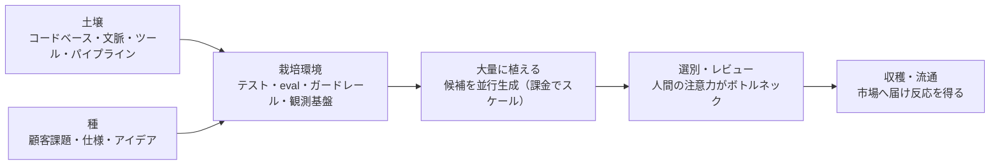

# 開発の農業化（Development as an Agriculture）

> **TL;DR**: 生成コストが下がるほど開発は「一本を丁寧に編集する工芸」から「大量に植えて良いものを選抜する大規模農業」へ寄る——深津貴之（note CXO）が土壌・種・栽培環境の対応表で示した見立て。

工芸から農業へという比喩が効くのは、AI駆動開発でスケールする工程としない工程が分かれるからである。深津貴之は開発の構成要素を農場の語彙に割り当てる——**土壌**はコードベース・コンテキスト・ツール・パイプライン、**種**は顧客課題・仕様・アイデア、**栽培環境**はテスト・eval・ガードレール・観測基盤。つくるのはAIであり、人間の仕事は「何を育てるかを決め、育つ環境を設計し、結果を選別すること」になると同氏は述べる。

生成コストが下がるほど、一つの案を丁寧に編集するより複数の候補を並行して育てて良いものを選ぶほうが合理的になる。この帰結として深津は道具立ての変化を2つ挙げる。開発ツールのUIは「一つの出力を編集するUI」から「複数の候補を比較し、選抜するUI」へ移り、バージョン管理にはコードの差分だけでなく**どのモデル・文脈・指示・評価を経て生まれたかという生成の系譜**が加わる。生産能力も人数だけでは決まらず、課金で押し切れる部分が出てくる。

ただし出荷量を決めるのは評価・統合・レビュー・ユーザーからの反応を処理できるパートであり、そこにはレバレッジが効きにくい（消費者はスケールしないため）と同氏は指摘する。結果、**生成は増やせても、正しさや価値を確認する速度は無限には増やせない**というパラドックスが残る。深津はここにビジネスチャンスがあると見る。この非対称は [[concepts/recursive-self-improvement]] で Anthropic が報告した「人間レビューが新ボトルネック」（Amdahlの法則）と同じ形をしており、[[concepts/eval-loop]] のような機械側の品質ゲートは、その確認速度を上げる打ち手として読める。

希少になるのは選ぶ力だと同氏は言う。生成能力が誰でも買えるほどコモディティ化した生成物の値段はゼロに近づき、価値が上がるのは——何をつくるべきかを定義する力、「良い」を判定可能な形にする eval 設計、大量の候補から価値を見抜く目利き、固有のデータ・文脈・顧客理解、市場へ届けて反応を得る信頼と流通——の側になる。組織にも対応する3つの役割が残ると整理する：**土壌をつくる人**（コンテキスト・基盤・ツール・ガードレールを整える）、**選別基準をつくる人**（品質・価値・安全性を評価できる仕組みにする）、**最終判断をする人**（数字だけでは決められない例外と出荷品質を判断する）。

この見立てでは 10x エンジニアの定義も変わる。AIツールを使えること自体は参加費にすぎず、差がつくのは「同じ計算資源と人間の時間から10倍の価値を収穫できるか」になる。深津が挙げるイケてるエンジニア（あるいはPM）の条件は、**人間の限られた注意力でレビューするに値する、最大の価値を収穫できる生産系をつくること**である。同氏はテック業界が大規模農業の成功事例や設計を真面目に学ぶべきだと締めくくる。

## 観察ログ（未検証）

- 2026-08-05: 「コモディティ化した生成物の値段はゼロに近づき、需要のある非生成物の価値は無限に値上がりする（需要のない非生成物はゼロ）」という深津の予測
- 2026-08-05: 「純粋に実装量をこなす仕事は減り、環境設計・評価・統合・運用へ仕事が移る」という予測

## 問い

- 「大量に植えて選抜する」を自分のwiki運用に当てはめると、選抜工程（ingest品質の判定）が明らかにボトルネックになる。選別基準を機械可読にする最小の一歩はどこか
- 深津が言う「生成の系譜」をバージョン管理に載せる実装は既に存在するか（どのモデル・文脈・指示・評価で生まれたかの記録）。このvaultの `log.jsonl`・`tier_log.jsonl` はその原始形か
- 「確認速度は無限には増やせない」がビジネスチャンスだとして、確認を売る商品は何になるのか（eval設計の受託か、選別済みの候補集合か）

## 関連

- [[people/fladdict]] — 著者。AI時代の産業構造・キャリア分析を継続的に発信
- [[concepts/eval-loop]] — 「良いを判定可能な形にする」を機構として実装したもの。本ページの選別工程にあたる
- [[concepts/recursive-self-improvement]] — 生成が加速し人間レビューがボトルネック化するというAmdahl構造をAnthropic内部データで論じる
- [[business/end-of-task-assignment]] — 「パイプラインを組む人とレビューする人だけが残る」という同型の結論をSpotify事例で論じる
