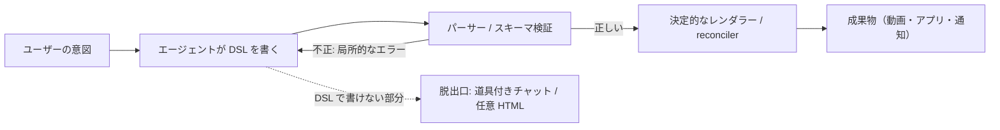

# DSL をハーネスにする｜表現力を捨てた言語がエージェントを安定させる

> **TL;DR**: 汎用コードでなく、語彙が有限で検証器付きの DSL（ドメイン固有言語）をエージェントに書かせ、実行は決定的なレンダラーに任せると、長時間・無人の委任でも出力が検証可能で再現可能になる、という設計論。

汎用言語はチューリング完全なので、同じ振る舞いを無数の書き方で表せ、その書き方が「このドメインで正しいか」を言語自体は教えてくれない。receptron/mulmoclaude リポジトリのエッセイ「DSLs as Harnesses」（2026-05-31 付）はここをエージェントの迷走の原因と見て、**DSL は表現力を手放すからこそ強いハーネスになる**と主張する。[[concepts/harness-engineering]] の「同じモデルでもハーネス次第で出力が大きく変わる」という前提に立ち、その中で DSL という1つの設計判断から定番のハーネスパターン4つがまとめて得られる、というのがエッセイの論旨である。

@snakajima は Karpathy の「LLM に ASD-STE100 で説明させる」という tip（[[concepts/asd-ste100-llm-writing]]）に返信する形でこのエッセイを紹介し、HTML・Markdown・ASD-STE100・ShapeScript などの DSL が LLM を制御する良い方法だと述べた。制御言語で LLM の文章を縛る話と、DSL でエージェントの出力を縛る話を同じ線上に置いた形である。

## DSL が与える4つのハーネス性質

エッセイは DSL の効用を次の4つに分ける。SWE-agent の研究（編集のたびに走って壊れた変更を即座に弾く linter、絞り込みを促す検索結果の上限）を引き合いに出している。

- **スキーマが記録の正本になる**: ユーザーの意図が命令型コードの細部に溶けず、diff・バージョン管理・検証ができる構造化オブジェクトとして残る
- **検証器が無料のフィードバックループになる**: DSL には必ずパーサーがあり、多くはスキーマ検査器も持つ。不正な構造は出力した瞬間に、場所を特定したエラーで弾かれる
- **文法が強制関数になる**: 語彙が有限なので、文法に無いオプションを捏造する余地が構造的に小さい
- **言語の単位がコンテキストの単位になる**: beat・レコード・ルールといった DSL の自然な区切りがそのままエージェントの編集単位になり、文書全体を抱えずに一部を直せる

## 3つの実例（MulmoClaude）

- **MulmoScript**: マルチモーダルなプレゼン・動画を beat（テキスト・画像・音声・タイミング）の列として書く JSON の DSL。エージェントが作るのは動画でなくスクリプトで、決定的なレンダラーが動画にする。描画前に中身を検査でき、同じスクリプトからは同じ動画が出る。画像タイプは `markdown`・`slide`・`textSlide`・`mermaid`・`html_tailwind` などの閉じた集合に限られる
- **Collections**: データの形（フィールドと型・関係・完了とみなす値・通知の時期・繰り返し）を `schema.json` で宣言し、エージェントはそこから生成された `SKILL.md` に従ってレコードを読み書きする。通貨の無い money フィールドや、存在しないコレクションを指す ref、生まれた時点で完了済みになる spawn（無限に再生成される）は、ロード時に Zod の検証器が弾く。通知の発火・解除や暦日計算は、ホスト側の reconciler（宣言どおりの状態に毎回揃える常駐処理）が毎回同じように実行する
- **繰り返しの支払い**: 「毎月10日締め・3日前に通知・支払済みにしたら翌月分を作る」を、タイマーや cron を書かずにスキーマのキー（`triggerField`・`triggerLeadDays`・`spawn`）だけで宣言する。以前は専用サブシステムだったものがコレクションのキー数個に置き換わった、とエッセイは書く

エッセイが新しい点として強調するのは **DSL を誰が書くか**である。Collections ではスキーマを書くのはエンジニアでなくエンドユーザーで、宣言するだけで非エンジニアがエージェントの作業環境を設計していることになる。エッセイはこれを「ハーネスエンジニアリングの民主化」と呼び、ユーザーが「優先度フィールドを足して」「カンバンで見たい」と頼むだけでデータアプリができる体験を **vibe crafting** と名付けている。vibe coding の開発者は diff を読みテストを回せるが、エンドユーザーは出力を監査できない。その差を埋めるのはより良いモデルでなくハーネス（DSL・検証器・サンドボックス化された HTML ビュー）だ、というのがエッセイの主張である。

## 唯一の危険: 脱出口を設計する

DSL の硬さはそのまま失敗の原因にもなる。必要なことを言語で表せないと、エージェントは諦めるか、DSL を本来の用途から捻じ曲げる。エッセイは、良い DSL はどれも**より表現力の高い層への意図的な出口**を用意している、と述べる。Collections では判断が要るレコードを道具付きのチャットへ渡す action ボタンと、フィールド型で表せない表示を任意の HTML で描くカスタムビューがこれに当たる。MulmoScript では外部アセットや生の HTML を埋め込める。エッセイの言葉では、肝は制約を最大化することでなく「どこで制約を効かせ、どこに出口を開けるか」を選ぶことにある。

## モデルが賢くなるほど効く

「DSL は弱いモデルの松葉杖で、賢くなれば汎用コードを渡せばよい」という直感に対し、エッセイは逆だと主張する。人間が各ステップを見ない長時間の自律委任では、出力が検証でき、実行が決定的で、やり直せることがむしろ重要になるからである。賢いモデルの能力は「何を言うか・何を作るか」の判断に向け、残りを言語が保証する、という分担になる。

この「エージェントが中身を決め、決定的なコードが実行する」分割は、AI に GUI でなく DSL を操作させる [[concepts/intermediate-notation-pattern]] や、生成と判断と実行を分ける [[concepts/decision-layer-model]] と同じ構造と考えられる（wiki 側の関連づけ）。中間記法パターンが主に精度とトークン量の面から DSL を勧めるのに対し、このエッセイは長期の無人委任での検証可能性を前面に出し、作り手をエンドユーザーにまで広げている点が異なる。

## 問い

- この vault の wiki ページ（frontmatter・`[[]]` リンク・index 登録）を DSL と見なすと、`validate_wiki.py` が検証器にあたる。DSL として足りない性質（閉じた語彙・脱出口）は何か
- 日本語の文章に対して、ASD-STE100 や Markdown のように名指しで指定できる「書き方の DSL」はあるか
- エンドユーザーが書いたスキーマが検証を通っても、意図と違うアプリになる場合（形式は正しいが中身が違う）はどう検出するか

## 関連

- [[concepts/harness-engineering]] — エッセイが前提にする「モデルよりハーネス」という枠組み
- [[concepts/intermediate-notation-pattern]] — AI に GUI でなく DSL を操作させる設計パターン。同じ分割を精度・トークン量の面から論じる
- [[concepts/asd-ste100-llm-writing]] — @snakajima がこのエッセイを紹介した返信先の Karpathy の tip。制御言語で LLM の文章を縛る
- [[concepts/decision-layer-model]] — LLM が作り、判断モデルが決め、コードが実行する分割。生成と実行を分ける別の型
