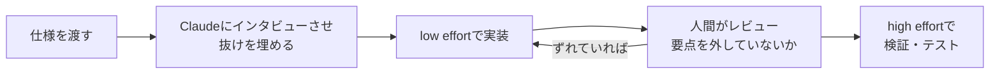

# effort レベルの使い分け（Spending your effort）

> **TL;DR**: effort は「どれだけ検証・エッジケース確認をし、どれだけ自分の判断で動くか」を変えるつまみで、高 effort が効くのは隠れたエッジケースの多いタスク（ハードウェア・コードレビュー・セキュリティ）。通常開発は「インタビュー→低/中 effort で実装→レビュー→高 effort で検証」のループで回す、と Anthropic Claude Code チームの Thariq（@trq212）が自身の eval 実行と実験から結論づけた。

「なぜ常に max にしないのか」という利用者の質問に答えるため、Thariq は Terminal-Bench 3.0 の結果を読み込み、同じタスクを複数の effort で Opus 5.5 に実行させた。最新モデル（[[models/claude-fable-5-1]] と [[models/claude-opus-5-5]]）は Claude Code でプロンプトキャッシュを壊さずに effort を切り替えられる点が長所だと Thariq は述べ、会話の途中でも `/effort` で変えることを勧めている。effort の中身の理論（モデル=何を知っているか／effort=どこまで徹底するか）は [[concepts/claude-code-model-effort]] が公式解説で、本ページはそれを「どの仕事にどのレベルを当てるか」という運用に落とした実測版にあたる。

## effort とは何か

Thariq の説明では、effort はタスクにどれだけ計算を使ってほしいかの近似をモデルに伝えるもので、依頼者がタスクの難しさをどう見積もっているかにも近い。人に「12時間ぶっ通しでやって」と頼めば本気の完成品を期待していると受け取られ、「1時間で」と頼めば要件を満たす最良版を出して後で反復する前提になる——あるいは「最低3時間は要る」と押し返して3時間働くこともある。Claude も同様で、どの effort でも依頼を妥当にこなそうとするが、高 effort ほど判断と検証のための自律的な行動が増える。Fable 5.1 と Opus 5.5 の effort 曲線は各レベルでベンチマークスコアと消費トークンが上がる「これまでで最良」のものだと Thariq は述べる（Terminal Bench 3.0 のスコアのグラフは画像で未収集）。

## 仕様の粒度で effort の効き方が変わる

Thariq が Opus 5.5 で試したトイ例では、仕様が曖昧なほど effort の差が大きく出た。

- **仕様が曖昧な構築タスク**（「個人用フィットネス・ワークアウト記録アプリを作って」）: low ではログと簡単なグラフだけ、高くなるほど機能が増え、max ではヒートチャートまで付いた。effort を上げると Claude が途中で下す選択も増える。反復の土台なら low、一発で最良版が欲しいなら max
- **軽く仕様がある設計タスク**（Claude Code の /config メニューの再設計）: どの effort でもサブメニューと検索改善という同じ発想に行き着いた。low（1分）は発想が伝わる対話スケッチだが Claude Code らしい見た目ではなく、max（28分）は Claude Code そっくりのモックアップと複数フローのウォークスルーまで出た。Claude の構想を掴むなら low を好む、と Thariq は述べる
- **仕様が詳細な構築タスク**（Claude にインタビューさせて作った仕様を実装させる）: モデルと effort が違っても設計・実装はかなり似通い、差は細部に留まった。max では一部の細部を簡素化する時間を取った

ここから Thariq は、通常の機能開発では effort は「どれだけループに入っていたいか」で決まると結論する。low は素早く出発点を返し、高 effort はより多く進めるぶん自分に代わって仮定を置く。仕様を渡して抜けをインタビューさせる前半は [[concepts/finding-unknowns]] の「実装前インタビュー」や [[tools/grill-me]] と同じ型である。

## 難しいタスクでは「エッジケースの多さ」が効き目を決める

完了できるかどうかが分かれる難問を見るため、Thariq はコミュニティ由来のベンチマーク Terminal-Bench 3.0（セキュリティ・ハードウェア・ML・科学・ソフトウェア・運用・メディアの分類）を読み込んだ。平均的な業務より遥かに野心的な課題が多く、例として 8bit ゲーム機を Verilog で小型 FPGA に収める課題、Takens の埋め込み定理を Lean 4 で形式証明する課題、MoE チェックポイント16シャードを参照 logits が再現する1ファイルに統合する課題、EU 域内貿易統計の月次申告を端から端まで行う課題、ポスター画像を編集可能なレイアウトファイルとして作り直す課題が挙げられている。

Thariq の主な読み取りは「高 effort は隠れたエッジケースが多いタスクで最も効く」こと。失敗の内訳を見ると、effort を上げるとエッジケース見落とし型の失敗は減るが、アプローチ自体を誤る失敗は直らないという。Thariq が挙げた事例（成功数は各5試行）は次のとおり。

- **html-js-filter**（JavaScript を持ち込むあらゆる手口を除去する HTML サニタイザ）: Fable 5.1 が low 1/5 → xhigh 5/5。low は約2分で1パス書き、手書きの1ページで試すだけ。high は約33分で、初稿を敵対的にレビューし、インストール済みパーサのソースを読んでバグを確認し、入力と出力が一致するまでクリーンなケースを流し、標準 XSS テストスイートを走らせ、最後にランダム文書ファザーまで書いた
- **mvcc-lsm-compaction**（クラッシュレポートからストレージエンジンのバグを直す・コンパクションを壊さない）: Opus 5.5 が low 0/5 → xhigh 4/5。low（約1分）はビルドも再現もせずコードを直し、新テストが元のバグを捕まえるか確かめなかった。xhigh（約11分）はまずクラッシュを再現し、コンパクションしない参照実装に対するランダムテストを書き、修正途中の版でテストが落ちることを確認した
- **cli-2ph-simple**（Python の CLI 線形計画ソルバ）: Opus 5.5 が low 0/5 → high 5/5。low は1パスで書いて小問題で確かめ約1万トークンで止まり、大問題で遅いかもと警告しつつ確かめなかった。high は別の総当たりソルバとランダム問題で突き合わせ、大きい問題を計時して長時間化・クラッシュに当たり探索を作り直した
- **gsea-proteomics**（プロテオミクスデータの GSEA で8処理のうち標的組織に似るものを探す）: Opus 5.5 が low 0/5 → high 4/5。low はもっともらしい前処理を1つ選んでそのまま報告。high は前処理を2通り試し、有意な処理の一覧が変わることに気づいて原因を掘ってから正しい方を選んだ。ユーザーがループにいれば問題設定を質問したかもしれないが、不在なら高 effort が勝る、と Thariq は補足する

高 effort が特に効く問題領域の分類図も示されているが、画像のため未収集。

## レベル別の目安（Thariq の経験則）

| レベル | 使いどころ | 例 |
|---|---|---|
| Low | 素早い応答でループに入っていたいとき | ブレスト・スケッチ・簡単な変更 |
| Medium | 普段のソフトウェア開発の大半 | 新機能の実装 |
| High | 検証が重要・エッジケースがある仕事 | ブラウンフィールドのコードベースのバグ修正 |
| Max | 難問を完全自律で解かせたいとき | アプリの端から端までの構築と検証・重要ソフトウェアの脆弱性探し |

パフォーマンス最適化やセキュリティレビューのように本番要件が高い複雑なタスクでも、徹底のためにトークンを使う価値があると Thariq は述べる。インタラクティブな図解版は claude.dev のブログ（spending-your-effort）にあるとされるが未収集。

## 問い

- 自分の運用（rigor を都度選ぶ・headless ingest）を Thariq の4段階に当てはめるとどうなるか。ユーザー不在の headless 実行は gsea-proteomics の「ループに人がいないなら高 effort」に該当し、[[concepts/claude-code-model-effort]] の「低 effort は聞く方へ倒れる」とも整合する
- 「effort はアプローチの誤りを直さない」なら、アプローチ誤りを減らす手段（仕様インタビュー・モデル変更）と effort 上げをどう切り分けて試すか
- 公式の「effort はタスク単位でなく一般的な好みとして扱え」（Lydia Hallie）と、Thariq の「タスクや会話途中で変えよ」は、キャッシュを壊さず切り替えられるようになった世代差で説明できるか

## 関連

- [[concepts/claude-code-model-effort]] — effort の理論面の公式解説（Lydia Hallie）。本ページはその運用・実測版
- [[models/claude-opus-5-5]] — Thariq が実験に使ったモデル。effort 別の挙動の事例の大半
- [[models/claude-fable-5-1]] — html-js-filter で low 1/5 → xhigh 5/5 を記録したモデル
- [[concepts/finding-unknowns]] — 同じ @trq212 のフレーム。「インタビューしてから実装」の前半部分
- [[tools/grill-me]] — 実装前インタビューの独立実装
- [[tools/claude-code-ultracode]] — `/effort ultracode` で起動する総力戦モード。max の先にある並列編成
- [[concepts/llm-model-selection-strategy]] — 工程ごとにモデル×effort を割り当てる実務戦略
- [[concepts/opus-motion-design-studio]] — 動画制作での effort 運用例（小修正 medium・新作 xhigh・ローンチ max）
- [[tools/claude-projects-threads]] — コーディネーターとスレッドで effort を分けて設定する Claude Projects。既定はスレッド high・コーディネーター low
- [[concepts/claude-code-long-task-harness]] — 本体 medium・レビュアーだけ high とし、受け入れチェックの通過数で effort を仕事単位に決める運用（@beamnxw）
