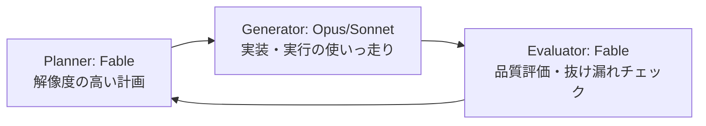

# Fableスプリント攻略（期間限定モデルの全力運用）

> **TL;DR**: 期間限定開放された [[models/claude-fable-5|Fable 5]] を8アカウント・Mac 9台で全力運用する実践記。柱は「HTMLしか読まない」認知負荷対策・初日のメタハーネス（改善基盤）先行構築・週50%制限下で Planner/Evaluator に Fable、Generator に下位モデルを置くループ設計の3つ（@AI_masaou）。

出発点は前回6月上旬の開放で得た「人間の方がボトルネック」という反省だと @AI_masaou は書く。マシンを増やしても、人間が成果物を読んで判断する速度が追いつかない。そこで今回は、次にいつ使えるか分からない7月7日までの開放に対し「時間をお金で買う」勝負の1週間と位置づけ、体制（並列数）・認知負荷（人間側の処理速度）・改善基盤（メタハーネス）・モデル配分（週50%制限）の4層で初日から攻略を仕込んだ記事になっている。

## 認知負荷対策「HTMLしか読まない」

やることはシンプルで、成果物をとにかくHTML化させる。自分は文章を読まず「HTMLしか読まない」つもりで、SVGや画像を入れて直感的に読める形にする、と @AI_masaou は述べる。何十ものループを回すと待ち時間が生まれるが、HTMLプレビューを作らせておけば「ここ何やってたっけ」がすぐ分かり、作業の引き継ぎ資料としても機能する。これは多窓・多アカウントで並列数を上げたときに効く対策で、1アカウント運用で文章を読む注意力を割けるならMarkdownでもよい、と適用条件も添えている。

細かい工夫として3つを挙げる。見た目が冗長になりがちな出力に「それジョブズなら許してくれるんですか」と圧をかけるプロンプト、「このくらいのトークン消費でいいだろう」という無意識の遠慮を外す意図的なリミッター解除、散歩しながらスマホで指示できる低認知負荷インターフェースの活用（かんばん型やモバイル指示）。

## 初日はメタハーネス（改善し続けられる基盤）から

初日の使い道として一番効くのは、コンテンツやアプリの制作でなくメタハーネスの自作だと @AI_masaou は主張する。具体的には、入力プロンプトを分析して改善させる仕組み・スキルやCLAUDE.mdをアップデートできる基盤・自分の意思決定情報ループ・増えた自作ハーネス群のアナリティクスツール——要するに「ログと、自分が作ったものを改善し続けられる基盤」を最速で仕込む。身近な一歩として、Claude Codeがローカルに残すJSONL形式の会話ログを「これを元に改善して」と渡すところから始めるのを勧めている。この投資はFableの期間が終わったあとのOpus環境でも効き続けるのが要点で、[[concepts/harness-engineering]] でいう自己改善レイヤーを、最上位モデルが使えるうちに書かせておく発想と読める。計画づくりにはExcalidrawというホワイトボードツールを使い、コンテンツ系→最終日はOpusでもやれることを高速で投げ倒す、という1週間の配分を先に設計したという。

## 週50%制限とモデル配分

実際に使うと5時間制限より週次制限が効いてくる、と @AI_masaou は指摘する。Fableは週の利用枠の50%までしか使えないため、Fableだけを回すと残り半分が丸ごと余る。挙がる戦略は3つ。①Fableを計画と評価の専任に絞る ②残り50%は外側のループで消化する（速度重視はSonnet、待てる場面はOpus） ③ultracode（多数のエージェントを一斉起動する機能）は雑に撃つと制限が速攻で来るので、本当に重要な所だけに使う。

雑にトークンを燃やして解決できない環境では、ハーネスエンジニアリング・[[concepts/loop-engineering|ループエンジニアリング]]の腕の見せ所になる、というのが著者の整理。ベースはAnthropicが以前から示すPlanner/Generator/Evaluator分割のループ設計パターンで、配分は Planner=Fable（メタ認知が強く目標ドリフトしにくい計画）・Evaluator=Fable（出力の品質評価は実は難しい仕事で、評価結果を次のPlannerに渡して回す）・Generator=Opus/Sonnet（実行の使いっ走りに最上位モデルは必須でなく、フレームワークによってはCodexでもよい）。実装はサブエージェントがAgentツール経由で呼ばれる性質を使い、CLAUDE.mdに「Evaluatorを呼ぶときはmodel=opusで」のようにモデル指定を書いて誘導するだけとする（記事中の例文ママ・[[tools/claude-code-subagents]] 参照）。Evaluatorは新品のコンテキストで評価させたいのでサブエージェント呼び出しと相性がよく、指定したモデルで実際に起動しているかは触って確認せよ、とも注意している。

## 観察ログ（未検証）

- 2026-07-03: @AI_masaou は Mac 9台・8アカウント・課金約28万円の体制でも「全然足りない」と報告（単一ソースの規模感の実測）
- 2026-07-03: 公式からも「HTMLプレビューをどんどん使いましょう」という発信が出ていたと @AI_masaou が言及（公式発信の所在は未確認）

## 問い

- Planner/Evaluator=Fable・Generator=下位という配分は、[[concepts/advisor-executor-pattern]] のFable Sandwichと何が違うか。評価器に最上位モデルを置く点が差分で、Haiku評価器を使う /goal コマンドとは逆の思想ではないか
- 自分のvaultで「Fableが去った後も効き続けるメタハーネス」に相当するのはどれか（LESSONS.md・evolve-insightsはその一部か、意思決定情報ループに相当するものは無いのでは）
- 「HTMLしか読まない」認知負荷対策は、1アカウント運用の自分にはどの並列数から引き合うか

## 関連

- [[concepts/advisor-executor-pattern]] — モデル配分3パターン（Advisor/Orchestrator/Fable Sandwich）の体系側。本ページはその実践者版のP/G/E配分
- [[concepts/frontier-model-extraction]] — 同じ期間限定Fable週間への向き合い方。あちらは「去る前に判断を抽出する」、こちらは「開放中に全力で運用する」
- [[concepts/loop-engineering]] — 「雑にトークンを燃やせない環境ではループ設計が腕の見せ所」という本ページの前提の一般論側
