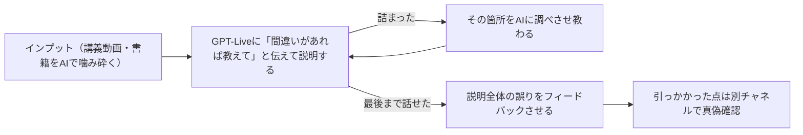

# AI時代のファインマンテクニック｜「わかった気」を説明して確かめる勉強法

> **TL;DR**: 生成AIは難度を下げて何度でも説明してくれるぶん「わかった気」になるのが極端に簡単になるので、学んだ内容を何も見ずに「背景→提案手法→検証結果→メリット・デメリット」の順で説明できるかで理解を確かめ、詰まったところだけ AI に調べさせて戻る、という勉強法。

iwashi（@iwashi86）がブログ記事「AI時代の勉強法(2026)」で、生成AI以降に理解の難しかったものが比較的容易に理解できるようになった一方、噛み砕いた説明を受けて「あーそういうことね」とすぐなりがちな点を「かなり危険」と指摘した。@t_wadaはこの一節を引いて「深く同意する」とポストしている。確認方法としてiwashiが挙げるのが、誰かに内容を説明してみるファインマンテクニックである。

## 説明の型：論文の骨子に沿って話す

iwashiは、大体の技術は論文の骨子と似た構成になっているとして、説明時に次の項目を話すようにしている。

- 背景（何かしらの課題が存在する）
- 課題を解くための提案技術や手法
- 実際に実験して検証した結果（論文でなければ無い場合もある）
- その技術のメリットとデメリット

これを何も見ずにスラスラ話せるなら、実装できるかはおいて概略は理解できている可能性が高く、スラスラ出てこないならわかった気になっているだけだ、とiwashiは述べる。例として SGD → Momentum を「SGD は勾配だけで更新しジグザグ進む→Momentum はこれまでの方向も使い、ぶれを打ち消す→速く収束するが追加ハイパラや最小値の行き過ぎがある」と説明し、そこから「Momentum の課題を Adam が〜」と後続技術へつなげている。

## インプット：英語の一次教材を AI で噛み砕く

iwashiは、知の高速道路で一番発達したのは動画だとし、Stanford の CS336（Language Modeling from Scratch）のような講義を英語のまま使う方法を挙げる。

- **動画のみ**: PC で講義を再生し、隣のスマホで GPT-Live に逐次通訳させる。ある程度わかるなら普段は黙らせ、わからない箇所だけ止めて質問する
- **動画→テキスト**: YouTube の transcript と講義資料 PDF を LLM に読ませ、自分専用の日本語解説 Web テキストを作らせて予習・復習に使う
- **動画→音声**: NotebookLM で対談音声にしてざっくり教わる（謎のメタファーを連発して分かりにくいこともある）
- **書籍**: 難しい箇所を撮影して ChatGPT に噛み砕かせ、何度か往復する。生成AI以前は輪読会でカバーしていた部分だという。ビジネス書は読み流せるので AI はあまり使わない
- **オライリー**: 学習プラットフォームで英語書籍の先行リリースまで読める。AI の技術書は変化が激しく翻訳の時差が痛いので英語で読み、AI で読みやすくする

## アウトプット：GPT-Live 相手に説明する

iwashiは、両手は塞がるが口と耳が空いている時間に、インプットした内容を GPT-Live に話している。「今から〜について説明するから、間違えているところがあったら教えて」と伝えて話し始め、詰まったところは理解が浅いので GPT-Live に調べさせて逆に教わり、また最初から話す。最後まで話せても「これまでの説明で間違っているところがあれば教えて」とフィードバックをもらう。ハルシネーションもありうるので、引っかかった点は別のチャネルで真偽を確かめる。

勉強会での登壇やブログ執筆も同じ働きをする。iwashiは MoE の技術メモを書いた際、前半はスラスラ書けたが Auxiliary Load Balancing Loss の節で論理が急にあやふやになり、理解できていなかったと気づいて学び直したと書いている。なお記事自体は誤字脱字チェック以外に生成AIを使わず手でタイプした、とiwashiは明記している。

[[concepts/output-first-learning]] が「出力を前提に読む」ことで定着させるのに対し、本手法は出力を**理解の検査**として使う点に重心がある。[[concepts/cognitive-debt]] の「説明できないものは出さない」という基準を、学習の場面に適用したものとも読める（wiki 側の関連づけ）。

## 問い

- このwikiのページを「背景→手法→検証→メリデメ」で何も見ずに話せるか。ingest 直後のページで試し、詰まる箇所を問いに回す運用にできるか
- AI が説明を噛み砕くほど「わかった気」が強まるなら、[[concepts/asd-ste100-llm-writing]] のように出力を制約して読ませる手と、本手法のように自分で話して検査する手はどう組み合わせるのがよいか
- GPT-Live 以外の音声対話（Claude の音声モードなど）でも、誤りの指摘が十分な精度で返ってくるか

## 関連

- [[concepts/cognitive-debt]] — AI の生成速度に人間の理解が追いつかない負債。「説明できないものは出さない」基準と同じ発想
- [[concepts/output-first-learning]] — 出力を前提に学ぶ血肉化法。本手法は出力を理解の検査に使う
- [[concepts/ai-teacher-prompt]] — AI に教師役を割り当てて理解を深める手法。本手法は逆に自分が教える側に回る
- [[concepts/research-methodology]] — ML リサーチ力の整理。論文の骨子に沿って説明する型と接続
- [[concepts/asd-ste100-llm-writing]] — LLM の出力を制御言語で書かせて理解しやすくする手法
