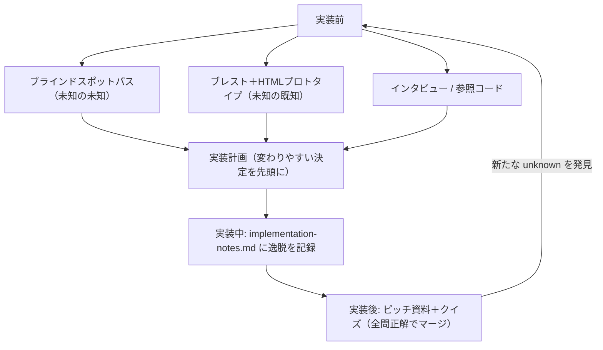

# 未知の発見（Finding Your Unknowns）

> **TL;DR**: プロンプトや仕様（地図）と実際の作業環境（領土）のずれ＝unknownsを、実装の前・中・後で体系的に発見する技法集。モデルが強くなるほど、仕事の質のボトルネックはモデル性能でなく人間側のunknown明確化能力に移る。

> 📌 X bookmark: 11,745（2026-07-04 時点）

エージェントは unknown に突き当たるたび「依頼者が何を望むか」の推測で穴を埋めて進む。任せる仕事が大きいほど推測箇所は増え、指示が具体的すぎればピボットすべき場面でも指示に従い続け、曖昧すぎれば業界標準ベースの仮定で埋められてタスクに合わない、という両側の失敗が起きる。事前計画だけでは足りず、unknownは実装の深部で見つかったり、そもそも別の解き方をすべきだと教えてくれたりするため、前・中・後の反復プロセスとして扱う。出発点は自分の未知の4象限での棚卸しになる。

- **Known Knowns**: プロンプトに書いた内容そのもの
- **Known Unknowns**: まだ決めていないと自覚できていること
- **Unknown Knowns**: 自明すぎて書かないが、見れば「これじゃない」と分かる暗黙の基準
- **Unknown Unknowns**: そもそも考慮していないこと・どこまで良くできるか知らないこと

エージェント自身が unknown の発見を加速する道具になる。コードベースとWebを高速に探索でき、平均的なトピックについては人間より知識があり、失敗からの反復も速いためである。その際は自分の思考の現在地・問題とコードベースへの習熟度を開示し、思考パートナーとして扱うことが前提になる。

## 実装前の技法

- **ブラインドスポットパス**: 未知の未知が多い領域（初めて触るモジュール・不慣れなドメイン）では、「blindspot pass」「unknown unknowns」という語を文字どおり使って盲点を洗い出させ、その結果で本題のプロンプトを改善する。自分が誰で何を知っているかの文脈提示が重要
- **ブレスト＋プロトタイプ**: 「見れば分かる」型の unknown knowns は、バックエンド配線なしのHTMLモックや大きく異なる複数デザイン案への反応で早期に言語化する。実装後に発見すると手戻りが高くつく。ほぼ毎回のコーディングセッションを探索・ブレストから始めることで、狭すぎ・広すぎのスコープ設定を防ぐ
- **インタビュー**: 「一度に1問ずつ、回答次第でアーキテクチャが変わる質問を優先して」と面接させ、残った曖昧さを潰す（[[tools/grill-me]] と同型の技法）
- **参照**: 言語化できない要求はソースコードを参照として渡すのが最良。別言語のライブラリでもフォルダごと指し示せば同じ意味論を移植できる。Claude Design がスクリーンショットでなく背後のコードを読むのも同じ原理
- **実装計画**: 変わりやすい決定（データモデル・型インターフェース・ユーザー向けの挙動）を先頭に、機械的なリファクタリングを末尾に並べた計画をレビューし、変更が必要な箇所を先に浮上させる

## 実装中の技法

- **実装ノート**: implementation-notes.md を並走させ、計画から逸脱を迫られたら保守的な選択肢を選んで「Deviations」に記録して続行させる。どれだけ計画しても unknown unknowns は残るため、次の試行のための学習ログを取る（[[concepts/implementation-notes-prompt]] の運用形）

## 実装後の技法

- **ピッチ・説明資料**: プロトタイプ・仕様・実装ノートを1つの文書にまとめる。レビュアーは自分と同じunknownsから出発するため、理解と承認の両方が速くなる
- **クイズ**: 変更内容の文脈つき解説とクイズを生成させ、全問正解するまでマージしない。差分読解だけでは既存コードパス依存の挙動を把握しきれない（[[concepts/ai-teacher-prompt]] と同じ「人間をループに残す」系の技法）

## 観察ログ（未検証）

- 2026-07-03: @trq212（Anthropic の Claude Code 開発者 Thariq Shihipar。[[concepts/implementation-notes-prompt]]・[[concepts/ai-teacher-prompt]] の発信者）が「A Field Guide to Fable: Finding Your Unknowns」として公開。「[[models/claude-fable-5|Fable]] は仕事の質が自分のunknownsを明確化する能力でボトルネックになる最初のモデル」は本人の評価
- 2026-07-03: 最高のagentic coder（本人が挙げる例はBorisとJarred）はunknownsが相対的に少なく、コードベースとモデル挙動の双方に深く同期している。「unknownsを減らし備えることがagentic codingのスキルそのもの」という本人の観察・主張
- 2026-07-03: Fableのローンチ動画は全編Claude Codeで編集したと本人が明言。転写でum・長い間をffmpegで削れるかの確認 → Remotionで語りに同期したUIのプロトタイプ → カラーグレーディングは「良し悪しが分からない」と気づき教師役で学ぶ、という自身のunknown発見プロセスの実例として提示
- 2026-07-03: これらの可視化にはほぼすべてのケースでHTML artifactが最良の表現手段、という本人の実践則

## 問い

- 自分のwiki運用に「ブラインドスポットパス」を移植できるか。新領域のingestやスキル設計の前に unknown unknowns を先に洗わせる工程を足す価値はあるか
- [[tools/grill-me]] のインタビューとの違いは何か。「アーキテクチャが変わる質問を優先」という優先順位付けはgrill-me側にも足せるか
- 実装計画の「変わりやすい決定を先頭に・機械的作業は末尾に」という並べ替えは、自分のspecs/plansテンプレートに適用できるか

## 関連

- [[concepts/implementation-notes-prompt]] — 同じ@trq212の技法。本フレームでは「実装中」フェーズに位置づく
- [[concepts/ai-teacher-prompt]] — 同じ@trq212の技法。実装後の理解補完（教師役・クイズ）と同目的
- [[tools/grill-me]] — 実装前「インタビュー」技法の独立実装（Matt Pocock作）。一問ずつの深掘りが同型
- [[models/claude-fable-5]] — 本手法の背景となるモデル。強いモデルほどボトルネックが人間側のunknown明確化に移る
- [[concepts/agentic-coding]] — 上位概念。unknownsの削減と計画をその中核スキルと位置づける
- [[concepts/career-advice-ai-age]] — Phil Chenの「問題を解くより見つける」。エージェント時代に価値を出す問題選択スキルとして接続
- [[concepts/ai-strategist-prompt]] — 会話履歴を横断させ「見えていない機会/リスク/前提」を強制出力させる参謀プロンプト。unknownsの掘り出しを個人利用に落とした型
